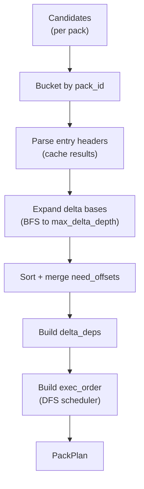

# Offset Archaeology -- Pack Planning and Execution

*The spill pipeline emits 2.1 million unique unseen blobs to the mapping bridge. The bridge looks up each OID in the MIDX: blob `e7d9112` lives in `pack-abc123.pack` at offset `0x1A3F00`. Blob `a4f0023` lives in the same pack at offset `0x0F2100`. But `e7d9112` is an OFS_DELTA whose base is `a4f0023` -- the scanner cannot inflate `e7d9112` without first inflating `a4f0023` and applying the delta. And `a4f0023` is itself a delta against offset `0x03B200`, which is a delta against offset `0x001100`, forming a chain four levels deep. If the executor processes offsets in ascending order and encounters `0x0F2100` before its own base at `0x03B200` has been decoded, the inflate fails and the blob is skipped. Worse, if the delta chain depth exceeds the configured limit of 64, the planner must detect this before execution begins rather than discovering it mid-decode. A naive scanner that decodes offsets on demand, without pre-resolving delta dependencies, produces non-deterministic skip sets that vary with pack layout. This is the delta dependency problem.*

---

Between the deduplicated unique blobs from Chapter 6 and the scanned bytes that reach the detection engine, three transformations occur: mapping blobs to pack offsets, planning which offsets to decode in which order, and executing those plans with bounded buffers. Each transformation introduces constraints that shape the next.

## 1. The Mapping Bridge

The `MappingBridge` sits at the boundary between the spill pipeline and pack planning. It receives unique blobs in strictly sorted OID order and classifies each as packed (found in the MIDX) or loose (not found). From `mapping_bridge.rs`:

```rust
pub struct MappingBridge<'midx, S: PackCandidateSink> {
    midx: &'midx MidxView<'midx>,
    sink: S,
    path_arena: ByteArena,
    stats: MappingStats,
    last_oid: Option<OidBytes>,
    midx_cursor: MidxCursor,
}
```

**`midx` and `midx_cursor`.** The MIDX provides OID-to-pack-offset lookup. The cursor is a streaming position that exploits sorted input: because OIDs arrive in ascending order, the cursor advances monotonically through the MIDX fanout table, turning each lookup into an amortized O(1) operation rather than O(log N) binary search.

**`path_arena`.** Path bytes from the spill pipeline's arena are re-interned into a bridge-owned arena. This produces stable `ByteRef` handles that remain valid for all downstream stages.

**`last_oid`.** Enforces the strict ordering invariant. The bridge rejects duplicate or out-of-order OIDs with immediate errors, catching spill bugs before they propagate to pack planning.

The `emit` implementation on `UniqueBlobSink` performs five steps per blob:

```rust
impl<S: PackCandidateSink> UniqueBlobSink for MappingBridge<'_, S> {
    fn emit(&mut self, blob: &UniqueBlob, paths: &ByteArena) -> Result<(), SpillError> {
        let (res, nanos) = perf::time(|| {
            self.ensure_sorted(blob.oid)?;

            let path_ref = self.intern_path(paths, blob.ctx.path_ref)?;
            let path_bytes = self.path_arena.get(path_ref);
            let cand_flags = classify_path(path_bytes).bits();
            let ctx = CandidateContext {
                cand_flags,
                path_ref,
                ..blob.ctx
            };

            perf_stats::sat_add_u64(&mut self.stats.unique_blobs_in, 1);

            match self
                .midx
                .find_oid_sorted(&mut self.midx_cursor, &blob.oid)?
            {
                Some(idx) => {
                    let (pack_id, offset) = self.midx.offset_at(idx)?;
                    let candidate = PackCandidate {
                        oid: blob.oid,
                        ctx,
                        pack_id,
                        offset,
                    };
                    self.sink.emit_packed(&candidate)?;
                    perf_stats::sat_add_u64(&mut self.stats.packed_matched, 1);
                }
                None => {
                    let candidate = LooseCandidate { oid: blob.oid, ctx };
                    self.sink.emit_loose(&candidate)?;
                    perf_stats::sat_add_u64(&mut self.stats.loose_unmatched, 1);
                }
            }

            Ok(())
        });

        perf::record_mapping(nanos);
        res
    }
}
```

The `finish` method validates that `packed_matched + loose_unmatched == unique_blobs_in`. This reconciliation catches silent data loss -- if any blob was neither matched nor emitted as loose, the pipeline has a bug.

## 2. Pack Plan Configuration

Each pack plan is governed by explicit limits. From `pack_plan.rs`:

```rust
#[derive(Clone, Copy, Debug)]
pub struct PackPlanConfig {
    /// Maximum delta chain depth to traverse (0 disables base expansion).
    pub max_delta_depth: u8,
    /// Safety bound for header parsing.
    pub max_header_bytes: usize,
    /// Maximum number of unique offsets tracked during planning.
    pub max_worklist_entries: usize,
    /// Maximum REF base lookups during planning.
    pub max_base_lookups: usize,
}
```

**`max_delta_depth`.** Defaults to 64. This bounds the BFS expansion of delta bases: if a candidate at depth 64 is itself a delta, the base is not expanded further. A depth of 0 disables expansion entirely, producing plans that contain only candidate offsets with no base resolution.

**`max_worklist_entries` and `max_base_lookups`.** These prevent resource exhaustion on pathological packs. A corrupt pack with circular delta references or an unusually deep chain hierarchy triggers `WorklistLimitExceeded` or `BaseLookupLimitExceeded` rather than unbounded memory growth.

## 3. The PackPlan Model

The plan captures everything needed to decode a single pack's candidates without re-parsing headers at execution time. From `pack_plan_model.rs`:

```rust
pub struct PackPlan {
    pub(crate) pack_id: u16,
    pub(crate) oid_len: u8,
    pub(crate) max_delta_depth: u8,
    pub(crate) candidates: Vec<PackCandidate>,
    pub(crate) candidate_offsets: Vec<CandidateAtOffset>,
    pub(crate) need_offsets: Vec<u64>,
    pub(crate) delta_deps: Vec<DeltaDep>,
    pub(crate) delta_dep_index: Vec<u32>,
    pub(crate) exec_order: Option<Vec<u32>>,
    pub(crate) stats: PackPlanStats,
}
```

**`need_offsets`.** The sorted, deduplicated set of pack offsets that must be decoded. This includes both candidate offsets (blobs the scanner cares about) and discovered base offsets (intermediate deltas needed to reconstruct candidates). The invariant: `need_offsets` is strictly increasing.

**`delta_deps` and `delta_dep_index`.** A two-table design that avoids `HashMap` on the hot decode path. `delta_deps` is a compact, sorted-by-offset array of dependency descriptors. `delta_dep_index[i]` yields the index into `delta_deps` for `need_offsets[i]`, or `NONE_U32` if the offset is not a delta. This provides O(1) dependency lookup during execution.

**`exec_order`.** Present only when the DFS scheduler produces an order different from the natural ascending sequence. When `None`, the executor processes offsets in ascending order with a merge cursor -- the fast path.

The delta dependency types are explicit about base location:

```rust
pub enum BaseLoc {
    /// Base stored at the given pack offset.
    Offset(u64),
    /// Base stored outside this pack (or unresolved).
    External { oid: OidBytes },
}
```

## 4. Building Pack Plans

The `build_pack_plans` function orchestrates per-pack plan construction. The algorithm has four phases:



Phase 1 buckets candidates by `pack_id` using sparse allocation -- only packs with candidates receive a `Vec`. Phase 2 parses entry headers at candidate offsets and caches the results. Phase 3 expands delta bases via BFS:

```rust
while let Some(item) = worklist.pop_front() {
    let entry = parse_entry(
        item.offset, pack, resolver, &mut entry_cache, config, pack_id,
        false, &mut base_lookup_count,
    )?;

    let next_depth = item.depth.saturating_add(1);
    let can_expand = item.depth < config.max_delta_depth;

    match entry {
        ParsedEntry::NonDelta => {}
        ParsedEntry::Ofs { base_offset, .. } => {
            if base_offset == item.offset {
                return Err(PackPlanError::DeltaCycleDetected {
                    pack_id,
                    offset: base_offset,
                });
            }
            if can_expand {
                enqueue_pack_local_base(
                    base_offset, next_depth, &unique_candidate_offsets,
                    &mut discovered_base_offsets, &mut worklist,
                    &mut need_count, config.max_worklist_entries,
                )?;
            }
        }
        ParsedEntry::Ref { base, .. } => {
            if let Some((base_pack, base_offset)) = base {
                if base_pack == pack_id && can_expand {
                    enqueue_pack_local_base(
                        base_offset, next_depth, &unique_candidate_offsets,
                        &mut discovered_base_offsets, &mut worklist,
                        &mut need_count, config.max_worklist_entries,
                    )?;
                }
            }
        }
    }
}
```

Self-referencing deltas (where `base_offset == item.offset`) are detected immediately as cycles. REF deltas whose base resolves to a different pack are recorded as `BaseLoc::External` and not expanded further.

## 5. The DFS Execution Scheduler

The DFS scheduler in `build_exec_order` produces a cache-aware decode order. The algorithm has four phases: CSR adjacency construction, descendant count propagation, DFS traversal with thin-subtree-first ordering, and identity check.

The key property: each base is immediately followed by all of its dependents before moving to the next base. This minimizes the number of bases that must survive in cache simultaneously.

```rust
/// Collect roots sorted by descending desc_count (largest subtree pushed
/// first, so it ends up at the bottom of the stack — processed last).
let mut roots: Vec<usize> = (0..n).filter(|&idx| indegree[idx] == 0).collect();
roots.sort_unstable_by(|&a, &b| desc_count[b].cmp(&desc_count[a]));
```

The scheduler returns `None` when there are no pack-local delta dependencies or when the DFS order matches the natural ascending sequence. This identity check preserves the fast monotone merge cursor path in the executor.

## 6. Pack Decode: Inflate and Delta Application

Pack decoding involves two primitives: zlib inflation and Git delta application. From `pack_inflate.rs`, the `PackFile` type provides zero-copy access:

```rust
pub struct PackFile<'a> {
    bytes: &'a [u8],
    oid_len: usize,
    data_end: usize,
}
```

The trailing hash is excluded from `data_end` to prevent misparsing the checksum as object data. Entry headers are parsed with a safety bound:

```rust
pub fn entry_header_at(
    &self,
    offset: u64,
    max_header_bytes: usize,
) -> Result<EntryHeader, PackParseError> {
```

For inflation, two variants exist: `inflate_limited_with` accepts a caller-provided `Decompress` (avoiding TLS overhead on the hot path), while `inflate_limited` uses a thread-local decompressor. Both enforce hard output caps:

From `pack_decode.rs`, the decode limits bound both object and delta sizes:

```rust
pub struct PackDecodeLimits {
    /// Maximum header bytes to parse for an entry.
    pub max_header_bytes: usize,
    /// Maximum object size (inflated) allowed for any entry.
    pub max_object_bytes: usize,
    /// Maximum delta payload size (inflated) for delta entries.
    pub max_delta_bytes: usize,
}
```

Delta application is implemented in `pack_inflate.rs` with raw pointer writes for performance:

```rust
pub fn apply_delta(
    base: &[u8],
    delta: &[u8],
    out: &mut Vec<u8>,
    max_out: usize,
) -> Result<(), DeltaError> {
```

The delta format encodes copy and insert instructions. Copy instructions reference ranges within the base object; insert instructions embed literal bytes. The `max_out` cap prevents unbounded allocation on corrupt deltas.

## 7. Pack Execution

The executor processes offsets in plan order, applies deltas with bounded buffers, and emits decoded blob bytes to a caller-provided `PackObjectSink`. From `pack_exec.rs`:

```rust
pub trait PackObjectSink {
    fn emit(
        &mut self,
        candidate: &PackCandidate,
        path: &[u8],
        bytes: &[u8],
    ) -> Result<(), PackExecError>;

    /// Called after all candidates for a pack are processed.
    fn finish(&mut self) -> Result<(), PackExecError> {
        Ok(())
    }
}
```

The executor uses a three-buffer rotation scheme to avoid per-offset heap allocations:

- **`inflate_buf`** receives raw zlib-inflated delta payloads.
- **`result_buf`** holds the final decoded object bytes.
- **`base_buf`** holds the base object bytes during fallback delta chain resolution.

Skip reasons are non-fatal and recorded per-offset:

```rust
pub enum SkipReason {
    PackParse(PackParseError),
    Decode(PackDecodeError),
    Delta(DeltaError),
    BaseMissing { base_offset: u64 },
    ExternalBaseMissing { oid: OidBytes },
    ExternalBaseError { detail: String },
    NotBlob,
}
```

Non-blob objects (commits, trees, tags) are recorded as `SkipReason::NotBlob` rather than treated as errors. The executor continues past decode failures, collecting all skip records for the final report.

## 8. The Engine Adapter

The `EngineAdapter` bridges decoded pack bytes into the detection engine. From `engine_adapter.rs`:

```rust
pub struct EngineAdapterConfig {
    /// Total chunk window size in bytes (overlap prefix + new payload).
    pub chunk_bytes: usize,
    /// When `true`, skip the binary content check and scan every blob.
    pub scan_binary: bool,
}
```

Blobs are scanned with overlap-safe chunking using a `RingChunker`. The chunking algorithm:

1. Stream blob bytes into fixed windows using `RingChunker::feed`.
2. Scan each window with `Engine::scan_chunk_into` at the correct base offset.
3. Drop findings that fall entirely inside the overlap prefix.
4. Convert findings into `FindingKey` values (no raw secret bytes).
5. Sort and dedup per blob for deterministic ordering.

Blobs that fit in a single chunk (the common case) skip the ring buffer entirely:

```rust
if blob.len() <= chunker.chunk_bytes() {
    perf::record_scan_chunker_bypass();
    let view = ChunkView {
        base: 0,
        is_first: true,
        window: blob,
    };
    scan_chunk(engine, scratch, file_id, overlap, view, out, &mut err);
```

The adapter implements `PackObjectSink`, connecting pack execution directly to the detection engine. Each `emit` call scans the blob, streams findings to the event sink, and records results in a shared findings arena.

## Summary / What's Next

The mapping bridge resolves unique blobs to pack offsets. Per-pack plans capture delta dependency graphs with bounded BFS expansion, and the DFS scheduler produces cache-aware execution orders. The executor inflates objects with bounded buffers, applies deltas, and emits blob bytes through the engine adapter for chunked scanning.

[Chapter 8](08-finalize-and-persist.md) takes the scanned blobs and their findings and transforms them into deterministic key-value write operations through the finalize builder, with two-phase persistence that separates data writes from watermark advancement.
