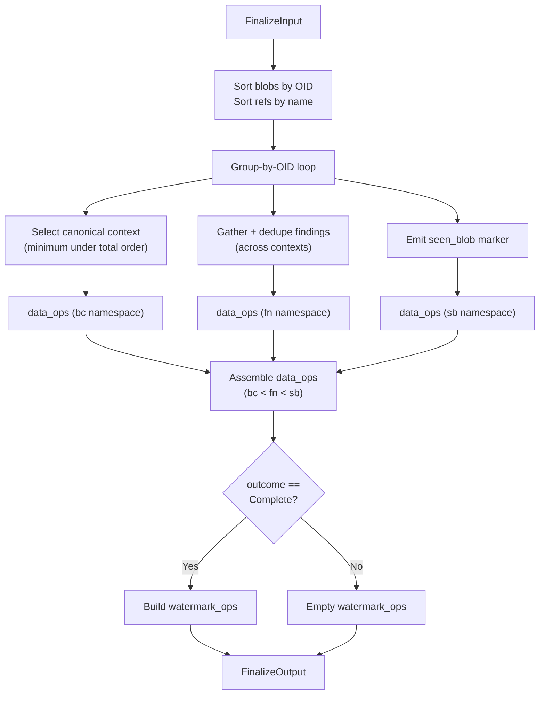

# The Watermark Contract -- Finalize and Persist

*A scan of 47 refs across a monorepo completes: 2.1 million blobs decoded, 847 findings detected, zero skips. The finalize builder sorts blobs by OID, selects canonical contexts, deduplicates findings, and produces 6.3 million key-value write operations across four namespaces. The persistence store commits data ops and watermark ops in a single atomic `WriteBatch`. The watermark for `refs/heads/main` advances from commit `7bc4d82` to `a3f9e01`. On the next scan, the commit walker loads this watermark and begins from `a3f9e01`, skipping 184,000 already-scanned commits. But suppose the previous scan had 12 skipped blobs due to budget exhaustion. The finalize builder detects this and sets the outcome to `Partial { skipped_count: 12 }`. The watermark ops list is empty. The persistence store writes data ops (seen markers, findings, blob contexts) but never advances the watermark. The next scan rescans the same commit range and picks up those 12 blobs. Without this two-phase separation, advancing the watermark past unscanned content creates a permanent blind spot -- those 12 blobs are never scanned again. This is the watermark safety contract.*

---

The finalize stage transforms scan results into persistence operations. It is a pure builder: no I/O, no side effects, no network calls. The returned `FinalizeOutput` separates data operations from watermark operations so that callers can commit them with the appropriate atomicity guarantees.

## 1. FinalizeInput -- What Goes In

The builder takes ownership of scan results so it can sort them deterministically. From `finalize.rs`:

```rust
pub struct FinalizeInput<'a> {
    /// Repository identifier.
    pub repo_id: u64,
    /// Policy hash (scan configuration identity).
    pub policy_hash: [u8; 32],
    /// Start set identity.
    pub start_set_id: StartSetId,
    /// Refs from the start set. Will be sorted and deduped by name.
    pub refs: Vec<RefEntry>,
    /// Scanned blobs with their contexts and findings.
    /// Will be sorted by OID.
    pub scanned_blobs: Vec<ScannedBlob>,
    /// Shared findings arena referenced by `scanned_blobs`.
    pub finding_arena: &'a [ScoredFinding],
    /// OIDs that were skipped during decode (budget exceeded, corrupt, etc.).
    /// If non-empty, watermarks will NOT be advanced.
    pub skipped_candidate_oids: Vec<OidBytes>,
    /// Arena holding the path bytes referenced by `scanned_blobs`.
    pub path_arena: &'a ByteArena,
}
```

**`repo_id` and `policy_hash`.** Together they namespace all persistence keys. Two scans of the same repository under different policies produce disjoint key sets. The `repo_id` is big-endian in all keys to preserve lexicographic ordering across key-value stores.

**`start_set_id`.** A 32-byte identity for the ref selection strategy. Watermark keys include this so that different start sets (e.g., default branch only vs. all branches) maintain independent watermarks.

**`skipped_candidate_oids`.** The critical safety signal. Any non-empty skip set forces a `Partial` outcome and suppresses watermark advancement.

## 2. FinalizeOutput -- What Comes Out

```rust
#[must_use]
pub struct FinalizeOutput {
    /// Seen-blob markers + blob context + findings.
    pub data_ops: Vec<WriteOp>,
    /// Ref watermark updates. Empty if outcome is `Partial`.
    pub watermark_ops: Vec<WriteOp>,
    /// Whether the run was complete or partial.
    pub outcome: FinalizeOutcome,
    /// Statistics for observability.
    pub stats: FinalizeStats,
}
```

**`data_ops`.** Always safe to write regardless of outcome. Contains three namespaces in lexicographic order: `bc\0` (blob context), `fn\0` (findings), `sb\0` (seen-blob markers). Keys within each namespace are sorted.

**`watermark_ops`.** Only produced when `outcome == Complete`. Contains ref watermark updates in the `rw` namespace, sorted by ref name.

**`#[must_use]`.** The compiler enforces that callers inspect the output. Silently discarding a `FinalizeOutput` is a bug -- the data ops must be written to the persistence store.

The outcome enum encodes the safety decision:

```rust
pub enum FinalizeOutcome {
    /// All candidates were scanned successfully.
    Complete,
    /// Some candidates were skipped.
    Partial {
        skipped_count: usize,
    },
}
```

## 3. The Finalize Algorithm

The `build_finalize_ops` function executes five steps in sequence:



### 3.1 Sorting for Determinism

```rust
input
    .scanned_blobs
    .sort_unstable_by(|a, b| a.oid.cmp(&b.oid));

input
    .refs
    .sort_unstable_by(|a, b| a.ref_name.cmp(&b.ref_name));
input.refs.dedup_by(|a, b| {
    let same = a.ref_name == b.ref_name;
    if same {
        debug_assert_eq!(
            a.tip_oid, b.tip_oid,
            "duplicate ref_name with different tip_oid"
        );
    }
    same
});
```

Sorting makes the group-by-OID loop trivial: equal OIDs are adjacent. Ref dedup with a debug assertion catches configuration bugs where the same ref name appears with different tip OIDs.

### 3.2 Canonical Context Selection

When multiple `ScannedBlob` entries share the same OID (because the same blob appeared under different paths or in different commits), the builder selects a single canonical context using a strict total order:

```rust
fn cmp_ctx(
    a_ctx: CandidateContext,
    a_path: &[u8],
    b_ctx: CandidateContext,
    b_path: &[u8],
) -> Ordering {
    a_ctx
        .commit_id
        .cmp(&b_ctx.commit_id)
        .then_with(|| a_path.cmp(b_path))
        .then_with(|| a_ctx.parent_idx.cmp(&b_ctx.parent_idx))
        .then_with(|| a_ctx.change_kind.as_u8().cmp(&b_ctx.change_kind.as_u8()))
        .then_with(|| a_ctx.ctx_flags.cmp(&b_ctx.ctx_flags))
        .then_with(|| a_ctx.cand_flags.cmp(&b_ctx.cand_flags))
}
```

The ordering is: commit ID (lowest wins), path bytes (lexicographic), parent index, change kind, context flags, candidate flags. This produces the same canonical context regardless of input order, scan mode, or worker count.

### 3.3 Finding Deduplication

Findings are gathered across all contexts for the same OID, then sorted and deduped by identity key `(start, end, rule_id, norm_hash)`:

```rust
blob_findings.clear();
for blob in &blobs[i..j] {
    let findings = finding_slice(blob.findings, input.finding_arena);
    blob_findings.extend_from_slice(findings);
}
let pre_dedup = blob_findings.len();
sort_and_dedupe_findings(&mut blob_findings);
```

The `confidence_score` field is intentionally excluded from the identity key. When two findings have identical identity but different confidence scores, `sort_and_dedupe_findings` keeps the highest confidence winner through its sort-then-dedup strategy.

## 4. Key Namespaces

The four key namespaces are ordered lexicographically by their prefix bytes:

| Prefix | Namespace | Description |
|--------|-----------|-------------|
| `bc\0` | blob_ctx | Canonical context per scanned blob |
| `fn\0` | finding | Individual finding records |
| `sb\0` | seen_blob | Scanned marker per blob OID |
| `rw` | ref_watermark | Ref tip watermarks |

A compile-time assertion enforces the ordering:

```rust
const _: () = {
    assert!(NS_BLOB_CTX[0] < NS_FINDING[0]);
    assert!(NS_FINDING[0] < NS_SEEN_BLOB[0]);
};
```

All blob-keyed namespaces share a common key layout: `namespace (3B) + repo_id_be (8B) + policy_hash (32B) + oid_bytes`. Finding keys extend this with `start_be (4B) + end_be (4B) + rule_id_be (4B) + norm_hash (32B)`. Big-endian numeric fields preserve lexicographic ordering across stores.

## 5. Watermark Key Encoding

Watermark keys use a dedicated arena-based builder to avoid per-key heap allocation during batch queries. From `watermark_keys.rs`:

```rust
pub struct KeyArena {
    bytes: Vec<u8>,
    refs: Vec<KeyRef>,
}
```

The key format for ref watermarks:

```text
"rw" (2B) || repo_id_be (8B) || policy_hash (32B) || start_set_id (32B) || ref_name || 0x00
```

**The null terminator.** Git ref names cannot contain NUL bytes (per `git-check-ref-format`). The trailing null byte terminates the variable-length ref name unambiguously and keeps prefix scans safe -- scanning all watermarks for a given repo/policy/start_set returns exactly the keys within that scope without matching longer ref names that share a prefix.

The `KeyRef` handle is an 8-byte struct (offset + length) that references into the arena without owning data:

```rust
pub struct KeyRef {
    pub(crate) off: u32,
    pub(crate) len: u32,
}
```

Watermark values encode the tip OID with a length prefix:

```rust
pub fn encode_ref_watermark_value(oid: &OidBytes) -> ([u8; 33], usize) {
    let mut out = [0u8; 33];
    let n = oid.len() as usize;
    out[0] = oid.len();
    out[1..1 + n].copy_from_slice(oid.as_slice());
    (out, 1 + n)
}
```

The fixed 33-byte buffer avoids heap allocation. The length prefix (`oid_len` as `u8`) disambiguates SHA-1 (20 bytes) from SHA-256 (32 bytes). Decode rejects any value where the declared length does not match 20 or 32, or where the actual byte count does not match the declared length.

## 6. The Persistence Contract

The `PersistenceStore` trait defines the atomic write contract. From `persist.rs`:

```rust
pub trait PersistenceStore {
    /// Commits finalize output atomically.
    ///
    /// Implementations may assume ops are pre-sorted by key for performance
    /// diagnostics, but must not require ordering for correctness.
    /// Implementations must ignore `watermark_ops` when the outcome is partial.
    fn commit_finalize(&self, output: &FinalizeOutput) -> Result<(), PersistError>;
}
```

The contract has three rules:

1. `data_ops` are always written.
2. `watermark_ops` are written only for `FinalizeOutcome::Complete`.
3. The combined write must be atomic -- readers never observe watermarks without the corresponding data writes.

The helper function `persist_finalize_output` returns the outcome on success so callers can update control flow without re-inspecting the output:

```rust
pub fn persist_finalize_output(
    store: &dyn PersistenceStore,
    output: &FinalizeOutput,
) -> Result<FinalizeOutcome, PersistError> {
    store.commit_finalize(output)?;
    Ok(output.outcome)
}
```

## 7. The RocksDB Implementation

The production persistence store uses RocksDB with a single `WriteBatch` for atomicity. From `persist_rocksdb.rs`:

```rust
impl PersistenceStore for RocksDbStore {
    fn commit_finalize(&self, output: &FinalizeOutput) -> Result<(), PersistError> {
        #[cfg(feature = "rocksdb")]
        {
            let mut batch = WriteBatch::default();
            for op in &output.data_ops {
                batch.put(&op.key, &op.value);
            }
            if matches!(output.outcome, FinalizeOutcome::Complete) {
                for op in &output.watermark_ops {
                    batch.put(&op.key, &op.value);
                }
            }
            self.db
                .write(batch)
                .map_err(|err| PersistError::backend(err.to_string()))?;
            Ok(())
        }
    }
}
```

The `WriteBatch` ensures all-or-nothing semantics: either all data ops and watermark ops are visible, or none are. The `debug_assert!` checks before batch construction validate that data ops and watermark ops are pre-sorted and that partial outcomes have no watermark ops.

The store also implements `SeenBlobStore` for the spill pipeline's batch dedup queries:

```rust
impl SeenBlobStore for RocksDbStore {
    fn batch_check_seen(&self, oids: &[OidBytes]) -> Result<Vec<bool>, SpillError> {
```

Seen-blob keys are built into a contiguous buffer and queried via `multi_get` to amortize RocksDB lookup overhead. The key layout matches the `sb\0` namespace from finalize.

## 8. ConcurrentMaintenance Detection

Recall from Chapter 1 that the scanner checks artifact fingerprints before and after execution. The connection to finalize is direct: if `artifacts_unchanged()` returns false after mode execution, the scanner returns `ConcurrentMaintenance` and the caller retries. The finalize builder never sees this case -- it only runs when artifact stability has been confirmed. But the two-phase persistence design provides defense in depth: even if a subtle race slipped past fingerprint detection, a `Partial` outcome from skipped blobs prevents watermark advancement.

## 9. The In-Memory Store

For tests, an `InMemoryPersistenceStore` records committed ops without synchronization:

```rust
pub struct InMemoryPersistenceStore {
    pub data_ops: std::cell::RefCell<Vec<WriteOp>>,
    pub watermark_ops: std::cell::RefCell<Vec<WriteOp>>,
}
```

The store respects the same contract: watermark ops are recorded only for `Complete` outcomes. This makes it straightforward to write tests that verify namespace ordering, canonical context selection, and finding deduplication without requiring a RocksDB instance.

## 10. Context Value Encoding

The canonical context is encoded as a binary value for the `bc\0` namespace:

```rust
fn encode_ctx_value(out: &mut Vec<u8>, ctx: CandidateContext, path: &[u8]) {
    let path_len: u32 = path
        .len()
        .try_into()
        .expect("path length exceeds u32::MAX; limits should prevent this");
    let cap = 4 + 1 + 1 + 2 + 2 + 4 + path.len();
    out.clear();
    out.reserve(cap);
    out.extend_from_slice(&ctx.commit_id.to_be_bytes());
    out.push(ctx.parent_idx);
    out.push(ctx.change_kind.as_u8());
    out.extend_from_slice(&ctx.ctx_flags.to_be_bytes());
    out.extend_from_slice(&ctx.cand_flags.to_be_bytes());
    out.extend_from_slice(&path_len.to_be_bytes());
    out.extend_from_slice(path);
}
```

The format is: `commit_id_be (4B) || parent_idx (1B) || change_kind (1B) || ctx_flags_be (2B) || cand_flags_be (2B) || path_len_be (4B) || path_bytes`. The reusable `out` buffer is cleared and re-filled per OID to avoid per-blob allocation.

## Summary / What's Next

The finalize builder transforms scan results into deterministic key-value operations through canonical context selection and finding deduplication. Two-phase persistence separates data writes from watermark advancement: partial scans record their findings but never advance watermarks past unscanned content. The RocksDB implementation commits both phases in a single `WriteBatch` for atomicity.

[Chapter 9](09-simulation-and-testing.md) covers the deterministic simulation harness that validates the entire pipeline -- from repo open through finalize -- without filesystem state, OS time, or real repositories.
