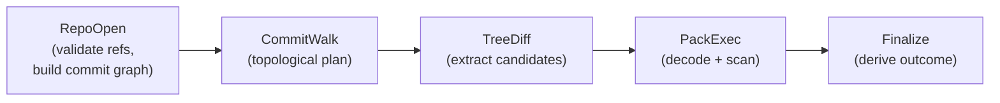
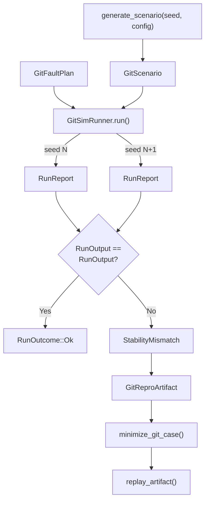

# The Deterministic Mirror -- Simulation and Testing

*A property test generates a scenario with 8 commits, 3 refs, and 24 blobs across 2 pack files. The runner executes the five-stage pipeline under schedule seed 7 and produces a `RunReport` with `scanned_hash = 0xab3f...`. The test increments the seed to 8 and reruns the same scenario. The scheduler picks a different task ordering, but the `scanned_hash` is identical -- `0xab3f...` again. On seed 9, the hash matches. On seed 10, the hash changes to `0xc71a...`. The test reports `FailureKind::StabilityMismatch` with the message "stability mismatch between seeds 7 and 10". The reproduction artifact captures the scenario, fault plan, both seeds, and a 1024-event trace ring. The minimizer shrinks the scenario from 8 commits to 3, removes one ref and one pack, and the mismatch still reproduces. The engineer replays the minimized artifact and finds that a race-winner in blob attribution caused a different canonical context at OID `0xe7d9112`, which changed the seen-store key encoding. This failure never touched a real Git repository, a filesystem, or an OS clock. It lived entirely inside the simulation harness.*

---

The Git scan pipeline spans eight stages with complex interactions: delta chain resolution, content-addressed deduplication, canonical context selection, and two-phase persistence. Testing each stage in isolation catches local bugs but misses integration failures where stage N's output triggers an edge case in stage N+2. The simulation harness validates the entire pipeline end-to-end under controlled conditions.

## 1. Design Principles

The simulation harness from `sim_git_scan/mod.rs` follows three principles:

```rust
//! Design principles:
//! - Keep production Git scanning untouched; introduce narrow seams only.
//! - Prefer data-driven scenarios and deterministic scheduling via `SimExecutor`.
//! - Emit bounded trace events that make failures reproducible and debuggable.
```

The harness does not mock the pipeline stages. It provides synthetic inputs (scenarios) and controlled execution (deterministic scheduling) to the real stage implementations. This means bugs found by the simulation are real bugs in production code, not artifacts of a test double.

## 2. The Scenario Schema

A `GitScenario` models a complete repository state at two layers: semantic (refs, commits, trees, blobs) and optional raw bytes (commit-graph, MIDX, packs). From `scenario.rs`:

```rust
pub struct GitScenario {
    /// Schema version for forward compatibility.
    pub schema_version: u32,
    /// Semantic repository model.
    pub repo: GitRepoModel,
    /// Optional embedded artifact bytes for byte-level simulation.
    pub artifacts: Option<GitArtifactBundle>,
}
```

The semantic model captures the object graph:

```rust
pub struct GitRepoModel {
    /// Object ID format (SHA-1 or SHA-256).
    pub object_format: GitObjectFormat,
    /// Refs included in the start set.
    pub refs: Vec<GitRefSpec>,
    /// Commit DAG (referenced by OID).
    pub commits: Vec<GitCommitSpec>,
    /// Tree objects (referenced by OID).
    pub trees: Vec<GitTreeSpec>,
    /// Blob objects (referenced by OID).
    pub blobs: Vec<GitBlobSpec>,
}
```

**`GitRefSpec`.** Each ref carries a name, tip OID, and optional watermark OID for incremental scanning:

```rust
pub struct GitRefSpec {
    /// Raw ref name bytes (for example `refs/heads/main`).
    pub name: Vec<u8>,
    /// Tip commit OID.
    pub tip: GitOid,
    /// Optional persisted watermark OID (incremental scan).
    pub watermark: Option<GitOid>,
}
```

**`GitArtifactBundle`.** When present, raw artifact bytes override the semantic model for byte-level testing:

```rust
pub struct GitArtifactBundle {
    /// Raw commit-graph bytes (optional).
    pub commit_graph: Option<Vec<u8>>,
    /// Raw multi-pack-index bytes (optional).
    pub midx: Option<Vec<u8>>,
    /// Pack file bytes keyed by pack ID.
    pub packs: Vec<GitPackBytes>,
}
```

The schema is versioned (`GIT_SCENARIO_SCHEMA_VERSION = 1`) and serializable with serde. This supports artifact persistence for replay across code changes.

## 3. Run Configuration

The `GitRunConfig` controls execution parameters:

```rust
pub struct GitRunConfig {
    /// Number of simulated worker threads.
    pub workers: u32,
    /// Maximum number of simulation steps (0 = auto-derived).
    pub max_steps: u64,
    /// Number of stability runs with different schedule seeds.
    pub stability_runs: u32,
    /// Trace ring capacity (events retained on failure).
    pub trace_capacity: u32,
}
```

**`stability_runs`.** The key mechanism for detecting non-determinism. The runner executes the same scenario multiple times with different schedule seeds and compares the externally visible output. Schedule-dependent state (step count, trace hash) is excluded from comparison; only scan-visible state (commit count, candidate count, scanned hash, skipped hash, outcome) must match.

**`max_steps`.** When set to 0, the runner derives a conservative budget from repo shape: `1000 + commits * 8 + refs * 4 + trees * 2`. This prevents runaway schedules without requiring callers to guess appropriate budgets.

## 4. The Runner

The `GitSimRunner` drives execution. From `runner.rs`:

```rust
pub struct GitSimRunner {
    cfg: GitRunConfig,
    schedule_seed: u64,
}
```

The `run` method executes a scenario under the base seed, then optionally runs stability checks:

```rust
pub fn run(&self, scenario: &GitScenario, fault_plan: &GitFaultPlan) -> RunOutcome {
    let base = match self.run_once_catch(scenario, fault_plan, self.schedule_seed) {
        RunOutcome::Ok { report } => report,
        fail => return fail,
    };

    if self.cfg.stability_runs <= 1 {
        return RunOutcome::Ok { report: base };
    }

    let baseline = RunOutput::from(&base);
    for i in 1..self.cfg.stability_runs {
        let seed = self.schedule_seed.wrapping_add(i as u64);
        match self.run_once_catch(scenario, fault_plan, seed) {
            RunOutcome::Ok { report } => {
                let candidate = RunOutput::from(&report);
                if candidate != baseline {
                    return RunOutcome::Failed(FailureReport {
                        kind: FailureKind::StabilityMismatch,
                        message: format!(
                            "stability mismatch between seeds {} and {}",
                            self.schedule_seed, seed
                        ),
                        step: report.steps,
                    });
                }
            }
            fail => return fail,
        }
    }

    RunOutcome::Ok { report: base }
}
```

The `run_once_catch` wrapper catches panics and converts them to `FailureKind::Panic`, ensuring the simulation never crashes the test process.

## 5. The Five-Stage Pipeline

Each run executes five stages in sequence, connected through `RunState`:



The runner uses a `SimExecutor` for deterministic scheduling. Each stage is spawned as a task:

```rust
enum StageKind {
    RepoOpen = 1,
    CommitWalk = 2,
    TreeDiff = 3,
    PackExec = 4,
    Finalize = 5,
}
```

The numeric discriminants are explicit to keep trace encoding stable across refactors. Stage transitions are strictly sequential: `RepoOpen` spawns `CommitWalk` on completion, `CommitWalk` spawns `TreeDiff`, and so on.

The `RunState` carries mutable per-run state through stage execution:

```rust
struct RunState<'a> {
    scenario: &'a GitScenario,
    trace: GitTraceRing,
    faults: GitFaultInjector,
    ref_arena: Option<ByteArena>,
    refs: Vec<StartSetRef>,
    commit_graph: Option<SimCommitGraph>,
    tree_source: Option<SimTreeSource>,
    plan: Vec<PlannedCommit>,
    candidates: Option<CandidateBuffer>,
    scanned: Vec<OidBytes>,
    skipped: Vec<OidBytes>,
    outcome: Option<FinalizeOutcome>,
}
```

## 6. Fault Injection

The fault plan is keyed by logical resources rather than filesystem paths. From `fault.rs`:

```rust
pub enum GitResourceId {
    /// Commit-graph file (if present).
    CommitGraph,
    /// Multi-pack-index file (if present).
    Midx,
    /// Pack file identified by logical pack id.
    Pack { pack_id: u16 },
    /// Persistence store (watermarks/seen store).
    Persist,
    /// Catch-all for non-core resources.
    Other(String),
}
```

Each resource has a sequence of read faults consumed in order:

```rust
pub struct GitReadFault {
    /// Optional I/O fault.
    pub fault: Option<GitIoFault>,
    /// Simulated latency ticks before completion.
    pub latency_ticks: u64,
    /// Optional data corruption.
    pub corruption: Option<GitCorruption>,
}
```

Three I/O fault variants exist:

```rust
pub enum GitIoFault {
    /// Return an I/O error by kind (opaque u8 tag).
    ErrKind { kind: u8 },
    /// Return at most `max_len` bytes (short read).
    PartialRead { max_len: u32 },
    /// Single EINTR-style interruption.
    EIntrOnce,
}
```

Three corruption variants transform bytes after a successful read:

```rust
pub enum GitCorruption {
    /// Truncate the returned data to `new_len` bytes.
    TruncateTo { new_len: u32 },
    /// Flip bits at a specific offset.
    FlipBit { offset: u32, mask: u8 },
    /// Overwrite bytes starting at `offset`.
    Overwrite { offset: u32, bytes: Vec<u8> },
}
```

The `GitFaultInjector` advances a per-resource read index. Missing entries default to no fault, so a plan with one read fault for the MIDX injects the fault on the first MIDX read and passes through all subsequent reads cleanly.

Pack reads use a `FaultyPackReader` that wraps the real `PackReader` trait:

```rust
impl PackReader for FaultyPackReader<'_> {
    fn read_at(&mut self, offset: u64, dst: &mut [u8]) -> Result<usize, PackReadError> {
        // ... copy from source bytes ...
        let (fault, op) = self.faults.next_read(&self.resource);
        record_fault_events(self.trace, &self.resource, op, &fault);
        // ... apply I/O fault, then corruption to dst ...
    }
}
```

Corruption is applied after copy into `dst` to mirror real-world on-wire corruption behavior.

## 7. The Trace Ring

The trace captures a minimal, deterministic record of execution. From `trace.rs`:

```rust
pub enum GitTraceEvent {
    /// A stage began execution.
    StageEnter { stage_id: u16 },
    /// A stage completed with counters.
    StageExit { stage_id: u16, items: u32 },
    /// A deterministic decision point.
    Decision { code: u32 },
    /// A fault was injected against a logical resource.
    FaultInjected {
        resource_id: u32,
        op: u32,
        kind: u16,
    },
}
```

Events are intentionally compact: no strings, no variable-length payloads. The `GitTraceRing` is a fixed-capacity ring buffer that evicts oldest events when full:

```rust
pub struct GitTraceRing {
    cap: usize,
    buf: VecDeque<GitTraceEvent>,
}
```

The trace hash is computed by hashing events in emitted order with stable tag bytes:

```rust
fn hash_event(hasher: &mut Hasher, ev: &GitTraceEvent) {
    match ev {
        GitTraceEvent::StageEnter { stage_id } => {
            hasher.update(&[1]);
            hasher.update(&stage_id.to_le_bytes());
        }
        // ...
    }
}
```

Tag bytes are explicit (`[1]`, `[2]`, `[3]`, `[4]`) to keep hash compatibility across refactors that change event declaration order.

## 8. The Run Report and Oracles

A successful run produces a `RunReport` with deterministic hashes:

```rust
pub struct RunReport {
    /// Total steps executed.
    pub steps: u64,
    /// Commit count emitted by the commit walk.
    pub commit_count: u32,
    /// Candidate count emitted by tree diff.
    pub candidate_count: u32,
    /// Count of unique skipped OIDs (after dedup).
    pub skipped_count: usize,
    /// Finalize outcome.
    pub outcome: SimFinalizeOutcome,
    /// Hash of scanned OIDs (sorted, unique).
    pub scanned_hash: [u8; 32],
    /// Hash of skipped OIDs (sorted, unique).
    pub skipped_hash: [u8; 32],
    /// Hash of trace events.
    pub trace_hash: [u8; 32],
}
```

End-of-run oracles validate four invariants:

1. **Sorted + unique.** Both `scanned` and `skipped` OID sets must be strictly increasing.
2. **Disjoint.** No OID appears in both sets, enforced by a two-pointer merge walk.
3. **Complete consistency.** A `Complete` outcome requires zero skips.
4. **Partial consistency.** A `Partial { skipped_count }` outcome requires `skipped_count > 0` and `skipped_count` must match the actual skip set size.

```rust
fn validate_outputs(state: &RunState<'_>) -> Result<FinalizeOutcome, FailureReport> {
    if !is_sorted_unique(&state.scanned) {
        return Err(failure_inv(61, "scanned OIDs not sorted/unique"));
    }
    if !is_sorted_unique(&state.skipped) {
        return Err(failure_inv(62, "skipped OIDs not sorted/unique"));
    }
    if has_overlap(&state.scanned, &state.skipped) {
        return Err(failure_oracle("scanned and skipped sets overlap"));
    }
    // ... outcome consistency checks ...
}
```

## 9. Scenario Generation

The `generate_scenario` function builds deterministic repo models from a seed. From `generator.rs`:

```rust
pub struct GitScenarioGenConfig {
    /// Scenario schema version to stamp on outputs.
    pub schema_version: u32,
    /// Number of commits to generate in a linear chain.
    pub commit_count: u32,
    /// Number of refs to generate.
    pub ref_count: u32,
    /// Number of blobs per tree.
    pub blobs_per_tree: u32,
}
```

Generated histories are single linear chains with flat trees. OIDs are deterministic placeholders derived from tags and indices:

```rust
fn oid_bytes(tag: u8, idx: u32) -> Vec<u8> {
    let mut out = vec![0u8; 20];
    out[0] = tag;
    out[1..5].copy_from_slice(&idx.to_be_bytes());
    out
}
```

Blobs use tag `0xB0`, trees use `0xA0`, commits use `0xC0`. Ref tips and watermarks are assigned randomly via `SimRng`, ensuring deterministic variation across seeds.

## 10. Reproduction Artifacts

When a run fails, the `GitReproArtifact` captures everything needed for deterministic replay:

```rust
pub struct GitReproArtifact {
    pub schema_version: u32,
    pub scanner_pkg_version: String,
    pub git_commit: Option<String>,
    pub target: String,
    pub scenario_seed: u64,
    pub schedule_seed: u64,
    pub run_config: GitRunConfig,
    pub scenario: GitScenario,
    pub fault_plan: GitFaultPlan,
    pub failure: FailureReport,
    pub trace: GitTraceDump,
}
```

The `replay_artifact` function reconstructs the runner from the embedded configuration and re-executes:

```rust
pub fn replay_artifact(artifact: &GitReproArtifact) -> RunOutcome {
    let runner = GitSimRunner::new(artifact.run_config.clone(), artifact.schedule_seed);
    runner.run(&artifact.scenario, &artifact.fault_plan)
}
```

The replay contract: `scenario_seed`, `schedule_seed`, `run_config`, `scenario`, and `fault_plan` are immutable once captured. Diagnostic fields like `scanner_pkg_version` and `git_commit` do not affect replay.

## 11. Deterministic Minimization

The minimizer shrinks a failing artifact through removal-only passes. From `minimize.rs`:

```rust
pub fn minimize_git_case(
    failing: &GitReproArtifact,
    cfg: MinimizerCfg,
    reproduce: impl Fn(&GitReproArtifact) -> bool,
) -> GitReproArtifact {
    let mut current = failing.clone();
    for _ in 0..cfg.max_iterations {
        let mut changed = false;
        changed |= shrink_fault_plan(&mut current, &reproduce);
        changed |= shrink_refs(&mut current, &reproduce);
        changed |= prune_unreachable_objects(&mut current, &reproduce);
        changed |= reduce_artifacts(&mut current, &reproduce);
        if !changed {
            break;
        }
    }
    current
}
```

Four passes execute in order:

1. **`shrink_fault_plan`** removes whole resources and trims read sequences.
2. **`shrink_refs`** removes refs (keeping the first ref stable).
3. **`prune_unreachable_objects`** performs a DFS from ref tips through parents and trees, removing commits, trees, and blobs not reachable from any retained ref.
4. **`reduce_artifacts`** drops the entire `GitArtifactBundle` if the failure reproduces without byte-level artifacts.

Each candidate is validated with the `reproduce` predicate. The minimizer only removes data -- it never mutates content. The output is locally minimal with respect to the enabled passes.

## 12. Simulation Persistence

The `SimPersistStore` implements the `PersistenceStore` trait with deterministic fault injection:

```rust
pub struct SimPersistStore {
    log: RefCell<Vec<SimPersistOp>>,
    faults: RefCell<GitFaultInjector>,
}
```

Each `commit_finalize` call consumes one fault-plan read for the `Persist` resource. I/O faults abort the commit atomically -- no ops are logged. On success, data ops are logged before watermark ops, and partial outcomes suppress watermark logging:

```rust
fn apply_finalize(&self, output: &FinalizeOutput) -> Result<(), PersistError> {
    let (fault, _idx) = self.faults.borrow_mut().next_read(&GitResourceId::Persist);
    if let Some(io_fault) = &fault.fault {
        return Err(fault_to_error(io_fault));
    }
    if fault.corruption.is_some() {
        return Err(PersistError::backend("simulated persistence corruption"));
    }
    // ... log data_ops, then watermark_ops if complete ...
}
```

The logged operations are inspectable after the run for oracle validation.



## Summary / What's Next

The simulation harness validates the Git scan pipeline without filesystem state, OS time, or real repositories. Deterministic scheduling with stability checks detects non-determinism. Fault injection exercises error paths in every pipeline stage. Reproduction artifacts capture the complete input state, and the minimizer reduces failing cases to their essential elements.

This concludes the scanner-git section. The eight-stage pipeline -- from repository discovery through artifact acquisition, commit planning, tree diffing, spill dedup, pack planning, execution, and finalize -- forms a complete system for scanning Git repositories at scale with explicit limits, deterministic output, and verified correctness.
