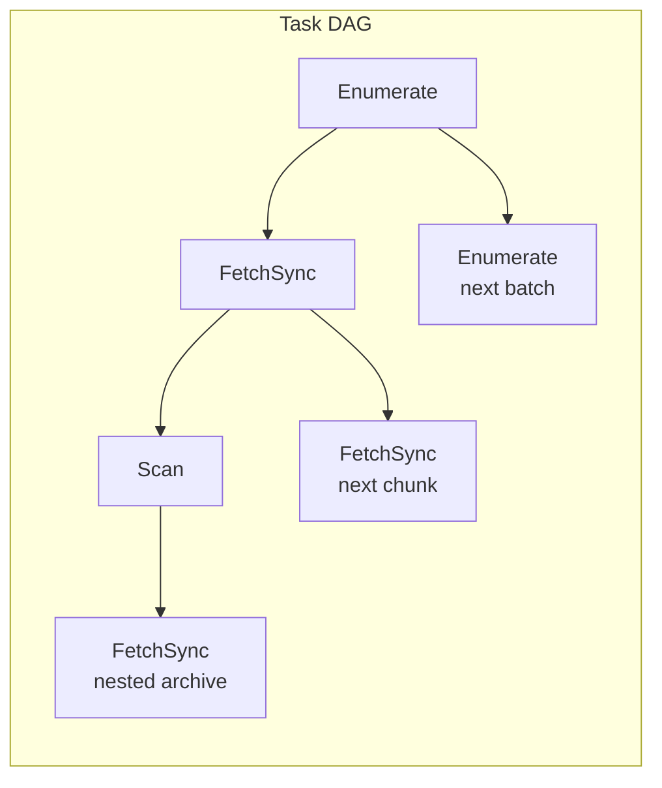
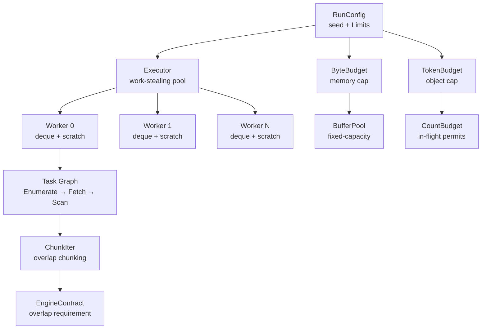

# "A Million Files, One Budget" -- The Scheduling Problem

*A scanner begins walking a directory tree containing 2.3 million files. Within the first second it discovers 14,000 paths, each needing a read, a chunk scan, and potentially archive expansion. Worker 0 grabs a 256 KiB buffer from the pool and reads the first file. Worker 1 does the same. Worker 2. Worker 3. By the fourth second, 8,192 buffers are in flight -- 2 GiB of memory consumed. The kernel starts swapping. Meanwhile, file `config.tar.gz` contains a 900 MiB `.sql` dump nested three archives deep; a single worker decompresses into unbounded heap. Discovery keeps pushing paths. The injector queue grows past 60,000 entries. RSS crosses 12 GiB and the OOM killer terminates the process. No findings are emitted. Separately, a 47-byte API key straddles bytes 65,534 and 65,581 -- exactly at the chunk boundary. Two workers scan the two halves. Neither sees the complete token. The secret ships to production undetected. Without a scheduler that bounds memory, enforces chunk overlap, and distributes work fairly, scanning at scale is a resource-exhaustion and correctness problem simultaneously.*

---

The scanner-scheduler crate exists to solve three problems at once: bound memory consumption with hard-cap budgets, guarantee that no secret is missed at chunk boundaries via overlap-based deduplication, and distribute work across CPU cores with a work-stealing executor that keeps all workers busy without starving any. The scheduler is backend-agnostic -- the same executor, budget primitives, and chunking logic serve blocking filesystem scans, Linux io_uring async I/O, and connector pipeline deployments.

The three problems are deeply intertwined. Memory bounding requires knowing how many buffers are in flight, which requires tracking task completion, which requires a termination protocol that correctly handles concurrent spawn and join. Chunk overlap correctness requires the scheduler to know the detection engine's maximum pattern span -- an interface contract that the scheduler trusts but does not validate. Work distribution requires randomized stealing that avoids correlated contention -- and the randomization must be deterministic for reproducibility.

This chapter introduces the module map, the core identifier types, the limits system, and the typed task model that makes the scheduler both efficient and introspectable. It establishes the vocabulary used throughout the remaining seven chapters: every subsequent chapter builds on the abstractions defined here.

## 1. Module Map

The scheduler is organized into four layers. From `scheduler/mod.rs`:

```text
                         ┌─────────────────────────────────────────────────────┐
                         │                   Scheduler                         │
                         │                                                     │
 ┌──────────────┐        │  ┌───────────┐    ┌───────────┐    ┌───────────┐   │
 │ I/O Backend  │───────►│  │  Injector │───►│  Worker 0 │◄──►│  Worker N │   │
 │ (discovery)  │        │  │  (global) │    │  (deque)  │    │  (deque)  │   │
 └──────────────┘        │  └───────────┘    └─────┬─────┘    └─────┬─────┘   │
       │                 │                         │                │         │
       │                 │                    steal│                │steal    │
       ▼                 │                         └────────────────┘         │
 ┌──────────────┐        │                                                    │
 │ ByteBudget   │◄───────│  Backpressure: budgets gate work admission         │
 │ TokenBudget  │        │                                                    │
 └──────────────┘        └─────────────────────────────────────────────────────┘
```

The module organization spans two levels: the `scheduler/` submodule (the work-stealing runtime itself) and several **top-level** modules declared in `lib.rs` that provide simulation harnesses, event types, and pipeline infrastructure.

### Scheduler-internal modules (`scheduler/mod.rs`)

The `scheduler/` submodule doc provides the authoritative breakdown:

| Layer | Modules | Purpose |
|-------|---------|---------|
| **Core Scheduling** | `contract`, `executor`, `budget`, `chunking`, `metrics`, `rng` | Run IDs, work-stealing pool, backpressure, chunk iteration, per-worker metrics, deterministic RNG |
| **Engine Abstraction** | `engine_trait`, `engine_stub`, `engine_impl` | Trait definitions for `ScanEngine` and `EngineScratch`; mock engine for testing; bridge to real engine |
| **I/O Backends** | `local_fs_owner`, `parallel_scan`, `local_fs_uring`, `shared_core` | Blocking FS reads, directory walking, Linux io_uring, common scan/postprocess pipeline |
| **Testing** | `sim` *(scheduler-internal)*, `sim_executor_harness`, `task_graph` | Scheduler invariant verification under random interleavings, step-driven executor model, object lifecycle FSM |

The scheduler-internal `sim` module (`scheduler/sim.rs`, gated on `#[cfg(any(test, feature = "scheduler-sim"))]`) is a deterministic simulation harness that explores out-of-order I/O completions and task scheduling to verify scheduler invariants. This is **not** the same as the top-level `sim` module described below.

### Top-level crate modules (`lib.rs`)

Several feature-gated modules are declared directly in `lib.rs` (lines 54-64), **not** inside `scheduler/`:

| Module | Feature Gate | Purpose |
|--------|-------------|---------|
| `sim` | `sim-harness` | Deterministic simulation **primitives** — `SimClock`, `SimRng`, `SimFs`, `SimExecutor`, `FaultInjector`, `TraceRing`, `ReproArtifact`, mutation operators. Contains sub-modules: `clock.rs`, `rng.rs`, `fs.rs`, `executor.rs`, `fault.rs`, `trace.rs`, `artifact.rs`, `minimize.rs`, `mutation/` |
| `sim_archive` | `sim-harness` | Deterministic archive materializers for the simulation harness |
| `sim_scanner` | `sim-harness` | Scenario and runner types for the scanner simulation harness |
| `demo` | `sim-harness` | Re-exports `scanner_engine::demo_tuning` for simulation and test scenarios |
| `sim_scheduler` | `scheduler-sim` | Scheduler-only simulation harness for task-program execution |

The naming overlap between `scheduler/sim.rs` (scheduler-internal invariant checker) and `src/sim/` (top-level simulation primitives) is intentional: the former *uses* the latter. The `scheduler-sim` feature implies `sim-harness`, so enabling `scheduler-sim` makes both the top-level `sim` primitives and the scheduler-internal `sim` module available.

### Always-available top-level modules

The remaining top-level modules in `lib.rs` are always compiled (no feature gates):

| Module | Purpose |
|--------|---------|
| `api` | Compatibility re-exports for scanner-engine public API types |
| `archive` | Archive scanning: detection, config, budgets, format handlers |
| `content_policy` | Re-exports scanner-engine content policy helpers |
| `engine` | Re-exports scanner-engine runtime types |
| `events` | Structured event types and sinks (core + git) |
| `finding_output` | Finding output contract aliases |
| `git_scan` | Git-scan compatibility surface (path-policy helpers) |
| `json_write` | Shared JSON write helpers for event encoding |
| `perf_stats` | Small arithmetic helpers for performance counters |
| `pipeline` | Configuration and statistics types for file-scanning pipelines |
| `pool` | Re-exports scanner-engine pool types |
| `runtime` | File tables, buffer pools, chunk readers |
| `scratch_memory` | Re-exports scanner-engine fixed-capacity scratch helpers |
| `source_kind` | Common source-kind marker shared across event types |
| `store` | Filesystem persistence producer contracts |

Two engines share one interface: the CPU engine (work-stealing executor for compute-bound scanning) and the I/O engine (backend-specific completion system). The scheduler bridges them via `ExecutorHandle`, which I/O completion handlers use to inject CPU work without knowing executor internals.

The separation between core scheduling and I/O backends is deliberate. The executor, budgets, and chunking logic are agnostic to how bytes arrive. A blocking `read()` call, an io_uring completion, and a connector pipeline chunk all produce the same `TsChunk` that the scan stage consumes. This means the scheduler's correctness properties -- work-conserving, exactly-once, budget-bounded -- hold regardless of the I/O backend.

Additional scheduler-internal modules handle resource control (`device_slots` for per-device I/O concurrency, `global_resource_pool` for large-job permits, `yield_policy` for deterministic yield behavior) and observability (`affinity` for CPU pinning, `alloc` for allocation tracking, `bench` for microbenchmarks, `rusage` for process resource usage). These are supporting infrastructure that the core scheduling loop does not depend on but that production deployments require for tuning and monitoring.

## 2. Run-Scoped Identifiers

Every scannable entity gets a typed identifier scoped to a single scan run. These identifiers serve two purposes: they prevent PII leakage in logs (no raw paths in trace output), and they provide a stable addressing system for findings and metrics. From `contract.rs`:

```rust
/// Run-scoped source identifier.
///
/// Represents a single data source (e.g., a Git repository, S3 bucket, or filesystem path)
/// within a scan run. Sources are discovered and assigned IDs at the start of a run.
///
/// # Privacy
///
/// **Do not log raw paths/URLs/etc.** Use this ID for tracing and metrics instead.
/// This prevents accidental PII exposure in logs while maintaining debuggability.
///
/// # Ordering
///
/// IDs are monotonically increasing within a run if and only if discovery order is
/// deterministic (controlled by [`RunConfig::seed`]). Do not rely on ID ordering
/// for correctness—only for reproducibility in testing.
#[derive(Clone, Copy, Debug, PartialEq, Eq, Hash)]
pub struct SourceId(pub u32);
```

```rust
/// Run-scoped object identifier.
///
/// Uniquely identifies a scannable object (file, blob, archive entry) within a run.
/// Objects belong to exactly one source; the `(source, idx)` pair is unique per run.
///
/// # Structure
///
/// ```text
/// ObjectId { source: SourceId(0), idx: 42 }
///            └─── which source ───┘  └─ object index within source
/// ```
#[derive(Clone, Copy, Debug, PartialEq, Eq, Hash)]
pub struct ObjectId {
    /// The source this object belongs to.
    pub source: SourceId,
    /// Object index within the source (0-based, monotonic if deterministic).
    pub idx: u32,
}
```

```rust
/// View identity for bytes passed to the detection engine.
///
/// When scanning an object, the scheduler may produce multiple "views" of the same bytes:
/// - View 0: Raw bytes as read from storage
/// - View 1: URL-decoded bytes
/// - View 2: Base64-decoded bytes
/// - etc.
#[derive(Clone, Copy, Debug, PartialEq, Eq, Hash, Default)]
pub struct ViewId(pub u16);
```

The three-level hierarchy `SourceId -> ObjectId -> ViewId` forms the addressing system for every finding. The scheduler is agnostic to view semantics -- it passes `ViewId` through to findings without interpreting it. The transform layer assigns meaningful view IDs.

All three types are `Copy`, `Clone`, `Hash`, and `Eq`. This allows them to be used as map keys, passed through task enums without indirection, and included in finding records without allocation. `SourceId` wraps a `u32`, `ObjectId` contains a `SourceId` and a `u32` index, and `ViewId` wraps a `u16`. The combined size for a fully-qualified finding address is 10 bytes -- small enough to embed in every finding record and every chunk metadata struct.

The `ObjectId` doc comment notes that the `idx` field is "monotonic within a source if enumeration order is deterministic." This conditional determinism is important: when the `RunConfig::seed` controls discovery order, identical inputs produce identical `ObjectId` sequences, enabling diff-based regression testing between scan runs.

## 3. The Engine Contract

Large files must be chunked to bound memory. Without chunking, a single 900 MiB SQL dump would consume 900 MiB of buffer space on a single worker while other workers compete for the remaining budget. Chunking breaks the file into manageable pieces -- but creates a correctness problem: secrets that span chunk boundaries are invisible to either chunk in isolation.

The `EngineContract` declares what the detection engine requires to handle boundary-spanning secrets. From `contract.rs`:

```rust
/// What the detection engine declares about chunking correctness.
///
/// The scheduler chunks large objects to bound memory usage. To avoid missing secrets
/// that span chunk boundaries, the scheduler needs to know the engine's requirements:
///
/// ```text
/// ┌─────────────────────────────────────────────────────────────────────┐
/// │                          Object bytes                               │
/// └─────────────────────────────────────────────────────────────────────┘
///
/// Chunked with overlap:
/// ┌────────────────────────┐
/// │       Chunk 0          │
/// └────────────────────────┘
///                 ┌────────────────────────┐
///                 │   overlap   │ Chunk 1  │
///                 └────────────────────────┘
///                                  ┌────────────────────────┐
///                                  │ overlap │   Chunk 2    │
///                                  └────────────────────────┘
/// ```
#[derive(Clone, Copy, Debug, PartialEq, Eq)]
pub struct EngineContract {
    /// Required overlap in bytes for overlap-only chunking correctness.
    ///
    /// - `Some(n)`: Overlap-only scanning is safe if each chunk includes at least
    ///   `n` bytes from the previous chunk as a prefix.
    /// - `None`: Overlap-only scanning is **not** safe; streaming-state scanning required.
    pub required_overlap_bytes: Option<u32>,
}
```

The contract has two modes: bounded overlap (`Some(n)`) for fixed-pattern engines, and unbounded (`None`) for engines with multi-line or streaming patterns. The scheduler trusts the engine's declaration without validating it -- this is a deliberate separation of concerns. The detection engine (covered in [section 10, scanner-engine](../10-scanner-engine/)) knows its pattern semantics; the scheduler knows its chunking mechanics. Neither needs to understand the other's internals.

The `EngineContract::bounded(256)` call creates a contract declaring that all patterns have a maximum match span of 256 bytes. Providing 256 bytes of overlap between adjacent chunks guarantees that any boundary-spanning secret appears in full within at least one chunk. The `EngineContract::unbounded()` call creates a contract that rejects overlap-only chunking entirely -- the scheduler must use streaming-state scanning instead. We will see in [Chapter 4](04-runtime-and-chunks.md) how the `params_from_contract` function enforces this at configuration time.

## 4. Limits and Backpressure

The `Limits` struct defines four hard caps that prevent unbounded resource consumption. From `contract.rs`:

```rust
/// Scheduler limits for backpressure control.
///
/// These limits are enforced as **hard caps** via token-based semaphores. When a limit
/// is reached, the scheduler blocks (work-conserving) rather than dropping work.
#[derive(Clone, Copy, Debug)]
pub struct Limits {
    /// Max objects in flight (discovered but not fully scanned).
    pub in_flight_objects: u32,

    /// Max concurrent read/fetch operations.
    pub in_flight_reads: u32,

    /// Max bytes buffered across all in-flight chunks.
    pub buffered_bytes: u64,

    /// Max tasks queued across injector and local queues.
    pub queued_tasks: u32,
}
```

The defaults reflect a server with ~32 cores and ~64 GiB RAM:

```rust
impl Default for Limits {
    /// Default limits tuned for ~32 cores, ~64 GiB RAM.
    fn default() -> Self {
        Self {
            in_flight_objects: 1024,
            in_flight_reads: 256,
            buffered_bytes: 512 * 1024 * 1024, // 512 MiB
            queued_tasks: 65536,
        }
    }
}
```

Zero limits deadlock the scheduler since no work can proceed. `Limits::validate` enforces this:

```rust
pub fn validate(&self) {
    assert!(self.in_flight_objects > 0, "in_flight_objects must be > 0");
    assert!(self.in_flight_reads > 0, "in_flight_reads must be > 0");
    assert!(self.buffered_bytes > 0, "buffered_bytes must be > 0");
    assert!(self.queued_tasks > 0, "queued_tasks must be > 0");
}
```

Each limit maps to a concrete budget type. `in_flight_objects` becomes a `CountBudget` (blocking, Mutex-based) because the discovery thread should block when the pipeline is full. `buffered_bytes` becomes a `ByteBudget` (non-blocking, CAS-based) because workers must never block on memory accounting in the scan hot path. `in_flight_reads` and `queued_tasks` become `TokenBudget` instances (non-blocking, CAS-based) for the same reason.

The tuning guidance in the doc comments provides actionable advice for operators:

| Limit | Increase if... | Decrease if... |
|-------|----------------|----------------|
| `in_flight_objects` | CPU-bound, low memory pressure | Memory-bound, many large objects |
| `in_flight_reads` | High-latency storage (S3, network) | Local SSD, hitting IOPS limits |
| `buffered_bytes` | Large objects, plenty of RAM | Memory-constrained environment |
| `queued_tasks` | Bursty discovery, many small objects | Steady-state throughput |

## 5. RunConfig and Determinism

All scheduling decisions are anchored to a `RunConfig` that captures the seed and limits for a single scan run. From `contract.rs`:

```rust
/// Run configuration for deterministic, reproducible scans.
///
/// Given:
/// - Same `seed`
/// - Same input sources in same order
/// - Same engine configuration
///
/// The scheduler guarantees:
/// - Same object processing order
/// - Same chunk boundaries
/// - Same finding emission order
#[derive(Clone, Copy, Debug, Default)]
pub struct RunConfig {
    /// Seed for deterministic scheduling decisions.
    ///
    /// Controls all randomized behavior (shuffling, work-stealing victim selection, etc.).
    /// A seed of 0 is explicitly allowed—the RNG module maps it to a non-zero internal
    /// state to avoid degenerate PRNG behavior.
    pub seed: u64,

    /// Resource limits for backpressure control.
    pub limits: Limits,
}
```

Determinism is critical for differential testing, regression hunting, and audit trails. Given the same seed and input order, the scheduler produces identical steal patterns and execution order on a single worker. Multi-worker runs are deterministic in work assignment but not timing -- the operating system's thread scheduler introduces non-determinism in which worker executes first after an unpark.

The `RunConfig::new(42)` constructor creates a config with seed 42 and default limits. The seed value 0 is explicitly allowed; the RNG module maps it to a non-zero internal state to avoid the XorShift degenerate all-zero lockup. The `validate()` method is explicit rather than automatic in constructors to allow building configs incrementally -- for example, setting the seed first, then adjusting individual limits, then validating.

The determinism guarantee has a practical implication for debugging: when a scan produces an unexpected finding (or fails to produce an expected one), operators can reproduce the exact scheduling decisions by rerunning with the same seed and input order on a single worker. The simulation harness (covered in [Chapter 8](08-determinism-and-simulation.md)) extends this to full replay without OS dependencies.

## 6. The Typed Task Model

The scheduler uses a typed task enum rather than `Box<dyn FnOnce()>`. From the `task_graph.rs` module doc:

```text
Three task types form a DAG:

Enumerate --+--> FetchSync --+--> Scan ----> (output)
            |               |     `--> FetchSync (nested archive)
            |               `--> FetchSync (next chunk)
            `--> Enumerate (next cursor batch)
```

The rationale, documented in `task_graph.rs`:

```text
# Why Typed Tasks Over `Box<dyn FnOnce()>`

1. **Size**: Task enum is ~56 bytes; boxed closure is 16 bytes + heap alloc
2. **Locality**: Tasks packed in deques without indirection
3. **Introspection**: Can inspect pending work for metrics/debugging
```

The `Task` enum defines the three variants. From `task_graph.rs`:

```rust
/// Task for the work-stealing executor.
///
/// # Ownership Rules
///
/// - `Enumerate`: No object context (frontier checked via try_acquire)
/// - `FetchSync`: Holds `ObjectRef` (released when all chunks done)
/// - `Scan`: Holds `ObjectRef` (same lifetime as fetch chain)
pub enum Task {
    /// Enumerate objects from a source.
    ///
    /// # Non-Blocking Requirement
    ///
    /// Enumerate MUST NOT block on frontier.acquire(). It uses try_acquire_ctx()
    /// and re-enqueues itself on failure. This prevents head-of-line deadlock
    /// when all executor threads are running Enumerate tasks.
    Enumerate {
        source_id: SourceId,
        cursor: EnumCursor,
    },

    /// Fetch next chunk from a local object (blocking read).
    ///
    /// On success: spawns Scan task, then spawns another FetchSync if more data.
    /// ObjectRef is cloned (cheap) to child tasks, permit released when all done.
    FetchSync {
        /// Shared object context (path, permit, file_id)
        obj: ObjectRef,
        /// Current file offset for next read
        offset: u64,
    },

    /// Scan a buffer of data.
    ///
    /// Runs detection engine, emits findings, returns buffer to pool.
    /// May spawn FetchSync for nested objects (archives).
    Scan {
        /// Shared object context
        obj: ObjectRef,
        /// Buffer containing data to scan
        buffer: TsBufferHandle,
        /// Absolute offset of buffer[0] in the object
        base_offset: u64,
        /// Valid bytes in buffer (u32 sufficient: BUFFER_LEN_MAX is 8 MiB)
        len: u32,
        /// Overlap prefix bytes (for cross-chunk dedup)
        prefix_len: u32,
    },
}
```



**`Enumerate` carries no object context.** It uses `try_acquire_ctx()` to non-blockingly check the frontier before creating an `ObjectRef`. If the frontier is full, the Enumerate task re-enqueues itself and retries later. This prevents deadlock: if all executor threads blocked on `acquire()` inside Enumerate tasks, no worker would be available to complete existing objects and release permits.

**`FetchSync` and `Scan` share an `ObjectRef`.** `ObjectRef` is `Arc<ObjectCtx>`, and `ObjectCtx` holds the RAII permit for the in-flight object frontier. From `task_graph.rs`:

```rust
/// Shared context for an in-flight object.
///
/// `ObjectCtx` is wrapped in `Arc` and shared by all tasks processing the same
/// object (FetchSync chain + Scan tasks). The frontier permit is released
/// exactly when the last `Arc<ObjectCtx>` drops.
#[derive(Debug)]
pub struct ObjectCtx {
    /// Object metadata (path, size hint, IDs)
    pub descriptor: ObjectDescriptor,
    /// Frontier permit - released when ObjectCtx drops.
    /// Intentionally not read; it's an RAII sentinel.
    _permit: ObjectPermit,
    /// File ID for scan engine
    pub file_id: FileId,
}
```

The `_permit` field is never read -- it exists solely as an RAII sentinel. When the last `Arc<ObjectCtx>` drops, the `ObjectPermit` (which wraps a `CountPermit`) releases its slot in the `ObjectFrontier`. This guarantees exactly-once permit release without manual coordination of "is this the last chunk."

At 56 bytes inline, a task fits in a single cache line. The alternative -- a 16-byte `Box<dyn FnOnce()>` plus a heap allocation per task -- adds an indirection that defeats the deque's cache-locality advantage. With millions of tasks per scan, this difference is measurable.

### 6.1 ObjectFrontier -- Bounded Discovery

The `ObjectFrontier` wraps a `CountBudget` to bound the number of discovered-but-not-complete objects. From `task_graph.rs`:

```rust
/// Bounded frontier for in-flight objects.
///
/// # Correctness
///
/// - Work-conserving: Enumerate re-enqueues itself, never drops objects
/// - Bounded: never exceeds configured capacity
/// - Leak-free: RAII permit in ObjectCtx releases on drop
#[derive(Debug)]
pub struct ObjectFrontier {
    budget: Arc<CountBudget>,
}
```

The frontier capacity maps directly to `Limits::in_flight_objects`. When the frontier is full, enumeration pauses. When an object completes (all its chunks scanned, all findings emitted), its `ObjectCtx` drops, the permit returns, and enumeration resumes. The feedback loop is automatic -- no explicit signaling between discovery and scan completion.

### 6.2 EnumCursor -- Resumable Discovery

Enumeration is paginated to avoid holding the executor hostage during large directory walks. From `task_graph.rs`:

```rust
/// Opaque cursor for resumable enumeration.
///
/// This type intentionally does NOT implement Clone. Moving a cursor
/// (re-enqueueing Enumerate) is a move, not a clone.
#[derive(Debug, Default)]
pub enum EnumCursor {
    /// Initial state - start enumeration
    #[default]
    Start,
    /// More work remains at this position
    Continue(Box<CursorState>),
    /// Enumeration complete
    Done,
}
```

Each Enumerate task processes one batch of entries (controlled by `ENUM_BATCH_SIZE`) and re-enqueues itself with an updated cursor if more entries remain. This ensures that the worker running Enumerate periodically returns to the work-stealing loop, allowing it to process other tasks or be stolen from.

## 7. The Five Non-Negotiable Invariants

The `contract` and `mod.rs` docs enumerate five invariants that the entire scheduler is built to maintain. These invariants are not aspirational -- they are enforced in code and verified by simulation.

| Invariant | Meaning | Enforcement Mechanism |
|-----------|---------|----------------------|
| **Work-conserving** | Backpressure delays work, never drops it | `CountBudget::acquire` blocks; `try_acquire` returns `None` and the caller retries |
| **Exactly-once** | Each object version scanned exactly once per run | `ObjectCtx` RAII holds the frontier permit; dedup predicate filters overlap findings |
| **Hard caps** | Bounded in-flight objects, reads, bytes, and tasks | `Limits` maps to `CountBudget`, `ByteBudget`, `TokenBudget` instances |
| **Budget invariance** | Limits enforced identically regardless of timing | `Relaxed` memory ordering on budgets; pure arithmetic accounting |
| **Leak-free cancellation** | Buffers and tokens always returned on any exit path | RAII `Drop` on permits and buffer handles; poison recovery in `CountBudget::release` |

**Work-conserving** means no task is dropped. When a budget is exhausted, the scheduler delays (parks the worker or blocks the discovery thread) rather than discarding the task. Every discovered file is eventually scanned. This invariant is what distinguishes the scheduler from a naive rate limiter that drops excess work.

**Exactly-once** is maintained through two mechanisms. First, the `ObjectFrontier` ensures each object is enumerated once and tracked until all its chunks complete. Second, the overlap deduplication predicate (`keep_finding_rel_end`) ensures findings in the overlap region are attributed to exactly one chunk. We will see in [Chapter 4](04-runtime-and-chunks.md) how the predicate works at the byte level.

**Budget invariance** means that the same inputs produce the same budget decisions regardless of which worker completes first. Because budget operations use `Ordering::Relaxed` (pure accounting, not synchronization), the budget state after N operations is the same regardless of the interleaving of those operations across threads.

**Leak-free cancellation** is the most subtle invariant. Consider: a worker panics while holding a `BytePermit`. The permit's `Drop` implementation runs during stack unwinding and returns the bytes to the budget. A `CountPermit` held via `Arc<ObjectCtx>` releases when the last reference drops -- even if some references were in tasks that were never executed because the executor shut down. The `CountBudget::lock_or_recover` method ensures release succeeds even when the mutex was poisoned by a prior panic.

## 8. How Everything Connects



The `RunConfig` seeds the RNG and sizes the budgets. The `Executor` spawns N worker threads, each with a Chase-Lev deque and per-worker scratch. Tasks flow through the typed task graph: Enumerate discovers objects, FetchSync reads chunks into pooled buffers, and Scan runs the detection engine. Budgets gate admission at each stage. The `EngineContract` determines chunk overlap, and `ChunkIter` produces `ChunkMeta` records that carry the overlap-deduplication predicate.

The lifecycle of a single file through the scheduler illustrates the complete pipeline:

1. **Discovery.** The directory walker encounters `app/config.json` (2.1 MiB). An Enumerate task calls `frontier.try_acquire_ctx()`, which returns a `CountPermit` from the `ObjectFrontier`.
2. **Object creation.** The permit is moved into an `ObjectCtx` wrapped in `Arc`. The `ObjectRef` is cloned into a FetchSync task and spawned locally.
3. **First chunk.** FetchSync acquires a buffer from `TsBufferPool`, reads 256 KiB + 256 bytes overlap, spawns a Scan task with the buffer, and spawns another FetchSync for the next chunk. Both tasks hold clones of the same `ObjectRef`.
4. **Scan.** The Scan task runs the detection engine on the buffer. Findings that pass `keep_finding_rel_end` are emitted via the event sink. The buffer handle drops, returning it to the pool.
5. **Completion.** After all chunks are scanned, the last `ObjectRef` clone drops. The `ObjectCtx` drops. The `CountPermit` returns to the `ObjectFrontier`. The discovery thread unblocks.

This lifecycle repeats for every file in the scan, with the executor's work-stealing and the budget system's backpressure ensuring that memory stays bounded and all workers stay busy.

## What's Next

[Chapter 2](02-budget-and-backpressure.md) examines the budget primitives in detail: the lock-free `ByteBudget` and `TokenBudget`, the blocking `CountBudget`, and the five invariants that make backpressure correct without ever dropping work.
