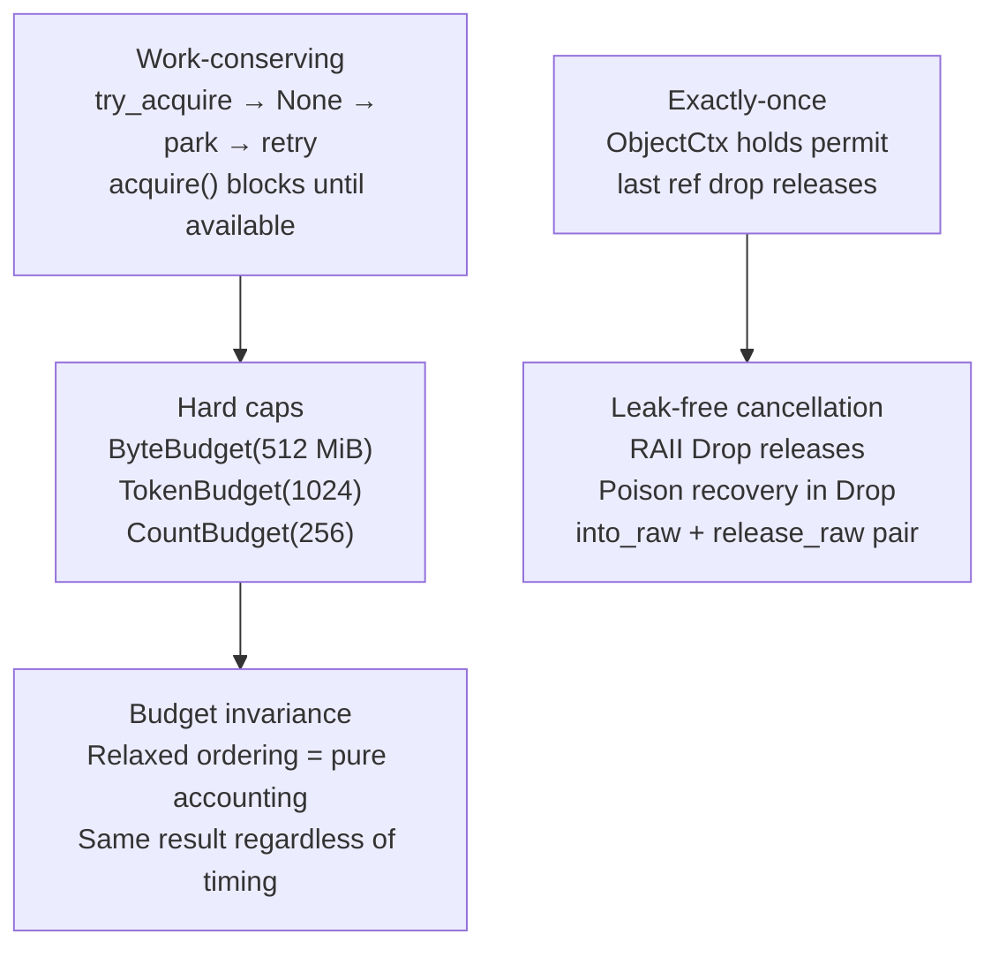

# "The Overflowing Pipeline" -- Budget and Backpressure

*Worker 3 acquires a 256 KiB buffer from the byte budget (512 MiB total, 487 MiB remaining) and begins reading a `.sql` dump. Worker 0 acquires another. Workers 1, 2, 4, 5, 6, and 7 each acquire one. Discovery has found 14,000 files, and the token budget allows 1,024 objects in flight. Buffers drain faster than scans complete. At tick 4,200, Worker 6 calls `try_acquire(262_144)` on the ByteBudget -- the remaining balance is 131,072 bytes. The CAS loop observes `cur < bytes` and returns `None`. Worker 6 parks. Worker 3 finishes scanning, and `BytePermit::drop` calls `fetch_add(262_144, Relaxed)`. Worker 6 is unparked, retries, and succeeds. No byte was dropped; no scan was skipped. But what if the permit had been moved to another thread and the `Drop` never ran? The 262,144 bytes would be permanently lost from the budget, and eventually every `try_acquire` returns `None` -- the scanner stalls silently with 100% of its memory budget "in flight" and zero active scans. This is the leak-free cancellation problem.*

---

The budget primitives are the scheduler's circulatory system. They enforce hard caps on memory and concurrency without blocking the hot path, and they guarantee that every acquired unit is eventually returned -- even across thread boundaries, even during panics, even when tasks are cancelled. This chapter examines the three budget types, their RAII permits, and the invariants that make backpressure correct.

The scheduler uses three distinct budget types because the three resource dimensions have different performance requirements. Memory accounting (bytes in flight) and task counting (tokens in flight) both run in the scan hot path at millions of operations per second -- they must be lock-free, using `AtomicU64` and `AtomicU32` with CAS loops respectively. Object counting (files in flight) runs at discovery speed, thousands per second, and uses a `Mutex + Condvar` for blocking acquisition. Choosing the wrong concurrency primitive for each dimension either wastes CPU (spinning on a mutex in the hot path) or adds complexity (CAS loops where a simple lock suffices).

## 1. ByteBudget -- Lock-Free Memory Accounting

`ByteBudget` tracks buffered bytes in flight. It uses a single `AtomicU64` with CAS-loop acquisition and unconditional `fetch_add` release. From `budget.rs`:

```rust
/// A non-blocking byte budget for backpressure.
///
/// Use this to enforce memory limits (e.g., max buffered bytes) without blocking.
/// The scheduler's idle strategy handles what to do when budget is exhausted.
///
/// ## Thread Safety
///
/// All operations are lock-free. Under contention, CAS failures trigger
/// `spin_loop()` to reduce interconnect pressure.
#[derive(Debug)]
pub struct ByteBudget {
    /// Total capacity (immutable after construction).
    total: u64,
    /// Available budget (cache-line isolated to prevent false sharing).
    avail: CacheLineU64,
}
```

**`avail` is cache-line aligned.** The `CacheLineU64` wrapper uses `#[repr(align(64))]` to prevent false sharing:

```rust
/// Cache-line aligned AtomicU64 to prevent false sharing.
///
/// When `ByteBudget` sits in a struct near other hot data, this ensures
/// writes to `avail` don't invalidate cache lines containing other fields.
#[repr(align(64))]
#[derive(Debug)]
struct CacheLineU64(AtomicU64);
```

Without this alignment, a worker updating `avail` would invalidate the cache line holding `total` on adjacent cores, causing false sharing. The 64-byte alignment guarantees each field lives on its own cache line.

The `ByteBudget` maintains the core invariant: `available + outstanding == total` at all times. "Outstanding" is the sum of all bytes held by live `BytePermit` instances plus any bytes transferred via `into_raw` but not yet returned via `release_raw`. This invariant is checked by the `debug_assert` in `release` and verified by concurrent stress tests.

### 1.1 Acquisition: CAS Loop with Fast Rejection

```rust
#[inline]
pub fn try_acquire(&self, bytes: u64) -> Option<BytePermit<'_>> {
    if bytes == 0 {
        return Some(BytePermit {
            budget: self,
            bytes: 0,
        });
    }

    // Fast rejection without CAS
    if bytes > self.total {
        return None;
    }

    let mut cur = self.avail.0.load(Ordering::Relaxed);
    loop {
        if cur < bytes {
            return None;
        }

        match self.avail.0.compare_exchange_weak(
            cur,
            cur - bytes,
            Ordering::Relaxed,
            Ordering::Relaxed,
        ) {
            Ok(_) => {
                return Some(BytePermit {
                    budget: self,
                    bytes,
                });
            }
            Err(observed) => {
                cur = observed;
                // Reduce interconnect pressure under contention
                spin_loop();
            }
        }
    }
}
```

**`Ordering::Relaxed` everywhere.** The module doc explains the rationale: the budget is pure accounting, not synchronization. Buffer contents visibility is enforced by the task/ownership system. Budget operations do not establish happens-before for other shared state. If budget were used to synchronize access to other data, that would be a design bug.

**`compare_exchange_weak` over `compare_exchange`.** On ARM, `compare_exchange` compiles to a `LDXR/STXR` loop that retries internally on spurious failures. Using `_weak` allows the compiler to emit a single attempt, letting the outer loop handle retries with a `spin_loop()` hint that reduces interconnect pressure.

### 1.2 Release: Unconditional fetch_add

```rust
#[inline]
fn release(&self, bytes: u64) {
    if bytes == 0 {
        return;
    }
    let prev = self.avail.0.fetch_add(bytes, Ordering::Relaxed);
    debug_assert!(
        prev.wrapping_add(bytes) <= self.total,
        "ByteBudget over-release: prev={} add={} total={}",
        prev,
        bytes,
        self.total
    );
}
```

Release is O(1) -- a single atomic `fetch_add`, no CAS loop needed. The `debug_assert` detects double-release bugs in development without adding overhead in release builds.

### 1.3 The RAII Permit

```rust
/// RAII permit for byte budgets.
///
/// Automatically releases the acquired bytes on drop.
#[derive(Debug)]
pub struct BytePermit<'a> {
    budget: &'a ByteBudget,
    bytes: u64,
}

impl Drop for BytePermit<'_> {
    #[inline]
    fn drop(&mut self) {
        self.budget.release(self.bytes);
    }
}
```

The permit is 16 bytes (pointer + amount) and is both `Send` and `Sync`. This means it can be moved to another thread for release -- critical for the scheduler where a buffer is acquired on a discovery thread and released on a worker thread.

### 1.4 Cross-Thread Handoff via into_raw

When a permit must cross an ownership boundary that does not fit RAII (for example, embedding the byte count in a task struct), `into_raw` detaches the amount from the `Drop` guard:

```rust
/// Consume the permit and return the byte count WITHOUT releasing.
///
/// Uses `mem::forget` to skip the `Drop` impl. This is sound because:
/// - `BytePermit` owns no heap allocations (just a reference + integer)
/// - The budget reference remains valid (lifetime bound to `'a`)
/// - The caller takes responsibility for calling `release_raw()` later
#[inline]
pub fn into_raw(self) -> u64 {
    let bytes = self.bytes;
    std::mem::forget(self);
    bytes
}
```

The caller later calls `budget.release_raw(amount)` to return the bytes. Leaking the permit does not cause undefined behavior -- only budget capacity exhaustion.

## 2. TokenBudget -- Discrete Resource Counting

`TokenBudget` mirrors `ByteBudget` but uses `AtomicU32` for counting discrete resources (objects, reads, tasks). From `budget.rs`:

```rust
/// A non-blocking token budget for counting discrete resources.
///
/// Similar to `ByteBudget` but uses `AtomicU32` for tokens (objects, reads, tasks).
#[derive(Debug)]
pub struct TokenBudget {
    /// Total capacity.
    total: u32,
    /// Available tokens (cache-line isolated).
    avail: CacheLineU32,
}
```

The CAS loop and RAII permit follow the same pattern. The module verifies permit sizes at compile time:

```rust
#[test]
fn permit_size_is_minimal() {
    // Verify permits are small (pointer + amount, no bool)
    assert_eq!(std::mem::size_of::<BytePermit>(), 16);
    assert_eq!(std::mem::size_of::<TokenPermit>(), 16);
}
```

## 3. CountBudget -- Blocking Permits for Discovery

`ByteBudget` and `TokenBudget` are non-blocking: callers receive `None` and must decide what to do. For the discovery thread, which is already I/O-bound on directory traversal, blocking is appropriate. `CountBudget` uses a `Mutex + Condvar` for this. From `count_budget.rs`:

```rust
/// Fixed-capacity, blocking token budget.
///
/// Use for "in-flight objects" / "queued work" caps where the producer thread
/// should block rather than spin when at capacity.
#[derive(Debug)]
pub struct CountBudget {
    /// Total capacity (immutable after construction).
    total: usize,
    /// Mutable state.
    state: Mutex<State>,
    /// Condition variable for blocking acquire.
    cv: Condvar,
}
```

### 3.1 Why Mutex + Condvar, Not Atomics

The module doc explains the design choice:

```text
- Discovery is already I/O-bound on directory traversal
- Simple, correct, no subtle memory ordering bugs
- Condvar provides efficient blocking (no spin-wait)
```

`CountBudget` is appropriate for file-level backpressure (thousands per second), NOT for chunk-level (millions per second). For chunk-level, the lock-free `ByteBudget` or `TsBufferPool` are used instead.

### 3.2 The Stranded Waiter Problem

`CountBudget::release` uses `notify_all()` instead of `notify_one()`. The code documents the exact scenario where `notify_one` deadlocks:

```rust
/// Use notify_all() to prevent "stranded waiter" deadlock.
///
/// Scenario with notify_one() + variable n:
///   - Waiter A needs 5, Waiter B needs 1, avail=0
///   - release(1) wakes A, A sees 1<5, re-waits
///   - B sleeps forever despite sufficient permits
///
/// notify_all() cost is negligible for file-level backpressure
/// (thousands/sec, not millions/sec).
self.cv.notify_all();
```

### 3.3 Permit Splitting

`CountPermit` supports splitting, which is used when a batch of permits must be distributed across sub-operations:

```rust
/// Split off `count` permits into a new permit.
///
/// This permit retains `self.n - count` permits.
/// Returns a new permit with `count` permits.
pub fn split(&mut self, count: usize) -> CountPermit {
    assert!(count > 0, "cannot split 0 permits");
    assert!(
        count <= self.n,
        "cannot split {} from permit with {} permits",
        count,
        self.n
    );
    assert!(self.active, "cannot split inactive permit");

    self.n -= count;
    CountPermit {
        budget: Arc::clone(&self.budget),
        n: count,
        active: true,
    }
}
```

### 3.4 Poison Recovery in Drop

The `CountBudget::release` path uses `lock_or_recover` instead of `lock().expect()`:

```rust
/// Lock state with poison recovery.
///
/// Used in Drop paths where we must not panic (risk of process abort).
/// If the mutex was poisoned by a prior panic, we recover the inner state
/// and continue - the alternative (panic in Drop) is worse.
#[inline]
fn lock_or_recover(&self) -> std::sync::MutexGuard<'_, State> {
    match self.state.lock() {
        Ok(guard) => guard,
        Err(poison) => {
            // Mutex was poisoned by a panic in another thread.
            // Recover the state - we still need to release permits.
            poison.into_inner()
        }
    }
}
```

Panicking in a `Drop` implementation during stack unwinding causes a process abort. The budget must release permits even if another thread panicked while holding the mutex.

## 4. The Five Invariants in Practice

The five invariants from [Chapter 1](01-scheduler-architecture.md) map directly to budget behavior:



**Work-conserving.** When `try_acquire` returns `None`, the worker does not drop the task. The tiered idle strategy (spin, yield, park) delays execution until budget becomes available. For `CountBudget`, the discovery thread blocks on `acquire()` and wakes when permits return.

**Exactly-once.** The `ObjectCtx` pattern (covered in [Chapter 4](04-runtime-and-chunks.md)) holds a `CountPermit` via `Arc`. The permit releases exactly when the last task referencing the object completes.

**Hard caps.** Every limit in `Limits` maps to a concrete budget instance. `in_flight_objects` becomes a `CountBudget`, `buffered_bytes` becomes a `ByteBudget`, and `queued_tasks` becomes a `TokenBudget`.

**Budget invariance.** Relaxed memory ordering ensures budget operations are pure arithmetic. Whether Worker 0 or Worker 7 completes first, the budget reaches the same state.

**Leak-free cancellation.** RAII permits release on drop, even during panics. `lock_or_recover` prevents process abort on poisoned mutexes. The `into_raw`/`release_raw` pair provides an explicit contract for cross-thread handoff.

## 5. Contention Considerations

The `ByteBudget` module doc addresses what to do when profiling shows contention:

```text
This implementation uses a single atomic per budget. Under high contention
(many workers hammering the same budget), this becomes a cache-line hotspot.

**If profiling shows budget contention**, consider:
1. **Sharded budget**: N atomics, acquire from preferred shard, steal if needed
2. **Local caching**: Per-worker cache with bulk refill/flush

We use the simple single-atomic design. Measure contention with
`perf c2c` or similar before adding complexity.
```

The cache-line alignment on `avail` prevents false sharing with adjacent fields, but under extreme contention (>16 workers all acquiring simultaneously), the single cache line becomes the bottleneck. The codebase documents both escalation paths without prematurely implementing them.

## 6. Concurrent Correctness

The budget tests verify the fundamental invariant: `available + outstanding == total` at all times. From `budget.rs`:

```rust
#[test]
fn concurrent_byte_budget_stress() {
    use std::sync::Arc;
    use std::thread;

    let budget = Arc::new(ByteBudget::new(1000));
    let iterations = 10_000;
    let threads = 4;

    let handles: Vec<_> = (0..threads)
        .map(|_| {
            let b = Arc::clone(&budget);
            thread::spawn(move || {
                for _ in 0..iterations {
                    // Try to acquire various amounts
                    if let Some(p) = b.try_acquire(10) {
                        std::hint::black_box(p.bytes());
                        // permit auto-releases on drop
                    }
                }
            })
        })
        .collect();

    for h in handles {
        h.join().expect("thread panicked");
    }

    // All permits should be released
    assert_eq!(budget.available(), 1000, "budget should be fully restored");
}
```

Four threads, 10,000 iterations each, acquiring and releasing 10 bytes at a time. The final assertion -- `available == 1000` -- proves that no bytes leaked during concurrent operation.

## What's Next

[Chapter 3](03-the-executor.md) builds on these budget primitives to construct the work-stealing executor: Chase-Lev deques, per-worker scratch space, deterministic RNG for steal victim selection, and the combined atomic state machine that eliminates the TOCTOU race between spawn and join.
