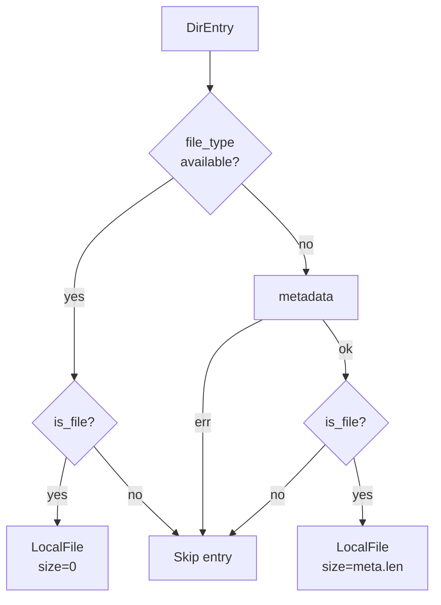
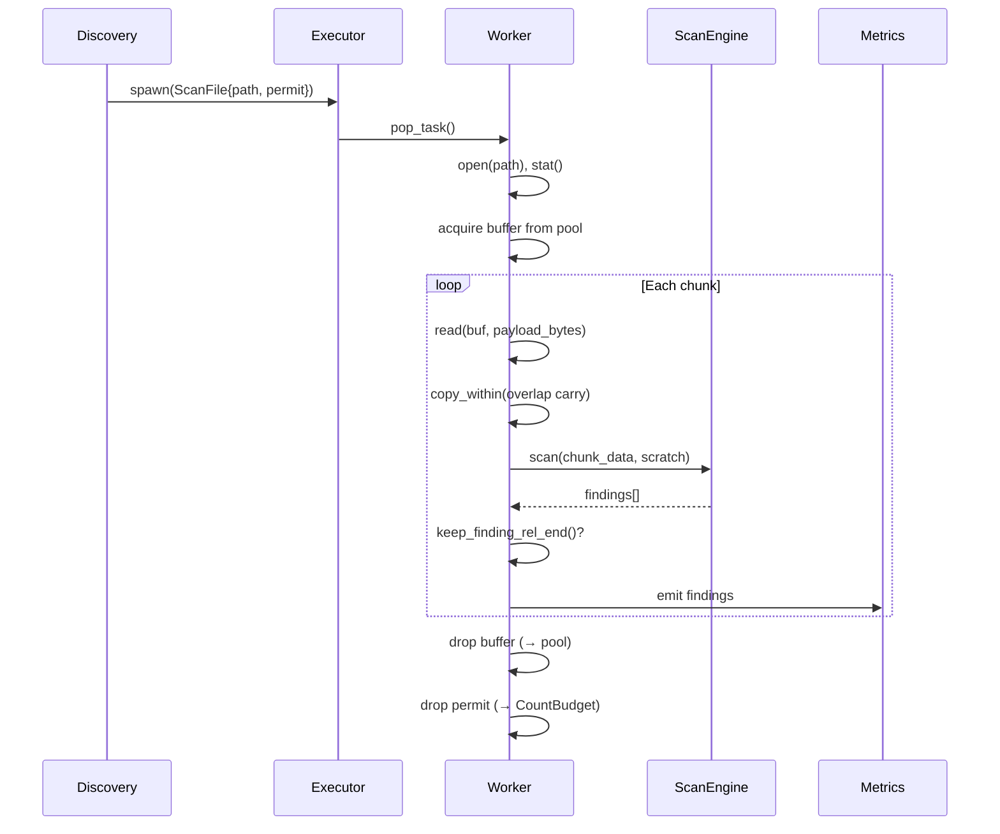

# "The Ignored Secret" -- Filesystem Scanning

*A security team runs a filesystem scan against `/srv/repos`, a directory containing 340,000 files across 12,000 subdirectories. The scanner walks the tree using a single-threaded directory iterator. At depth 4, it encounters a `.gitignore` file specifying `vendor/` and `*.log`. The walker correctly skips `vendor/credentials.json`. But the gitignore also contains a malformed pattern `!important-config.*` with a Unicode BOM prefix -- the pattern fails to parse, and the walker silently falls back to ignoring the negation. `important-config.env` is skipped, and the AWS credentials inside it are never scanned. Separately, a 47 MiB SQL dump at `/srv/repos/data/export.sql` is discovered. The scanner opens the file, obtains metadata showing `size = 49,283,072 bytes`, and begins chunked reading with 256 KiB payloads and 256 bytes of overlap. Worker 5 reads chunk 0 (bytes 0..262,400), scans it, then calls `copy_within` to carry the last 256 bytes forward as overlap. The next `read()` returns 262,144 bytes into the remainder of the buffer. After 188 chunks, the file is fully scanned with zero seeks and zero re-reads of overlap bytes. Without the overlap carry pattern, each chunk would require a seek backward by 256 bytes -- 188 additional syscalls for a single file, multiplied across 340,000 files.*

---

The local filesystem scanner is the primary I/O backend for the scheduler. It combines gitignore-aware directory walking with the work-stealing executor, chunked I/O with overlap carry, and backpressure from `CountBudget` to bound discovery depth. This chapter follows a file from discovery through reading to scan completion.

## 1. ParallelScanConfig

The high-level entry point is `parallel_scan_dir`, which wraps the lower-level `scan_local` with directory walking and sensible defaults. From `parallel_scan.rs`:

```rust
/// Configuration for parallel directory scanning.
///
/// # Defaults
///
/// | Parameter | Default | Rationale |
/// |-----------|---------|-----------|
/// | `workers` | `num_cpus::get()` | Match hardware parallelism |
/// | `chunk_size` | 256 KiB | Balance syscall overhead vs memory |
/// | `pool_buffers` | 4 × workers | Avoid buffer starvation under load |
/// | `max_in_flight_objects` | 1024 | Bound discovery queue memory |
/// | `max_file_size` | 100 MiB | Skip large binaries that rarely contain secrets |
```

The peak memory equation is straightforward: `pool_buffers * (chunk_size + overlap)`. With defaults (8 workers, 32 buffers, 256 KiB chunks, 256 bytes overlap): 32 * 262,400 = ~8 MiB. The memory bound is deterministic and controllable.

## 2. LocalConfig -- The Backend Configuration

`LocalConfig` controls the scanning backend. From `local_fs_owner.rs`:

```rust
/// Configuration for local filesystem scanning.
#[derive(Clone)]
pub struct LocalConfig {
    /// Number of CPU worker threads.
    pub workers: usize,
    /// Payload bytes per chunk (excluding overlap).
    pub chunk_size: usize,
    /// Total buffers in the pool.
    pub pool_buffers: usize,
    /// Per-worker local queue capacity in buffer pool.
    pub local_queue_cap: usize,
    /// Max discovered-but-not-complete files.
    pub max_in_flight_objects: usize,
    /// Maximum file size in bytes to scan.
    pub max_file_size: u64,
    /// Seed for deterministic executor behavior.
    pub seed: u64,
    /// Pin worker threads to CPU cores (Linux only, no-op elsewhere).
    pub pin_threads: bool,
    /// If true, deduplicate findings within each chunk.
    pub dedupe_within_chunk: bool,
    /// Archive scanning configuration.
    pub archive: ArchiveConfig,
    /// When `true`, skip files that appear to be binary (NUL byte heuristic).
    pub skip_binary: bool,
    /// Structured event sink for finding output.
    pub event_sink: Arc<dyn crate::events::EventOutput>,
    /// Optional persistence producer for post-dedupe FS finding batches.
    pub store_producer: Option<Arc<dyn StoreProducer>>,
}
```

**`max_file_size` is enforced at open time**, not discovery time. Discovery avoids per-file metadata when a `file_type()` hint is available from the directory entry. The size check happens after `open()`, using the snapshot from `metadata().len()`. This gives consistent point-in-time semantics -- the file size at the moment it was opened, not when it was discovered.

## 3. Gitignore-Aware Directory Walking

The directory walker uses the `ignore` crate, which provides gitignore-compatible pattern matching. From `parallel_scan.rs`:

```rust
/// Classify a directory entry into a `LocalFile`, if eligible.
///
/// The algorithm uses `file_type()` as a fast hint when available, but must
/// fall back to `metadata()` if the hint is missing.
#[inline(always)]
fn local_file_from_entry<E: EntryLike>(entry: E) -> Option<LocalFile> {
    if let Some(ft) = entry.file_type() {
        if !ft.is_file() {
            return None;
        }
        return Some(LocalFile {
            path: entry.into_path(),
            size: 0,
        });
    }

    let meta = match entry.metadata() {
        Ok(meta) => meta,
        Err(_e) => {
            #[cfg(debug_assertions)]
            eprintln!("[IterWalker] Metadata error for {:?}: {}", entry.path(), _e);
            return None;
        }
    };

    if !meta.file_type().is_file() {
        return None;
    }

    Some(LocalFile {
        path: entry.into_path(),
        size: meta.len(),
    })
}
```

The two-tier approach -- fast type hint first, metadata fallback second -- avoids a `stat()` syscall per file on platforms that provide type information in directory entries (Linux with `d_type`, macOS). The fallback ensures correctness on platforms that do not.



## 4. The Overlap Carry I/O Pattern

The local scanner acquires ONE buffer per file and carries overlap bytes forward using `copy_within`. From the module doc in `local_fs_owner.rs`:

```text
# I/O Pattern: Overlap Carry

Instead of seeking back for each chunk's overlap:
1. Acquire ONE buffer per file (panics if exhausted; `CountBudget` prevents this)
2. Read sequentially, carry overlap bytes forward via `copy_within`
3. Eliminates: seeks, re-reading overlap from kernel, per-chunk pool churn

Iteration 1:                    Iteration 2:
┌─────────────────────────┐     ┌─────────────────────────┐
│      payload bytes      │     │overlap│  new payload    │
│      (from read)        │     │(copy) │  (from read)    │
└─────────────────────────┘     └─────────────────────────┘
                          │            ▲
                          └────────────┘
                        copy_within(tail → head)
```

The buffer is acquired at file-open time. The `CountBudget` (recall from [Chapter 2](02-budget-and-backpressure.md)) limits the number of discovered-but-not-complete files, ensuring the buffer pool is never exhausted. If it were, the `acquire()` call would panic -- indicating a mismatch between the token budget and the buffer pool sizing.

## 5. Why Blocking Reads First

The module doc explains the decision to start with blocking reads:

```text
# Why Blocking Reads First?

1. **Strong baseline**: Kernel page cache is highly optimized; often hits memory
2. **Minimal complexity**: No async runtime, no completion queues
3. **Measureable**: Establish baseline before adding io_uring complexity
```

| Workload | Expected Behavior |
|----------|-------------------|
| Hot cache (small files) | CPU-bound, near memory bandwidth |
| Cold cache (SSD) | I/O-bound, ~3-5 GB/s with good SSD |
| Cold cache (HDD) | I/O-bound, ~150-200 MB/s sequential |

For page-cache-hot workloads, blocking reads are competitive with io_uring. The io_uring backend (Chapter 5, continued) exists for cold-cache scenarios where workers show significant idle time in `read` syscalls.

## 6. Discovery Backpressure

The scan loop uses `CountBudget` to bound discovery depth. The discovery thread blocks when the in-flight object count reaches the configured maximum:

```rust
/// Blocking Token Budget for In-Flight Object Caps
///
/// Provides backpressure at discovery/scheduling time by limiting
/// the number of in-flight objects. When the cap is reached, the
/// discovery thread blocks until permits are released.
///
/// # Usage
///
/// ```ignore
/// let budget = CountBudget::new(256); // max 256 in-flight files
///
/// // Discovery thread
/// for path in walk_files(root) {
///     let permit = budget.acquire(1); // blocks if at capacity
///     executor.spawn(ScanTask { path, _permit: permit });
/// }
///
/// // Worker thread (permit drops when task completes)
/// fn scan_task(task: ScanTask, ctx: &mut WorkerCtx) {
///     // ... scan file ...
///     // task._permit drops here, releasing the permit
/// }
/// ```
```

This creates a natural feedback loop: when workers are slower than discovery (large files, archive expansion), the discovery thread blocks. When workers are faster (small files in cache), the discovery thread runs at full speed. No tuning is needed -- the `CountBudget` capacity is the only knob.

## 7. The Scan Pipeline

Each file passes through a common pipeline shared by all I/O backends. From `shared_core` (referenced in `mod.rs`):

```text
scan → prefix-prune → dedupe → metrics
```



The overlap carry means only one buffer is active per file. The buffer returns to the pool when the `TsBufferHandle` drops. The `CountPermit` returns to the `CountBudget` when the task completes. Both releases happen automatically via RAII.

## 8. The io_uring Backend

On Linux, an alternative backend uses io_uring for async I/O. From the module doc:

```text
# When to Consider io_uring

Profile first. If workers show significant idle time waiting on reads
(visible in `perf` as time in `read` syscall), io_uring may help.
For page-cache-hot workloads, blocking reads are competitive.
```

The `local_fs_uring` module provides the same correctness guarantees as the blocking path -- the same overlap carry pattern, the same deduplication predicate, the same buffer pool -- but submits I/O operations to a kernel completion queue instead of blocking on `read()`. The executor continues executing scan tasks on other files while waiting for I/O completion.

The backend is conditionally compiled:

```rust
#[cfg(target_os = "linux")]
pub mod local_fs_uring;
```

## 9. Correctness Invariants for Filesystem Scanning

The `local_fs_owner` module doc enumerates the invariants specific to filesystem scanning:

```text
- **Work-conserving**: Every discovered file is scanned (CountBudget backpressure
  ensures buffer availability)
- **Chunk overlap**: `engine.required_overlap()` bytes overlap between chunks
- **Budget bounded**: `max_in_flight_objects` limits discovered-but-not-complete files
- **Buffer bounded**: `pool_buffers` limits peak memory
- **Snapshot semantics**: File size taken at open time (consistent point-in-time)
```

**Snapshot semantics** deserve emphasis. A file that grows between discovery and reading gets the size at open time. A file that shrinks returns fewer bytes than expected -- the `read` call returns less data, and the chunk iterator terminates naturally when `offset >= obj_len`. No race condition leads to undefined behavior.

The `parallel_scan` module adds:

```text
- **Fail-soft**: I/O errors on individual files don't abort the scan
```

A permission error on one file increments the `open_errors` counter and continues scanning the next file. The scan completes with an accurate error count rather than aborting halfway through.

## What's Next

[Chapter 6](06-archive-handling.md) examines archive expansion: how the scheduler detects archive formats from filename extensions and magic bytes, applies depth/entry/byte limits to prevent zip bombs, and scans nested archive entries using streaming decoders with deterministic budget enforcement.
