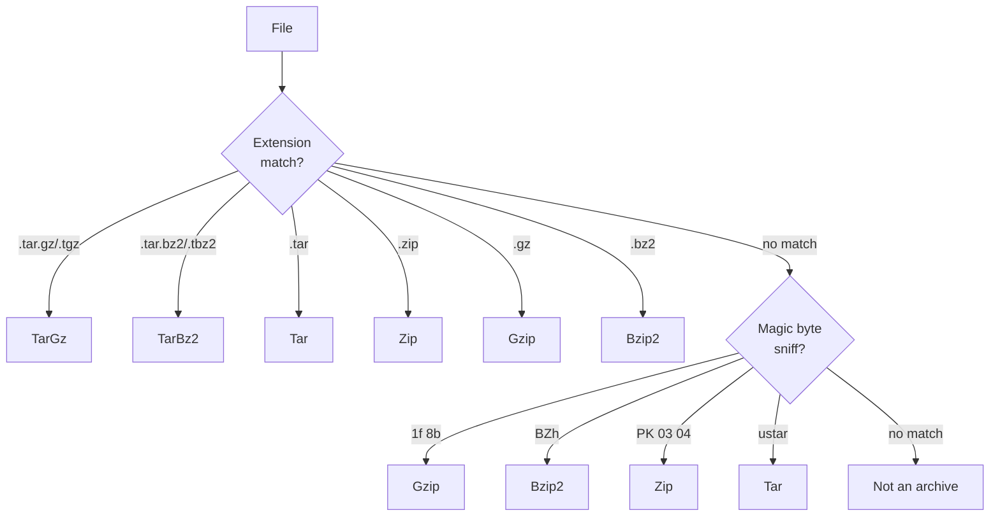
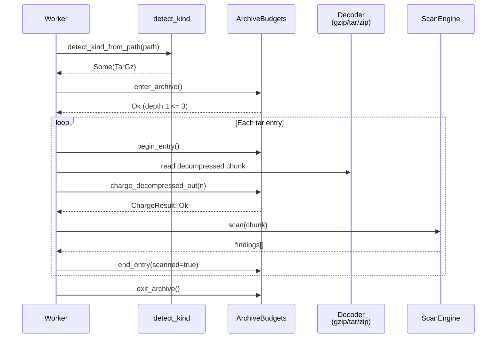

# "The Zip Bomb" -- Archive Handling

*A file named `report.tar.gz` weighs 42 KiB on disk. Worker 4 detects the `.tar.gz` extension and begins streaming decompression. The gzip layer inflates to a tar stream. The first tar entry is `data/export.csv`, claiming an uncompressed size of 4.2 GiB -- a 100,000:1 inflation ratio. Without limits, the scanner allocates 4.2 GiB of heap for a single entry while other workers compete for the remaining memory budget. But the `ArchiveBudgets` tracker is active. It charges 64 MiB against the per-entry budget (`max_uncompressed_bytes_per_entry = 67,108,864`), then returns `ChargeResult::Clamp { allowed: 0, hit: BudgetHit::SkipEntry(ByteLimitExceeded) }`. Worker 4 closes the entry, increments the `entries_skipped` counter, and advances to the next tar header. Entry 2 is a 12 KiB configuration file with an API key on line 7. It scans normally. Entry 3 is another nested archive: `inner.zip` at depth 2. The budget tracker pushes a new frame onto the stack. At depth 3, a third-level `secrets.tar` would exceed `max_archive_depth = 3`. The budget returns `BudgetHit::SkipArchive(DepthExceeded)`. The nested archive is skipped, but the remaining entries in `inner.zip` continue scanning. Without these layered budgets, a single crafted archive exhausts all available memory or CPU time.*

---

Archives are hostile input. Every size, path, and entry count declared in archive metadata is untrusted. The archive handling subsystem applies layered resource caps -- per-entry, per-archive, per-root -- to bound memory, CPU, and nesting depth while still scanning all legitimate content.

## 1. ArchiveKind -- Format Detection

The `detect.rs` module maps filenames and magic bytes to `ArchiveKind`. From `detect.rs`:

```rust
/// Archive container kind.
///
/// | Kind   | Entries     | Access pattern           |
/// |--------|-------------|--------------------------|
/// | `Tar`  | many        | sequential (512-B blocks)|
/// | `Zip`  | many        | random-access via EOCD   |
/// | `TarGz`| many (chain)| sequential gzip → tar    |
/// | `TarBz2`| many (chain)| sequential bzip2 → tar  |
/// | `Gzip` | one         | sequential decompression |
/// | `Bzip2`| one         | sequential decompression |
#[repr(u8)]
#[derive(Clone, Copy, Debug, PartialEq, Eq, Hash)]
pub enum ArchiveKind {
    Gzip = 0,
    Tar = 1,
    Zip = 2,
    TarGz = 3,
    Bzip2 = 4,
    TarBz2 = 5,
}

impl ArchiveKind {
    /// Returns `true` for kinds that contain multiple named entries.
    #[inline(always)]
    pub const fn is_container(self) -> bool {
        matches!(
            self,
            ArchiveKind::Tar | ArchiveKind::Zip | ArchiveKind::TarGz | ArchiveKind::TarBz2
        )
    }
}
```

The detection algorithm uses a two-phase approach:

1. **Extension-based detection** (no I/O, no allocation): pure byte-suffix matching with `| 0x20` for ASCII case-folding
2. **Magic-byte sniffing** (fallback): examines the first bytes of the file content

Extension detection has strict precedence over magic sniffing. This is the only way to distinguish `.tar.gz` from plain `.gz` -- both start with the `1f 8b` gzip magic bytes, but `.tar.gz` requires gzip decompression followed by tar iteration.



## 2. ArchiveConfig -- Layered Resource Limits

`ArchiveConfig` defines every resource cap applied during archive expansion. From `config.rs`:

```rust
/// Shared archive scanning configuration (pipeline + scheduler).
///
/// All limits are hard bounds. Archive code must treat archive metadata and
/// payload as hostile: sizes, counts, paths, and offsets are untrusted.
#[derive(Clone, Debug, Serialize, Deserialize)]
pub struct ArchiveConfig {
    /// Master enable switch.
    pub enabled: bool,
    /// Maximum nested archive depth (e.g. zip-inside-tar-inside-gz).
    pub max_archive_depth: u8,
    /// Maximum number of entries processed per archive container.
    pub max_entries_per_archive: u32,
    /// Maximum decompressed bytes scanned for a single entry.
    pub max_uncompressed_bytes_per_entry: u64,
    /// Maximum total decompressed bytes per archive container.
    pub max_total_uncompressed_bytes_per_archive: u64,
    /// Maximum total decompressed bytes across all archives per root file.
    pub max_total_uncompressed_bytes_per_root: u64,
    /// Maximum bytes of archive metadata parsed per container.
    pub max_archive_metadata_bytes: u64,
    /// Maximum tolerated inflation ratio (decompressed / compressed).
    pub max_inflation_ratio: u32,
    /// Maximum display-path length for a single canonicalized entry.
    pub max_virtual_path_len_per_entry: usize,
    /// Maximum total virtual path bytes per archive container.
    pub max_virtual_path_bytes_per_archive: usize,
    /// Optional wall-clock deadline (seconds) per root-level scan.
    pub max_wall_clock_secs_per_root: Option<u64>,
    /// Policy for encrypted content.
    pub encrypted_policy: EncryptedPolicy,
    /// Policy for unsupported content.
    pub unsupported_policy: UnsupportedPolicy,
}
```

Limits form a strict hierarchy:

```text
Root  (max_total_uncompressed_bytes_per_root)
 └─ Archive  (max_total_uncompressed_bytes_per_archive)
     └─ Entry  (max_uncompressed_bytes_per_entry)
```

The `validate` method enforces nesting order: `entry <= archive <= root`. Violating this ordering is a configuration bug, not a runtime error:

```rust
if self.max_total_uncompressed_bytes_per_archive < self.max_uncompressed_bytes_per_entry {
    return Err(ArchiveConfigError::ArchiveBytesCapTooSmall {
        per_entry: self.max_uncompressed_bytes_per_entry,
        per_archive: self.max_total_uncompressed_bytes_per_archive,
    });
}
if self.max_total_uncompressed_bytes_per_root
    < self.max_total_uncompressed_bytes_per_archive
{
    return Err(ArchiveConfigError::RootBytesCapTooSmall {
        per_archive: self.max_total_uncompressed_bytes_per_archive,
        per_root: self.max_total_uncompressed_bytes_per_root,
    });
}
```

### 2.1 Safety-First Defaults

```rust
impl Default for ArchiveConfig {
    fn default() -> Self {
        Self {
            enabled: true,
            max_archive_depth: 3,
            max_entries_per_archive: 4096,
            max_uncompressed_bytes_per_entry: 64 * 1024 * 1024, // 64 MiB
            max_total_uncompressed_bytes_per_archive: 256 * 1024 * 1024, // 256 MiB
            max_total_uncompressed_bytes_per_root: 512 * 1024 * 1024, // 512 MiB
            max_archive_metadata_bytes: 16 * 1024 * 1024, // 16 MiB
            max_inflation_ratio: 128,
            max_virtual_path_len_per_entry: 1024,
            max_virtual_path_bytes_per_archive: 1024 * 1024, // 1 MiB
            max_wall_clock_secs_per_root: None,
            encrypted_policy: EncryptedPolicy::SkipWithTelemetry,
            unsupported_policy: UnsupportedPolicy::SkipWithTelemetry,
        }
    }
}
```

**Depth 3** covers common nesting (`.tar.gz` containing a `.zip`) while blocking adversarial depth. **128x inflation ratio** accommodates high-compression formats while catching classic zip bombs. **No wall-clock deadline by default** keeps the system fully deterministic; production deployments opt in explicitly.

## 3. ArchiveBudgets -- Deterministic Enforcement

`ArchiveBudgets` is the runtime tracker that enforces limits during scanning. From `budget.rs`:

```rust
/// Deterministic budget tracker for nested archive scanning.
///
/// Holds immutable caps (copied from [`ArchiveConfig`] at construction) and
/// mutable counters that advance as bytes flow through the scanner.
#[derive(Clone, Debug)]
pub struct ArchiveBudgets {
    // -- Immutable caps ---
    max_depth: u8,
    max_entries_per_archive: u32,
    max_uncompressed_bytes_per_entry: u64,
    max_total_uncompressed_bytes_per_archive: u64,
    max_total_uncompressed_bytes_per_root: u64,
    max_archive_metadata_bytes: u64,
    max_inflation_ratio: u32,

    // -- Optional wall-clock deadline ---
    max_wall_clock_secs: Option<u64>,
    deadline: Option<Instant>,

    // -- Mutable root-level counter ---
    root_decompressed_out: u64,

    // -- Frame stack (one slot per nesting level, preallocated) ---
    frames: Box<[ArchiveFrame]>,
    depth: usize,
}
```

The frame stack is preallocated to `max_archive_depth` and never grows after startup. No `Vec::push` or `Vec::pop` on hot paths. The caller protocol is documented:

```text
new(cfg) / reset()
  enter_archive()          ← push a frame, enforce depth cap
    note_entry() / begin_entry()   ← count + optionally open entry scope
      charge_metadata(n)
      charge_compressed_in(n)
      charge_decompressed_out(n) / charge_discarded_out(n)
    end_entry(scanned)     ← close entry scope
  exit_archive()           ← pop frame
```

### 3.1 BudgetHit -- Graduated Response

Budget violations produce graduated responses. From `budget.rs`:

```rust
/// Classification of a budget limit hit.
///
/// Variants are ordered by increasing blast radius:
///
/// | Variant          | Scope affected                                  |
/// |------------------|-------------------------------------------------|
/// | `SkipEntry`      | Current entry only; archive continues.          |
/// | `SkipArchive`    | Entire archive discarded (no progress yet).     |
/// | `PartialArchive` | Archive stops; bytes already scanned are kept.  |
/// | `StopRoot`       | All remaining archives under this root stop.    |
#[derive(Clone, Copy, Debug, PartialEq, Eq)]
pub enum BudgetHit {
    SkipEntry(EntrySkipReason),
    SkipArchive(ArchiveSkipReason),
    PartialArchive(PartialReason),
    StopRoot(PartialReason),
}
```

The `ChargeResult` communicates partial progress:

```rust
/// Result of charging a quantity where partial progress is meaningful (bytes).
#[derive(Clone, Copy, Debug, PartialEq, Eq)]
pub enum ChargeResult {
    /// Full requested amount is within budget and was charged.
    Ok,
    /// Only `allowed` bytes (possibly zero) were charged.
    Clamp { allowed: u64, hit: BudgetHit },
}
```

When a charge exceeds the remaining budget, `Clamp` tells the caller exactly how many bytes it may still process. The charged amount has already been debited -- the caller must not re-charge.

### 3.2 Inflation Ratio Defense

Inflation ratio enforcement prevents classic zip bombs:

```text
Inflation-ratio enforcement runs at both archive and entry scopes:
`archive_out <= archive_in * R` and, while an entry scope is open,
`entry_out <= entry_in * R`.  Per-entry ratio tracking is independent of
archive-level ratio credit, preventing a credit-accumulation attack where
many small well-compressed entries build up archive-level headroom that a
single malicious entry later exploits.
```

This defense is documented directly in the `budget.rs` module doc. A crafted archive with 1,000 well-compressed small entries would accumulate enough archive-level credit to decompress a massive final entry. Per-entry ratio tracking eliminates this attack vector.

## 4. Policy Enums -- Escalation Ladders

Encrypted and unsupported content use escalation ladders. From `config.rs`:

```rust
/// Policy for how to treat encrypted archives or encrypted entries.
///
/// Variants form an escalation ladder from least to most disruptive.
#[repr(u8)]
#[derive(Clone, Copy, Debug, PartialEq, Eq, Hash, Default, Serialize, Deserialize)]
pub enum EncryptedPolicy {
    /// Skip encrypted content and increment telemetry counters.
    #[default]
    SkipWithTelemetry = 0,
    /// Treat the current archive as failed and continue scanning other roots.
    FailArchive = 1,
    /// Abort the entire scan.
    FailRun = 2,
}
```

The default (`SkipWithTelemetry`) silently skips encrypted content, which is the safest choice when the scanner cannot decrypt. Operators who require full coverage can escalate to `FailArchive` or `FailRun` to surface encryption as an error rather than a coverage gap.

## 5. The Scanning Pipeline for Archives



The archive budget is checked at every decompression step. If any charge returns `Clamp`, the entry or archive is closed according to the `BudgetHit` classification. Findings from previously scanned entries are preserved -- only future entries are affected.

## 6. Wall-Clock Deadline

The optional wall-clock deadline provides CPU-exhaustion defense:

```rust
/// Optional wall-clock deadline (seconds) per root-level archive scan.
///
/// When set, each `reset()` call arms an `Instant`-based deadline in
/// [`ArchiveBudgets`]. Nested archives share the root's deadline.
///
/// `None` disables the deadline entirely -- no `Instant` is created and
/// budget tracking remains fully deterministic.
pub max_wall_clock_secs_per_root: Option<u64>,
```

The deadline is bounded to prevent `Instant::now().checked_add()` from returning `None`:

```rust
/// Maximum allowed value for `max_wall_clock_secs_per_root` (24 hours).
///
/// Values beyond this are almost certainly configuration errors. More
/// importantly, very large values can cause `Instant::now().checked_add()`
/// to return `None`, silently disabling the deadline.
pub const MAX_WALL_CLOCK_SECS_PER_ROOT: u64 = 86_400;
```

The deadline is the only source of non-determinism in the budget system. All byte and count accounting is deterministic and reproducible regardless of wall-clock time.

## 7. Validation Errors

Configuration validation is comprehensive. From `config.rs`:

```rust
#[derive(Clone, Debug, PartialEq, Eq)]
pub enum ArchiveConfigError {
    MaxArchiveDepthZero,
    MaxEntriesPerArchiveZero,
    MaxUncompressedBytesPerEntryZero,
    MaxTotalUncompressedBytesPerArchiveZero,
    MaxTotalUncompressedBytesPerRootZero,
    ArchiveBytesCapTooSmall { per_entry: u64, per_archive: u64 },
    RootBytesCapTooSmall { per_archive: u64, per_root: u64 },
    MaxArchiveMetadataBytesZero,
    MaxInflationRatioZero,
    MaxVirtualPathLenPerEntryZero,
    MaxVirtualPathBytesPerArchiveZero,
    PathBudgetTooSmall { per_entry: usize, per_archive: usize },
    MaxWallClockSecsPerRootZero,
    MaxWallClockSecsPerRootTooLarge { value: u64, max: u64 },
}
```

Each variant corresponds to a violated invariant. Validation runs even when `enabled == false` so configs can be tested without toggling the feature flag.

## What's Next

[Chapter 7](07-events-and-persistence.md) covers the event system and persistence layer: how findings flow from the scan engine through `CoreEvent` to structured output sinks, and how the `StoreProducer` trait enables pluggable finding persistence with loss accounting.
