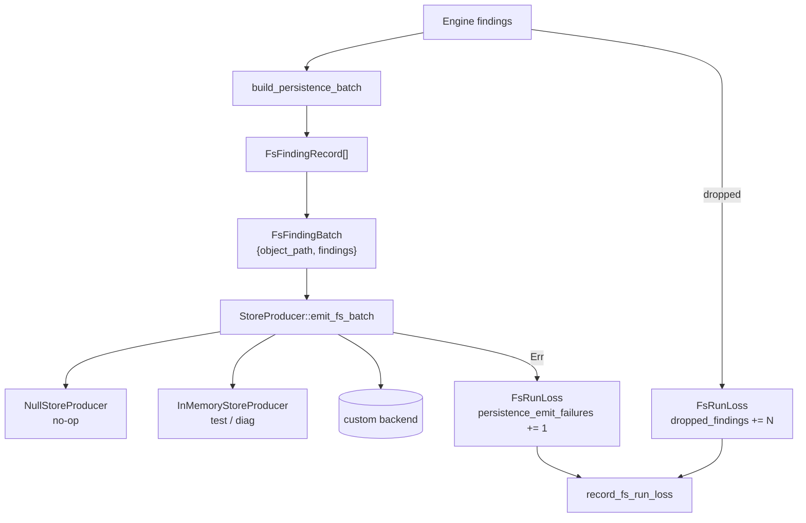

# "The Silent Drop" -- Events and Persistence

*A filesystem scan completes after 47 seconds. The executor ran 340,000 file-scan tasks across 8 workers. Worker 2 emitted 14 findings via the event sink. Worker 6 emitted 3. The `StoreProducer` backend wrote 15 of the 17 finding batches to the database. Batch 9, containing two findings for `config/secrets.yaml`, failed with a transient SQLite `SQLITE_BUSY` error. The `emit_fs_batch` call returned `Err(FsStoreError::backend("database is locked"))`. The scheduler incremented `persistence_emit_failures` to 1 and continued scanning. At run end, `record_fs_run_loss` was called with `FsRunLoss { dropped_findings: 0, persistence_emit_failures: 1 }`. The backend marked the run as incomplete. A retry scan later recovered the two findings. Without the loss accounting, the two missing findings would have been invisible -- the scan would appear complete, and the secrets in `config/secrets.yaml` would pass through the pipeline undetected. This is the silent drop problem: when persistence failures are swallowed, scan coverage becomes a lie.*

---

The event system connects the scan engine to the outside world. Every finding, progress update, and diagnostic passes through a structured event surface that separates git-specific payloads from the core scanner output. The persistence layer provides a pluggable write-side API with explicit loss accounting so that no failure is ever silent.

## 1. CoreEvent -- The Event Taxonomy

The event surface is split into git-free core events and git-specific events. From `events.rs`:

```rust
pub enum CoreEvent<'a> {
    /// Finding emitted from a scanned object.
    Finding(FindingEvent<'a>),
    /// Periodic progress signal for long-running scans.
    Progress(ProgressEvent),
    /// End-of-scan summary.
    Summary(SummaryEvent),
    /// Diagnostic message from scan/runtime plumbing.
    Diagnostic(DiagnosticEvent<'a>),
}
```

The `'a` lifetime ties event data to scratch buffers, allowing zero-copy event emission from the scan loop without heap allocation.

### 1.1 FindingEvent

```rust
/// Structured finding payload written by scheduler event sinks.
pub struct FindingEvent<'a> {
    pub source: SourceKind,
    pub object_path: &'a [u8],
    pub start: u64,
    pub end: u64,
    pub rule_id: u32,
    pub rule_name: &'a str,
    pub commit_id: Option<u32>,
    pub change_kind: Option<&'a str>,
    pub confidence_score: i8,
}
```

**`object_path` is `&[u8]`, not `&str`.** Filesystem paths can contain invalid UTF-8 on Unix. Encoding the path as raw bytes preserves all valid path values without lossy conversion. The event sink handles any necessary escaping for its output format.

**`confidence_score` is `i8`.** The Phase 1 range is 0-10. Using `i8` allows future expansion to negative scores (for anti-patterns that decrease confidence) without changing the type.

### 1.2 ProgressEvent and SummaryEvent

```rust
/// Scheduler progress counters.
pub struct ProgressEvent {
    pub source: SourceKind,
    pub stage: &'static str,
    pub objects_scanned: u64,
    pub bytes_scanned: u64,
    pub findings_emitted: u64,
}

/// End-of-run summary counters.
pub struct SummaryEvent {
    pub source: SourceKind,
    pub status: &'static str,
    pub elapsed_ms: u64,
    pub bytes_scanned: u64,
    pub findings_emitted: u64,
    pub errors: u64,
    pub throughput_mib_s: f64,
}
```

Progress events are periodic signals for long-running scans. Summary events fire once at run end with aggregated counters including throughput.

## 2. EventOutput Trait -- The Sink Interface

```rust
/// Git-free event sink surface used by scheduler scan paths.
///
/// `emit_core` must preserve event ordering as observed by callers.
pub trait EventOutput: Send + Sync {
    fn emit_core(&self, event: CoreEvent<'_>);
    fn flush(&self);
}

/// Git-specific extension surface layered on top of [`EventOutput`].
pub trait GitEventOutput: EventOutput {
    fn emit_git(&self, event: GitEvent<'_>);
}
```

The trait is object-safe (`dyn EventOutput`) and requires `Send + Sync` because workers call `emit_core` from multiple threads. Two implementations are provided:

```rust
#[derive(Default)]
pub struct NullEventOutput;

impl EventOutput for NullEventOutput {
    #[inline]
    fn emit_core(&self, _event: CoreEvent<'_>) {}
    #[inline]
    fn flush(&self) {}
}
```

`NullEventOutput` discards all events -- used in benchmarks and tests where event output is not under test.

```rust
#[derive(Default)]
pub struct VecEventOutput {
    encoded: Mutex<Vec<u8>>,
}
```

`VecEventOutput` accumulates JSON-encoded events in memory, protected by a `Mutex`. The `take()` method drains accumulated output for assertion in tests.

## 3. GitEvent -- The Extension Surface

```rust
pub enum GitEvent<'a> {
    /// Per-commit metadata for git scans.
    CommitMeta(CommitMetaEvent<'a>),
    /// Dictionary entries used by git identity interning.
    IdentityDictionary(IdentityDictionaryEvent<'a>),
}
```

Git events carry commit metadata and interned identity dictionaries. These are only emitted by git-aware scan paths (covered in [section 11, scanner-git](../11-scanner-git/)). The separation ensures that filesystem and connector scan paths depend only on `EventOutput`, not `GitEventOutput`.

> **Disambiguation**: The `CommitMetaEvent` shown here (from `scanner-scheduler/src/events.rs`) is the *output-facing* event type, carrying borrowed string slices (`commit_id: &[u8]`, `author: &str`, `committer: &str`) for JSON serialization. The `scanner-git` crate has a separate `CommitMetaEvent` (from `scanner-git/src/events.rs`) used for *internal coordination*, with different fields (`commit_id: u32`, `commit_oid: OidBytes`, `timestamp: u64`, `identity: Option<CommitIdentityIds>`). The scanner runtime's `CoordinationEventSink` consumes the scanner-git version, while the CLI event output path uses the scheduler version shown here.

## 4. StoreProducer -- Persistence Interface

The `StoreProducer` trait defines the write-side API for finding persistence. From `store.rs`:

```rust
/// Producer interface for FS finding persistence.
///
/// Implementations must be `Send + Sync` because the scheduler calls
/// `emit_fs_batch` from worker threads.
///
/// # Contract
///
/// - `emit_fs_batch` is called zero or more times during a scan, once per
///   scanned object that produced findings.
/// - `record_fs_run_loss` is called exactly once at the end of a scan run.
/// - `end_run` is called once after `record_fs_run_loss` to finalize the run.
/// - Errors from `emit_fs_batch` and `record_fs_run_loss` do **not** abort the scan.
pub trait StoreProducer: Send + Sync + 'static {
    /// Emit one post-dedupe finding batch for a single scanned object.
    fn emit_fs_batch(&self, batch: FsFindingBatch<'_>) -> Result<(), FsStoreError>;

    /// Record run-level loss accounting once per run.
    fn record_fs_run_loss(&self, loss: FsRunLoss) -> Result<(), FsStoreError>;

    /// Finalize the run after all findings and loss records have been emitted.
    fn end_run(&self, _had_coverage_limits: bool) -> Result<(), FsStoreError> {
        Ok(())
    }
}
```

The trait is `'static` and object-safe, allowing `Arc<dyn StoreProducer>` in scheduler configs. The `emit_fs_batch` method borrows data from scratch buffers -- implementations must copy or serialize before returning.

### 4.1 FsFindingRecord

```rust
/// Persistence-ready representation of one FS finding.
///
/// All offsets are absolute byte positions within the scanned object.
#[derive(Clone, Copy, Debug, PartialEq, Eq)]
pub struct FsFindingRecord {
    /// Engine rule identifier that matched.
    pub rule_id: u32,
    /// Start of the root-buffer region that contains the match (inclusive).
    pub root_hint_start: u64,
    /// End of the root-buffer region that contains the match (exclusive).
    pub root_hint_end: u64,
    /// Start of the matched span within the (possibly decoded) buffer.
    pub span_start: u64,
    /// End of the matched span within the (possibly decoded) buffer.
    pub span_end: u64,
    /// BLAKE3 digest of the normalized secret value (32 bytes).
    pub norm_hash: NormHash,
    /// Additive confidence score from gate signals.
    pub confidence_score: i8,
}

/// Compile-time guard: `FsFindingRecord` must fit in 80 bytes to stay cache-friendly.
const _: () = assert!(std::mem::size_of::<FsFindingRecord>() <= 80);
```

The compile-time size assertion enforces cache friendliness. The `norm_hash` (BLAKE3 digest) enables cross-run deduplication by the persistence backend.

### 4.2 FsFindingBatch

```rust
/// Borrowed finding batch produced by one scan loop iteration.
#[derive(Clone, Copy, Debug)]
pub struct FsFindingBatch<'a> {
    /// Filesystem or virtual path of the scanned object.
    pub object_path: &'a [u8],
    /// Post-dedupe findings for this object, in scan-order.
    pub findings: &'a [FsFindingRecord],
}
```

One batch per scanned object that produced findings. Batches may arrive out of file order when workers run in parallel.

## 5. FsRunLoss -- Loss Accounting

```rust
/// Run-level loss accounting for FS persistence.
#[derive(Clone, Copy, Debug, Default, PartialEq, Eq)]
pub struct FsRunLoss {
    /// Findings dropped by engine max-findings caps.
    pub dropped_findings: u64,
    /// Number of persistence batch emissions that failed.
    pub persistence_emit_failures: u64,
}

impl FsRunLoss {
    /// Whether the run should be treated as incomplete.
    #[inline]
    pub fn incomplete(&self) -> bool {
        self.dropped_findings > 0 || self.persistence_emit_failures > 0
    }
}
```

`FsRunLoss` captures two classes of data loss: findings dropped by engine caps (the engine hit its per-object finding limit and stopped reporting) and persistence failures (the backend failed to write a batch). Either condition marks the run as incomplete.



## 6. Implementations

### 6.1 NullStoreProducer

```rust
/// No-op producer that discards all batches and loss records.
///
/// Used as the default when no persistence backend is configured.
#[derive(Clone, Copy, Debug, Default)]
pub struct NullStoreProducer;

impl StoreProducer for NullStoreProducer {
    #[inline]
    fn emit_fs_batch(&self, _batch: FsFindingBatch<'_>) -> Result<(), FsStoreError> {
        Ok(())
    }

    #[inline]
    fn record_fs_run_loss(&self, _loss: FsRunLoss) -> Result<(), FsStoreError> {
        Ok(())
    }
}
```

### 6.2 InMemoryStoreProducer

```rust
/// In-memory producer that collects all batches for later inspection.
///
/// Useful in integration tests to assert that the scheduler emits the
/// expected findings and loss records without needing a real backend.
#[derive(Debug, Default)]
pub struct InMemoryStoreProducer {
    batches: Mutex<Vec<OwnedFsFindingBatch>>,
    losses: Mutex<Vec<FsRunLoss>>,
}
```

The `InMemoryStoreProducer` converts borrowed `FsFindingBatch` into owned copies, storing them for post-run assertion. Integration tests use this to verify finding correctness without a database.

## 7. PipelineConfig and PipelineStats

The pipeline configuration and stats types are shared across scanning backends. From `pipeline.rs`:

```rust
/// Configuration for the high-level pipeline scanner.
#[derive(Clone, Debug)]
pub struct PipelineConfig {
    /// Bytes read per chunk (excluding overlap).
    pub chunk_size: usize,
    /// Maximum number of files to queue.
    pub max_files: usize,
    /// Total byte capacity reserved for path storage.
    pub path_bytes_cap: usize,
    /// Archive scanning configuration.
    pub archive: ArchiveConfig,
}
```

```rust
/// Summary counters for a pipeline run.
///
/// All counters are always populated (unconditional arithmetic).
/// `errors` counts read errors (distinct from `walk_errors` and `open_errors`).
#[derive(Clone, Copy, Debug, Default)]
pub struct PipelineStats {
    /// Number of files enqueued.
    pub files: u64,
    /// Number of chunks scanned.
    pub chunks: u64,
    /// Total bytes scanned (excludes overlap).
    pub bytes_scanned: u64,
    /// Total number of findings emitted.
    pub findings: u64,
    /// Errors encountered while walking directories.
    pub walk_errors: u64,
    /// Errors encountered while opening files.
    pub open_errors: u64,
    /// Errors encountered while reading files.
    pub errors: u64,
    /// Optional Base64 decode/gate instrumentation (feature: `b64-stats`).
    #[cfg(feature = "b64-stats")]
    pub base64: crate::Base64DecodeStats,
    /// Archive scanning outcomes (when enabled).
    pub archive: ArchiveStats,
}
```

The core counters (`files` through `errors`) use unconditional arithmetic -- they are always populated regardless of feature flags. The `base64` field is conditionally compiled behind the `b64-stats` feature (which implies `stats`, which implies `perf-stats`). When enabled, it tracks Base64 decode and gate instrumentation via `Base64DecodeStats`. This ensures release builds report accurate core statistics for operational monitoring without paying for diagnostic instrumentation that is only needed during performance analysis.

## 8. The Error Classification System

The `failure` module (referenced in `mod.rs`) classifies errors into actionable categories:

```text
| Module | Purpose |
|--------|---------|
| [`failure`] | Production error classification (retryable vs permanent vs exhaustion) |
```

Errors are classified as retryable (transient I/O errors that benefit from backoff), permanent (permission denied, file not found), or exhaustion (budget depleted, pool empty). This classification drives the retry logic in the scan pipeline without conflating different failure modes.

## What's Next

[Chapter 8](08-determinism-and-simulation.md) covers the simulation infrastructure: the deterministic executor, simulated filesystem, fault injection, and mutation testing that enable reproducible testing of the entire scheduler without OS dependencies.
