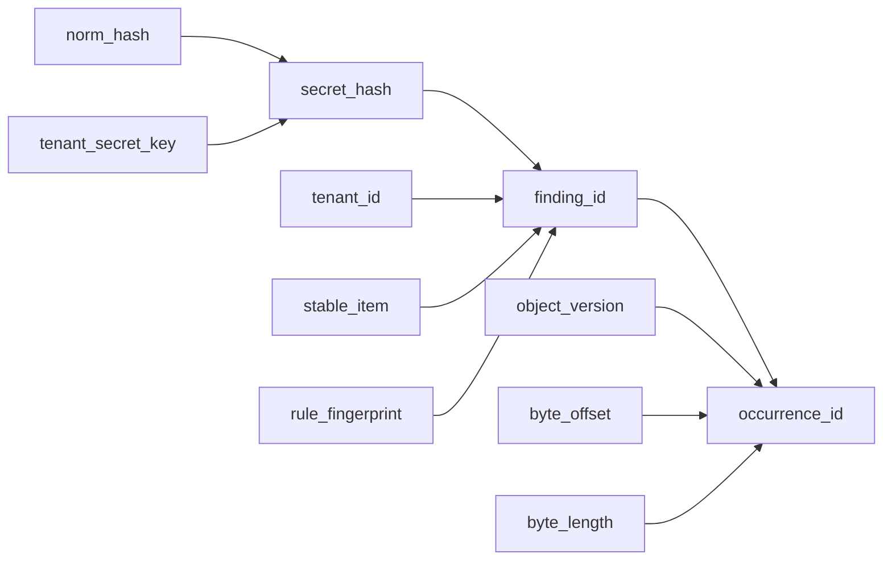

# The Output Channels -- Event Sinks and the Durable Commit Pipeline

*A distributed worker scans shard `fs-0xe5` and discovers a leaked API key in `/data/repos/acme/services/auth/token.env` at byte range `[128, 172)`. The engine produces a `FindingRecord` with `norm_hash = 0xa3f7...c1` and `rule_id = 9`. The event sink streams the finding as a JSONL line: `{"path":"/data/repos/acme/services/auth/token.env","rule_name":"generic-api-key","start":128,"end":172,"source":"fs","confidence_score":8}`. The operator sees the line in the live feed within milliseconds. Good -- real-time visibility. But the downstream deduplication service queries the finding store for shard `fs-0xe5`. The store returns zero records. The event stream carries the path, the rule name, the byte range. It does not carry the `finding_id` -- the stable identity that is deterministic across scan runs. It does not carry the `occurrence_id` -- the instance-specific identity that distinguishes this match at this byte offset in this file version. The JSONL format was designed for human-readable telemetry, not for identity-bearing persistence. Without the `DurableCommitSink` to derive `norm_hash` to `secret_hash` to `finding_id` to `occurrence_id`, the finding is visible but untrackable. It cannot be deduplicated against previous scans. It cannot be linked to a key rotation event. It exists in the telemetry stream as an ephemeral event and vanishes when the stream closes.*

---

The runtime defines two parallel output channels with fundamentally different contracts. The event channel streams findings as formatted records for operators and monitoring systems -- it is fire-and-forget, best-effort, and format-flexible. The commit channel derives stable identities and persists them for deduplication and audit -- it is durable, identity-bearing, and error-propagating. This chapter examines both sides: the four event formats for CLI output, the `CoordinationEventSink` for distributed telemetry, and the identity chain derivation in the `DurableCommitSink`.

## 1. The Four Event Formats

The runtime supports four output formats, selectable via the `EventFormat` enum from `lib.rs`:

```rust
/// CLI-selectable event output format.
#[derive(Clone, Copy, Debug, Default, PartialEq, Eq)]
pub enum EventFormat {
    #[default]
    Jsonl,
    Text,
    Json,
    Sarif,
}
```

Each format is implemented as a struct in `event_sink.rs` that implements the `EventOutput` trait from `scanner-scheduler`. The CLI wiring in `cli.rs` selects the sink. The return type is `Box<dyn CliEventSink>`, where `CliEventSink` is a local super-trait combining `EventOutput` (for core events) and `GitEventOutput` (for git-specific events like commit metadata and identity dictionaries):

```rust
trait CliEventSink: EventOutput + GitEventOutput {}

impl<T> CliEventSink for T where T: EventOutput + GitEventOutput {}

fn build_event_sink(
    event_format: EventFormat,
    verbose: bool,
    null_sink: bool,
) -> Box<dyn CliEventSink> {
    if null_sink {
        eprintln!("info: --null-sink enabled; findings will not be written to stdout");
        return Box::new(NullEventSink);
    }
    match event_format {
        EventFormat::Jsonl => Box::new(JsonlEventSink::new(io::stdout())),
        EventFormat::Text => Box::new(TextEventSink::new(io::stdout(), verbose)),
        EventFormat::Json => Box::new(JsonEventSink::new(io::stdout())),
        EventFormat::Sarif => Box::new(SarifEventSink::new(io::stdout())),
    }
}
```

The `null_sink` flag discards all events -- useful for benchmarking where output overhead must be zero. The `NullEventSink` from `scanner_git` implements both `EventOutput` and `GitEventOutput` with empty method bodies, satisfying the `CliEventSink` bound. The blanket impl `impl<T> CliEventSink for T where T: EventOutput + GitEventOutput {}` means any type that implements both traits automatically satisfies `CliEventSink` -- the format sinks (`JsonlEventSink`, `TextEventSink`, etc.) all implement both traits.

### 1.1 JSONL -- One Record Per Line

The `JsonlEventSink` is the default format and the most commonly used in production. Each event is a single JSON object followed by a newline. From `event_sink.rs`:

```rust
/// JSONL event sink backed by a buffered writer.
pub struct JsonlEventSink<W: Write + Send> {
    writer: Mutex<BufWriter<W>>,
}
```

The writer is wrapped in a `Mutex` because drivers may emit events from multiple worker threads during parallel scanning. A single `Mutex` over the `BufWriter` serializes writes and ensures that individual JSONL lines are not interleaved. The `BufWriter` reduces system call overhead by batching writes into larger chunks -- a single `write_all` for a 200-byte JSONL line goes into the buffer and is flushed to the OS only when the buffer is full or when `flush()` is called.

The sink handles `BrokenPipe` errors as success:

```rust
fn handle_io(result: io::Result<()>) -> io::Result<()> {
    if let Err(error) = result {
        if error.kind() == ErrorKind::BrokenPipe {
            return Ok(());
        }
        return Err(error);
    }
    Ok(())
}
```

This is a CLI parity requirement. When output is piped to `head -n 10` or `jq '.path' | head`, the downstream process closes its stdin pipe after reading enough data. The scanner receives a `BrokenPipe` error on the next write. The scanner must not crash on this error -- it must treat it as a clean shutdown. The `handle_io` function converts `BrokenPipe` to `Ok(())`, suppressing the error while propagating all other I/O failures.

Finding events are encoded without a `type` field to match the scanner-rs golden format (the reference implementation's output). This is documented in the module-level comments: "Finding records intentionally omit a `type` field for scanner-rs parity." Non-finding events (progress, summary, diagnostic) include a `type` field for disambiguation.

### 1.2 Text -- Human-Readable Output

The `TextEventSink` formats findings as compact text lines for terminal display:

```rust
/// Human-readable text event sink.
pub struct TextEventSink<W: Write + Send> {
    writer: Mutex<BufWriter<W>>,
    verbose: bool,
}
```

In compact mode (default), findings are rendered as single lines with path, byte range, rule name, and source:

```text
src/main.rs:5-12  rule  (fs)
```

In verbose mode, findings are rendered with labeled fields for readability:

```text
--- finding ---
  rule:   rule-name
  path:   src/main.rs
  range:  5-12
  source: fs
```

Progress events are only emitted in verbose mode (to reduce noise in compact output). Summary events are always emitted (they provide essential post-scan statistics). Diagnostic events are written to stderr, not stdout, so they do not interfere with finding output that may be piped to downstream tools.

### 1.3 JSON -- Streaming Array

The `JsonEventSink` emits findings as a JSON array -- a single valid JSON document:

```rust
/// Streaming JSON array sink.
pub struct JsonEventSink<W: Write + Send> {
    writer: Mutex<BufWriter<W>>,
    first: AtomicBool,
    closed: AtomicBool,
}
```

The `first` flag tracks whether a comma separator is needed between array elements. The first element is preceded by `\n`; subsequent elements are preceded by `,\n`. The `closed` flag prevents double-closing the array. This idempotency guard is critical because `flush()` is called twice in practice: once when the scan loop finishes, and once by the CLI runner:

```rust
    fn flush(&self) {
        if self.closed.swap(true, Ordering::Relaxed) {
            return;
        }
        let Ok(mut guard) = self.writer.lock() else {
            return;
        };
        if handle_io(guard.write_all(b"\n]\n")).is_err() {
            return;
        }
        let _ = handle_io(guard.flush());
    }
```

The `closed.swap(true, Ordering::Relaxed)` check is a compare-and-swap that returns the previous value. If the previous value was `true` (already closed), the function returns immediately. If `false` (not yet closed), the function proceeds to write the closing bracket. Without this guard, the output would contain `\n]\n\n]\n` -- invalid JSON. The `Ordering::Relaxed` is sufficient because there is no data dependency between the flag check and the write -- the `Mutex` on the writer provides the necessary synchronization.

### 1.4 SARIF -- Static Analysis Results

The `SarifEventSink` emits findings in SARIF 2.1.0 format, the standard interchange format for static analysis tools:

```rust
/// SARIF 2.1.0 sink.
pub struct SarifEventSink<W: Write + Send> {
    writer: Mutex<BufWriter<W>>,
    first: AtomicBool,
    closed: AtomicBool,
}
```

The SARIF header is written at construction time, including the tool driver metadata (scanner name and version). Only `Finding` events produce SARIF results; progress, summary, and diagnostic events are silently dropped -- they have no representation in the SARIF schema. The `flush` method closes the SARIF document with `]}]}\n`, completing the JSON structure.

The confidence score is mapped to a SARIF `rank` value (0-100 scale) by the formula `(confidence_score.max(0) as f64 / 10.0) * 100.0`, clamped to 100.0. Negative confidence scores map to rank 0.

## 2. The CoordinationEventSink -- Distributed Event Recording

In distributed mode, events are not written to stdout. They are forwarded to a coordinator-facing recorder that persists them as telemetry. The `CoordinationEventSink` converts borrowed event data into owned representations:

```rust
/// Distributed event sink that forwards events to a coordinator recorder.
pub struct CoordinationEventSink {
    shard_id: Arc<str>,
    recorder: Arc<dyn CoordinationEventRecorder>,
}
```

The `shard_id` is included with every recorded event, associating the event with the shard that produced it. The `recorder` is an `Arc<dyn CoordinationEventRecorder>` -- a trait object shared between the event sink and the commit sink.

The sink implements `EventOutput` by converting the borrowed `CoreEvent<'_>` (which contains `&[u8]` and `&str` references) into an owned `StoredCoreEvent` (which contains `Vec<u8>` and `String`). From `coordination_sink.rs`:

```rust
/// Owned core event representation persisted by distributed sinks.
#[derive(Clone, Debug, PartialEq)]
pub enum StoredCoreEvent {
    Finding {
        source: scanner_scheduler::source_kind::SourceKind,
        object_path: Vec<u8>,
        start: u64,
        end: u64,
        rule_id: u32,
        rule_name: String,
        commit_id: Option<u32>,
        change_kind: Option<String>,
        confidence_score: i8,
    },
    Progress { /* ... */ },
    Summary { /* ... */ },
    Diagnostic { /* ... */ },
}
```

The conversion is straightforward but necessary: the `CoreEvent<'_>` borrows data from the scan loop's internal buffers, which are invalidated when the next item is processed. The owned representation preserves the event data beyond the scan's borrow scope.

The critical design decision is in the error handling:

```rust
impl EventOutput for CoordinationEventSink {
    fn emit_core(&self, event: CoreEvent<'_>) {
        let owned = match event {
            CoreEvent::Finding(finding) => StoredCoreEvent::Finding {
                source: finding.source,
                object_path: finding.object_path.to_vec(),
                // ... field conversion ...
            },
            // ... other variants ...
        };

        let _ = self.recorder.record_core_event(&self.shard_id, owned);
    }

    fn flush(&self) {}
}
```

The `let _ =` discards the recorder's `Result`. Event recording is intentionally non-fatal. The module-level doc comment explains the design: "Recorder failures are intentionally non-fatal for event emission: commit durability is enforced by `DurableCommitSink`, while event recording remains best-effort telemetry." If the coordinator's event store is temporarily unreachable, findings are still persisted through the commit sink. The event stream degrades gracefully; the identity chain does not.

The sink also implements `GitEventOutput` for git-specific events. The `StoredGitEvent` enum captures commit metadata and identity dictionary entries:

```rust
/// Owned git event representation persisted by distributed sinks.
#[derive(Clone, Debug, PartialEq, Eq)]
pub enum StoredGitEvent {
    CommitMeta {
        commit_id: u32,
        oid_hex: String,
        timestamp: u64,
        author_name_id: Option<u32>,
        author_email_id: Option<u32>,
        committer_name_id: Option<u32>,
        committer_email_id: Option<u32>,
    },
    IdentityDictionary {
        id: u32,
        value: Vec<u8>,
    },
}
```

## 3. The CoordinationEventRecorder Trait

The recorder trait defines the coordinator-facing persistence interface:

```rust
/// Coordinator-facing recorder for distributed scan output.
pub trait CoordinationEventRecorder: Send + Sync {
    fn record_core_event(&self, shard_id: &str, event: StoredCoreEvent) -> Result<()>;
    fn record_git_event(&self, shard_id: &str, event: StoredGitEvent) -> Result<()>;
    fn record_commit_progress(&self, shard_id: &str, event: CommitProgressRecord) -> Result<()>;
    fn record_identity_chain(&self, shard_id: &str, record: IdentityChainRecord) -> Result<()>;
}
```

Four methods, each handling a different category of output. The `shard_id` parameter allows the recorder to partition records by shard. The `Result` return propagates persistence failures to the caller -- but as noted above, the `CoordinationEventSink` ignores failures for events, while the `DurableCommitSink` propagates failures for identity records.

The `CommitProgressRecord` enum tracks the item lifecycle:

```rust
/// Commit lifecycle checkpoints emitted by durable commit sinks.
#[derive(Clone, Debug, PartialEq, Eq)]
pub enum CommitProgressRecord {
    Begin {
        item_key: Vec<u8>,
        size_hint: Option<u64>,
    },
    Finish {
        item_key: Vec<u8>,
    },
}
```

## 4. The DurableCommitSink -- Identity Chain Derivation

The `DurableCommitSink` is the persistence side of the two-channel architecture. It implements the `CommitSink` trait (defined in the runtime's `commit_sink` module) and derives the full identity chain for each finding. From `commit_sink.rs`:

```rust
/// Durable commit sink used by distributed mode.
///
/// This sink derives the full finding identity chain from engine-level finding
/// batches and persists records through the coordinator recorder.
///
/// Derivation flow:
/// `norm_hash -> secret_hash -> finding_id -> occurrence_id`.
///
/// The sink stores per-item metadata from `begin_item` so `upsert_findings`
/// can use connector-provided version IDs when present.
pub struct DurableCommitSink {
    shard_id: Arc<str>,
    recorder: std::sync::Arc<dyn CoordinationEventRecorder>,
    tenant_id: TenantId,
    tenant_secret_key: TenantSecretKey,
    in_flight_meta: Mutex<BTreeMap<Vec<u8>, ItemMeta>>,
}
```

**`shard_id: Arc<str>`.** Identifies which shard this sink is processing. Every record persisted through the recorder carries this shard ID. The `Arc<str>` representation avoids per-record cloning overhead when the shard ID is passed to multiple recorder calls.

**`recorder: Arc<dyn CoordinationEventRecorder>`.** The coordinator-facing recorder, shared with the `CoordinationEventSink`. Both sinks write to the same recorder, ensuring events and identity records are routed to the same persistence backend.

**`tenant_id: TenantId` and `tenant_secret_key: TenantSecretKey`.** Tenant-scoped identity inputs from the B1 Identity section. The `TenantSecretKey` is combined with the `norm_hash` to produce a `secret_hash`. Different tenants scanning the same secret produce different `secret_hash` values, providing cryptographic tenant isolation in multi-tenant deployments.

**`in_flight_meta: Mutex<BTreeMap<Vec<u8>, ItemMeta>>`.** A map from item key bytes to item metadata. `begin_item` inserts an entry; `finish_item` removes it. `upsert_findings` reads the metadata to obtain the `VersionId` for occurrence derivation. The `BTreeMap` provides ordered keys, and the `Mutex` provides thread-safe access.

## 5. The Identity Chain Derivation

The core of the `DurableCommitSink` is the four-step identity derivation. From `commit_sink.rs`:

```rust
    fn derive_identity_record(
        &self,
        item_key: &ItemKey,
        meta: &ItemMeta,
        finding: &FindingRecord,
    ) -> Result<IdentityChainRecord> {
        let norm_hash = NormHash::from_digest(finding.norm_hash);
        let secret_hash = key_secret_hash(&self.tenant_secret_key, &norm_hash);

        let finding_id = derive_finding_id(&FindingIdInputs {
            tenant: self.tenant_id,
            item: meta.stable_item_id,
            rule: rule_fingerprint_from_rule_id(finding.rule_id),
            secret: secret_hash,
        });

        // Connector-provided versions are authoritative; the item-key
        // fallback keeps occurrence IDs deterministic for scan flows that
        // have not plumbed version metadata through ItemMeta yet.
        let object_version = meta
            .version
            .map(|version| version.object_version_id())
            .unwrap_or_else(|| ObjectVersionId::from_version_bytes(item_key.as_bytes()));
        let occurrence_id = derive_occurrence_id(&OccurrenceIdInputs {
            finding: finding_id,
            version: object_version,
            byte_offset: finding.start,
            byte_length: finding.end.saturating_sub(finding.start),
        });

        Ok(IdentityChainRecord {
            item_key: item_key.as_bytes().to_vec(),
            rule_id: finding.rule_id,
            start: finding.start,
            end: finding.end,
            confidence_score: finding.confidence_score,
            norm_hash: *norm_hash.as_bytes(),
            secret_hash: *secret_hash.as_bytes(),
            finding_id: *finding_id.as_bytes(),
            occurrence_id: *occurrence_id.as_bytes(),
        })
    }
```

The derivation follows the B1 Identity chain:



**Step 1: `norm_hash` to `secret_hash`.** The engine's `norm_hash` (the normalized hash of the detected secret value) is combined with the `tenant_secret_key` through `key_secret_hash()`. This step binds the secret identity to the tenant: the same secret produces different `secret_hash` values for different tenants.

**Step 2: `secret_hash` to `finding_id`.** The `finding_id` is derived from four inputs: `tenant_id`, `stable_item` (a hash of the connector tag and item key), `rule_fingerprint` (derived from the numeric rule ID), and `secret_hash`. The `finding_id` is stable across scan runs: scanning the same tenant's same file with the same rule and finding the same secret always produces the same `finding_id`. This is the deduplication key.

**Step 3: `finding_id` to `occurrence_id`.** The `occurrence_id` adds instance-specific information: the `object_version` (file version or commit OID), the `byte_offset` (start position within the item), and the `byte_length` (end minus start). Different occurrences of the same finding (same secret at different offsets, or same secret in different file versions) produce different `occurrence_id` values. This enables tracking of how a finding changes over time.

The `object_version` is derived from the `ItemMeta.version` field when available. When not available (the `None` case), it falls back to `ObjectVersionId::from_version_bytes(item_key.as_bytes())` -- deriving the version from the item key itself. This fallback is deterministic but less semantically meaningful than a connector-provided version.

The `rule_fingerprint_from_rule_id` function maps the engine's numeric rule ID to a 32-byte fingerprint:

```rust
fn rule_fingerprint_from_rule_id(rule_id: u32) -> RuleFingerprint {
    let mut bytes = [0u8; 32];
    bytes[..4].copy_from_slice(&rule_id.to_le_bytes());
    RuleFingerprint::from_bytes(bytes)
}
```

The rule ID is placed in the first 4 bytes in little-endian order; the remaining 28 bytes are zeroed. This is a deterministic, reversible mapping that produces a unique fingerprint for each rule ID.

## 6. The IdentityChainRecord

The output of identity derivation:

```rust
/// Identity chain derived for distributed finding persistence.
#[derive(Clone, Debug, PartialEq, Eq)]
pub struct IdentityChainRecord {
    pub item_key: Vec<u8>,
    pub rule_id: u32,
    pub start: u64,
    pub end: u64,
    pub confidence_score: i8,
    pub norm_hash: [u8; 32],
    pub secret_hash: [u8; 32],
    pub finding_id: [u8; 32],
    pub occurrence_id: [u8; 32],
}
```

Every stage of the identity chain is preserved. Downstream consumers can verify the chain by recomputing any step from its inputs. The record also carries the original finding metadata so the finding store has a complete picture without joining against the event stream.

## What's Next

[Chapter 4](04-distributed-worker.md) examines the distributed runtime: the `ShardLease`, the `DistributedCoordinator` trait, and the acquire-scan-complete loop that drives production worker fleets.
