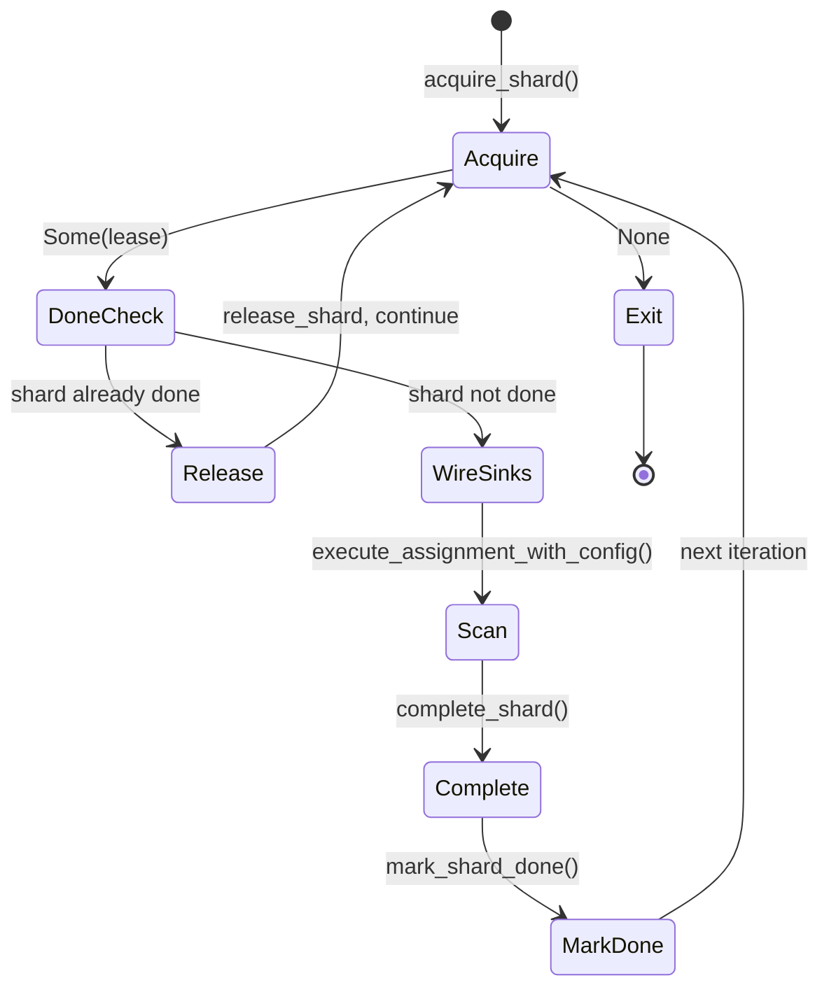

# The Distributed Loop -- ShardLease, Coordinator, and the Acquire-Scan-Complete Cycle

*Worker 12 acquires shard `fs-0xf1` from the coordinator. The scan completes successfully: 340 files scanned, 7 findings emitted, all identity records persisted through the `DurableCommitSink`. The worker calls `complete_shard` to record the scan report and checkpoint. Then it calls `mark_shard_done` to update the done-ledger. But between `complete_shard` and `mark_shard_done`, the network partitions. The coordinator receives the completion record but never receives the done-ledger update. The coordinator times out the lease and assigns `fs-0xf1` to Worker 15. Worker 15 acquires the shard, checks the done-ledger -- the shard is not marked done. Worker 15 scans all 340 files again, derives all 7 identity records again, and calls `complete_shard` and `mark_shard_done`. The network heals. The coordinator now has two completion records for `fs-0xf1`. The finding store has 14 identity records where it should have 7. Without a done-ledger check between acquisition and scanning, every network partition doubles the work and the finding count. The done-ledger is the at-most-once gate that makes the loop idempotent.*

---

The `distributed` module implements the production worker loop. It connects the runtime's scan dispatch (filesystem via `ordered_content`, Git via `git_repo`) to the coordination layer: acquiring shard leases, checking the done-ledger for already-completed work, executing scans with coordinator-backed sinks, and completing shards with checkpoint metadata. The module is intentionally small -- under 370 lines of non-test code -- because the complexity lives in the interfaces it consumes, not in the loop itself. The worker loop is the integration point; the source-family modules, the identity chain, and the coordination protocol are the mechanisms.

## 1. The ShardLease

A `ShardLease` is the unit of distributed work. It bundles coordination metadata with execution metadata into a single payload that the worker loop consumes. From `distributed.rs`:

```rust
/// Lease payload consumed by the distributed runtime.
#[derive(Clone, Debug)]
pub struct ShardLease {
    pub shard_id: Arc<str>,
    pub assignment: Assignment,
    pub tenant_id: TenantId,
    pub tenant_secret_key: TenantSecretKey,
}
```

Let us examine each field:

**`shard_id: Arc<str>`.** The coordinator-assigned shard identifier, stored as `Arc<str>` to avoid per-clone heap allocation when the ID is shared across the event sink, commit sink, and coordinator calls. This is the key used in the done-ledger, the event recorder, and the commit sink. Recall from the B2 Coordination section that shard IDs are stable across lease reassignments: when Worker 12 loses shard `fs-0xf1` and Worker 15 picks it up, the shard ID is the same. The done-ledger is keyed by shard ID, so checking `is_shard_done("fs-0xf1")` returns the same answer regardless of which worker asks.

**`assignment: Assignment`.** The complete work unit for the scan. An `Assignment` bundles the connector tag (a fixed-size ASCII identifier like `FILESYSTEM_CONNECTOR_TAG` or `GIT_CONNECTOR_TAG`), source payload (path), shard spec (key range), cursor (resume position), and policy hash. The assignment tells the runtime *what* to scan; the lease wraps it with coordination context that tells the worker *how* to manage the scan lifecycle.

**`tenant_id: TenantId` and `tenant_secret_key: TenantSecretKey`.** Tenant-scoped identity inputs for the `DurableCommitSink`. The `DurableCommitSink` uses these to derive tenant-isolated `secret_hash` and `finding_id` values, as described in [Chapter 3](03-event-and-commit-sinks.md). The tenant ID and secret key are per-lease because different shards may belong to different tenants in a multi-tenant deployment.

The lease bundles everything the worker needs to execute one scan without additional coordinator round-trips. Once acquired, the worker can construct sinks, run the scan, and complete the shard using only the information in the lease and the shared recorder.

## 2. The DistributedCoordinator Trait

The coordinator trait defines the six operations the worker loop needs:

```rust
/// Coordinator surface required by the distributed runtime.
pub trait DistributedCoordinator: Send + Sync {
    /// Acquire the next lease to process, or `None` when no work remains.
    fn acquire_shard(&self) -> Result<Option<ShardLease>>;
    /// Release a lease without marking it complete (used by done-ledger skips).
    fn release_shard(&self, lease: &ShardLease) -> Result<()>;
    /// Mark one lease complete with optional checkpoint metadata.
    fn complete_shard(
        &self,
        lease: &ShardLease,
        checkpoint: Option<CursorUpdate>,
        report: ScanReport,
    ) -> Result<()>;
    /// Query done-ledger status before scanning a shard.
    fn is_shard_done(&self, shard_id: &str) -> Result<bool>;
    /// Persist done-ledger completion after successful scan.
    fn mark_shard_done(&self, shard_id: &str) -> Result<()>;
    /// Shared recorder used by both event and commit sinks.
    fn event_recorder(&self) -> Arc<dyn CoordinationEventRecorder>;
}
```

The trait is `Send + Sync` because the coordinator may be shared across threads (though the current worker loop is single-threaded, the trait does not preclude multi-threaded use).

**`acquire_shard() -> Result<Option<ShardLease>>`.** The worker calls this to get the next piece of work. `Some(lease)` means work is available. `None` means the queue is empty and the worker should exit the loop. The `Result` wrapper allows the coordinator to signal communication failures (network timeouts, authentication errors, coordinator unavailability).

**`release_shard(&self, lease: &ShardLease) -> Result<()>`.** Returns a lease without completing it. This is used when the done-ledger check reveals the shard was already processed by a previous worker. Releasing returns the shard to the coordinator's pool so it can be garbage-collected or reassigned as appropriate, without advancing its cursor or recording new scan results.

**`complete_shard(&self, lease: &ShardLease, checkpoint: Option<CursorUpdate>, report: ScanReport) -> Result<()>`.** Marks the shard as successfully scanned. The optional `CursorUpdate` carries the scan's final cursor position for resumption support. The `ScanReport` carries aggregate counters (items scanned, bytes scanned, findings emitted). The coordinator persists these so that scan progress can be tracked and so that a future scan of the same shard can resume from the checkpoint rather than re-scanning from the beginning.

**`is_shard_done(&self, shard_id: &str) -> Result<bool>`.** Queries the done-ledger. Returns `true` if the shard was already scanned and marked done by a previous worker. This is the at-most-once gate: a shard that was completed before this lease was acquired should not be scanned again.

**`mark_shard_done(&self, shard_id: &str) -> Result<()>`.** Records completion in the done-ledger. Called after `complete_shard`, creating a two-phase completion: first the coordinator records the scan results, then the done-ledger is updated. This ordering matters for crash recovery: if the worker crashes between `complete_shard` and `mark_shard_done`, the shard will be re-issued, but the done-ledger check will trigger (because `complete_shard` succeeded), and the duplicate work is avoided on the next attempt.

**`event_recorder() -> Arc<dyn CoordinationEventRecorder>`.** Returns the shared recorder used by both the `CoordinationEventSink` (for events) and the `DurableCommitSink` (for identity records). Sharing the recorder ensures that events and identity records are routed to the same persistence backend and can be correlated by shard ID.

## 3. The Worker Loop

The `run_worker` function is the production entry point. It implements the acquire-scan-complete cycle:

```rust
/// Run the distributed worker loop until no more shards are available.
pub fn run_worker(
    coordinator: &dyn DistributedCoordinator,
    config: DistributedRuntimeConfig,
) -> Result<DistributedRunReport, DistributedRuntimeError> {
    let recorder = coordinator.event_recorder();
    let mut report = DistributedRunReport::default();

    loop {
        let Some(lease) = coordinator
            .acquire_shard()
            .map_err(DistributedRuntimeError::Coordinator)?
        else {
            break;
        };
        report.leases_seen = report.leases_seen.saturating_add(1);

        if coordinator
            .is_shard_done(&lease.shard_id)
            .map_err(DistributedRuntimeError::Coordinator)?
        {
            coordinator
                .release_shard(&lease)
                .map_err(DistributedRuntimeError::Coordinator)?;
            report.shards_skipped_done = report.shards_skipped_done.saturating_add(1);
            continue;
        }

        let sink = CoordinationEventSink::new(Arc::clone(&recorder), lease.shard_id.clone());
        let commit = DurableCommitSink::new(
            Arc::clone(&recorder),
            lease.shard_id.clone(),
            lease.tenant_id,
            lease.tenant_secret_key,
        );
        let cancel = CancellationToken::new();

        // Build execution config with commit-sink persistence enabled so
        // findings flow through the DurableCommitSink for identity derivation.
        let mut runtime = config.budgets.to_execution_config()?;
        runtime.filesystem.emit_findings_to_commit_sink = true;

        let outcome = execute_assignment_with_config(
            &lease.assignment,
            runtime,
            &RuntimeEngineConfig::default(),
            &GitExecutionConfig::default(),
            &sink,
            &commit,
            &cancel,
        )
        .map_err(DistributedRuntimeError::Runtime)?;

        coordinator
            .complete_shard(&lease, outcome.checkpoint_hint, outcome.report)
            .map_err(DistributedRuntimeError::Coordinator)?;
        coordinator
            .mark_shard_done(&lease.shard_id)
            .map_err(DistributedRuntimeError::Coordinator)?;

        report.shards_scanned = report.shards_scanned.saturating_add(1);
    }

    Ok(report)
}
```

The loop follows a five-phase cycle:



**Phase 1: Acquire.** The worker requests the next lease. If `None`, the loop exits and returns the accumulated report. If `Some(lease)`, the counter `leases_seen` is incremented.

**Phase 2: Done-ledger check.** Before scanning, the worker queries `is_shard_done`. If the shard was already completed by a previous worker (or by this worker in a previous iteration that crashed after `mark_shard_done` but before the loop advanced), the lease is released and `shards_skipped_done` is incremented. The `continue` restarts the loop at Phase 1.

**Phase 3: Wire sinks.** The worker constructs two sinks: a `CoordinationEventSink` for streaming events to the recorder, and a `DurableCommitSink` for deriving and persisting identity records. Both share the same `recorder` via `Arc::clone`. The `DurableCommitSink` takes four parameters: the recorder, the shard ID, the tenant ID, and the tenant secret key. Stable item identity is trusted from connector-provided `ItemMeta` (set by the scan loop via `CommitSink::begin_item`), so the sink does not need a separate connector tag.

A fresh `CancellationToken` is created for each scan. If the runtime needs to cancel the scan (e.g., because the lease is about to expire), it calls `cancel.cancel()` on this token.

**Phase 4: Scan.** The worker builds a `ScanExecutionConfig` from the budgets via `to_execution_config()`, then enables `emit_findings_to_commit_sink` so that findings flow through the `DurableCommitSink` for identity derivation. It then calls `execute_assignment_with_config`, passing the fully-configured execution config, a default `RuntimeEngineConfig`, a default `GitExecutionConfig`, the event sink (the `CoordinationEventSink` implements `GitEventOutput`), the commit sink, and the cancellation token. The function dispatches through the appropriate source-family module based on the assignment's connector tag. Git scans use a dedicated execution path that receives git-specific configuration directly. The function returns an `AssignmentOutcome` containing the `ScanReport` and optional `CursorUpdate`.

**Phase 5: Complete and mark done.** The worker calls `complete_shard` with the checkpoint and report, then `mark_shard_done` to update the done-ledger. `shards_scanned` is incremented.

The runtime config is minimal:

```rust
/// Runtime config for distributed scans.
#[derive(Clone, Copy, Debug, Default, PartialEq, Eq)]
pub struct DistributedRuntimeConfig {
    pub budgets: ScanBudgets,
}
```

Only the budgets are configurable. The distributed runtime uses default engine configuration (cached via `OnceLock` as described in [Chapter 2](02-engine-construction.md)), default transforms, and default tuning. Custom engine configuration is a CLI concern, not a distributed concern.

## 4. The DistributedRunReport

The worker loop tracks aggregate statistics:

```rust
/// Summary report from one distributed run loop.
#[derive(Clone, Copy, Debug, Default, PartialEq, Eq)]
pub struct DistributedRunReport {
    pub leases_seen: u64,
    pub shards_scanned: u64,
    pub shards_skipped_done: u64,
}
```

**`leases_seen`** counts the total number of leases acquired from the coordinator, including those skipped by the done-ledger.

**`shards_scanned`** counts the number of shards that were actually scanned (passed the done-ledger check and completed successfully).

**`shards_skipped_done`** counts the number of shards that were skipped because the done-ledger indicated they were already complete.

The invariant `leases_seen == shards_scanned + shards_skipped_done` always holds when the loop completes without error. The runtime's tests verify this explicitly.

## 5. The InMemoryCoordinator -- Test Double

The module provides a comprehensive in-memory coordinator for testing:

```rust
/// In-memory distributed coordinator for tests and local harnesses.
#[derive(Clone, Default)]
pub struct InMemoryCoordinator {
    state: Arc<Mutex<InMemoryCoordinatorState>>,
}

#[derive(Default)]
struct InMemoryCoordinatorState {
    queue: VecDeque<ShardLease>,
    done: HashSet<String>,
    released: Vec<String>,
    completed: Vec<CompletedShard>,
    core_events: Vec<(String, StoredCoreEvent)>,
    git_events: Vec<(String, StoredGitEvent)>,
    commit_progress: Vec<(String, CommitProgressRecord)>,
    identity_records: Vec<(String, IdentityChainRecord)>,
}
```

The coordinator holds a `VecDeque<ShardLease>` (drained by `acquire_shard` via `pop_front`), a `HashSet<String>` for the done-ledger (checked by `is_shard_done`, updated by `mark_shard_done`), and vectors for recording every event, identity record, progress record, and completion. This test double enables end-to-end verification: a test constructs leases, runs the worker loop, and then inspects every recorded artifact to verify correctness.

The `InMemoryCoordinator` also implements `CoordinationEventRecorder`, so it serves dual roles: both the coordinator (lease management, done-ledger) and the recorder (event/identity persistence). The `event_recorder()` method clones the coordinator (cheaply -- it clones the `Arc<Mutex<...>>`) and wraps it:

```rust
    fn event_recorder(&self) -> Arc<dyn CoordinationEventRecorder> {
        Arc::new(self.clone())
    }
```

Tests use accessor methods (`done_set()`, `released_shards()`, `completed_shards()`, `core_events()`, `identity_records()`) to inspect the recorded state after the worker loop completes. This enables assertions like "shard `shard-2` was marked done," "at least one identity record was persisted," and "the CLI and distributed paths produce the same finding set."

## 6. Error Handling

The distributed runtime defines a two-variant error:

```rust
/// Distributed runtime error.
#[derive(Debug)]
pub enum DistributedRuntimeError {
    Coordinator(AnyError),
    Runtime(ScanRuntimeError),
}
```

**`Coordinator(AnyError)`** wraps errors from `DistributedCoordinator` methods: network errors, authentication failures, coordinator unavailability. These are typically transient -- a retry after backoff may succeed.

**`Runtime(ScanRuntimeError)`** wraps errors from the scan execution path: file I/O errors, engine construction failures, invalid paths. These are typically permanent -- the same scan will fail the same way on retry.

The separation allows callers to dispatch on the variant and choose the appropriate recovery strategy. The `From<ScanRuntimeError>` impl enables using `?` in the worker loop body to convert runtime errors automatically.

## What's Next

[Chapter 5](05-the-worker-binary.md) examines `gossip-worker`, the thin binary entrypoint that parses CLI arguments, initializes tracing, and delegates to the runtime for scan execution.
