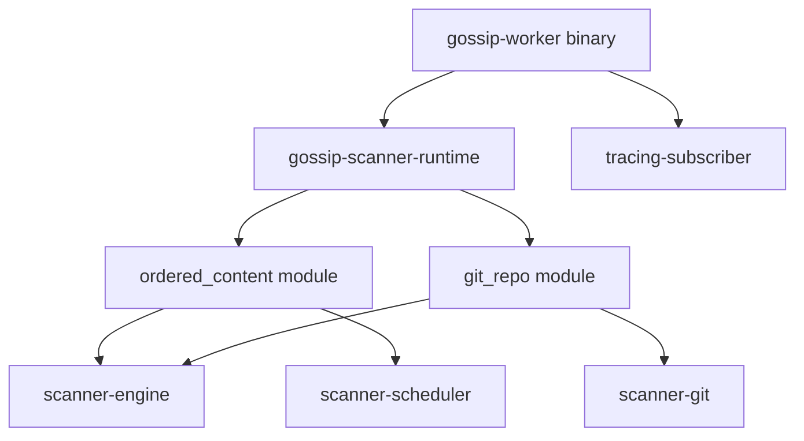
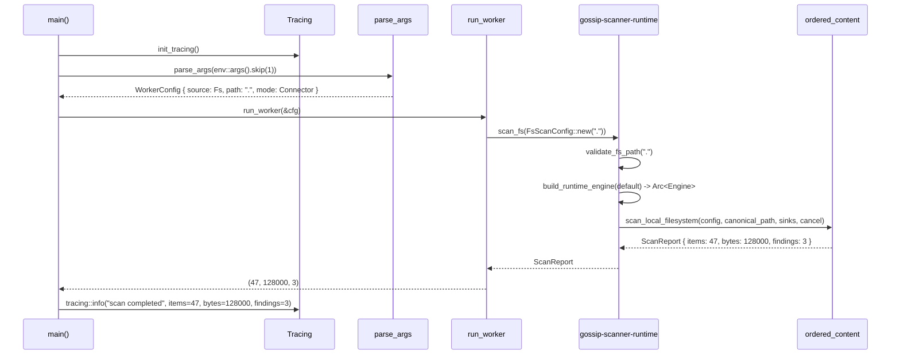

# The Thin Binary -- gossip-worker as CLI Wrapper

*An operator deploys `gossip-worker` to a fleet of 200 machines. The first deployment attempt fails on 12 machines. The error message is `thread 'main' panicked at 'called Result::unwrap() on an Err value: Os { code: 13, kind: PermissionDenied, message: "Permission denied" }'`. No stack trace. No structured context. No indication of which path was denied, which operation failed, or which configuration led to the failure. The operator SSH-es into each machine, runs `strace`, and discovers that `/data/corpus/secrets.yaml` has mode `0600` owned by a different user. The fix is a one-line `chmod`. But the diagnosis took 45 minutes because the binary produced an unstructured panic instead of a structured error with the file path, the operation that failed, and the OS error code. A second operator on a different team encounters a different failure: `gossip-worker git /data/repos/acme/src` exits with `scan failed: git path '/data/repos/acme/src' invalid: path is inside a git repository but is not the repository root (root is '/data/repos/acme')`. This error took 3 seconds to diagnose. The difference: the second error message was produced by the runtime's structured error chain, not by a raw panic. A binary entrypoint has one job: translate human intent (CLI arguments) into structured runtime calls, and translate runtime results (including errors) into human-readable output with actionable context.*

---

The `gossip-worker` crate is the thinnest layer in the stack. At ~320 lines total (including tests), it is a binary entrypoint that does three things: initializes tracing, parses CLI arguments, and delegates to the runtime's scan dispatch modules. It contains no scanning logic, no engine construction, no event formatting, no identity derivation, no coordination protocol. Every substantive operation is performed by `gossip-scanner-runtime`, which in turn delegates to the source-family modules (`ordered_content` and `git_repo`) and the source-specific backends. The worker is the outermost shell; the runtime is the reusable library.

This chapter walks through the binary from `main()` to scan completion, examining each structural choice.

## 1. The Architecture

The binary's dependency chain is intentionally narrow:



The worker depends on exactly two crates: `gossip-scanner-runtime` (for `scan_fs`, `scan_git`, `FsScanConfig`, `GitScanConfig`, `ExecutionMode`, `ScanBudgets`, `ScanRuntimeError`) and `tracing-subscriber` (for structured log initialization). It does not depend on the scanner engine, on any connector implementation, or on the coordination types. The runtime is the facade that encapsulates all scanning dependencies; the worker is the shell that provides the process boundary.

This narrow dependency graph means the worker binary compiles quickly, links against a small set of symbols, and has a minimal attack surface. The binary can be replaced with a different entrypoint (an HTTP service, a gRPC worker, a WASM module) without duplicating any scanning logic.

## 2. WorkerSource and WorkerConfig

The binary defines two private types for its own configuration:

```rust
#[derive(Clone, Copy, Debug, PartialEq, Eq)]
enum WorkerSource {
    Fs,
    Git,
}
```

`WorkerSource` is a private enum with two variants. It mirrors the runtime's two source families (filesystem via `ordered_content`, Git via `git_repo`) but is intentionally separate -- the worker's CLI grammar does not need to expose the `InMemory` connector tag, which is only used in testing.

```rust
/// Worker launch configuration.
///
/// The worker intentionally defaults to connector mode so both worker and CLI
/// entrypoints exercise the same runtime-family boundary.
#[derive(Clone, Debug, PartialEq, Eq)]
struct WorkerConfig {
    source: WorkerSource,
    path: PathBuf,
    execution_mode: ExecutionMode,
}

impl Default for WorkerConfig {
    fn default() -> Self {
        Self {
            source: WorkerSource::Fs,
            path: PathBuf::from("."),
            execution_mode: ExecutionMode::Connector,
        }
    }
}
```

Three fields:

**`source: WorkerSource`.** The scan source kind. Defaults to `Fs` (filesystem scanning).

**`path: PathBuf`.** The scan target. Defaults to `"."` (the current working directory).

**`execution_mode: ExecutionMode`.** The execution mode flag from [Chapter 1](01-runtime-architecture.md). Defaults to `ExecutionMode::Connector`. The doc comment explains the choice: "The worker intentionally defaults to connector mode so both worker and CLI entrypoints exercise the same runtime-family boundary." In practice, both modes execute the same code path (as documented in Chapter 1), but defaulting to Connector mode ensures the worker is labeled correctly in telemetry and logs.

The defaults are chosen for the common deployment case: a worker started in a directory containing source code, scanning the filesystem. Running `gossip-worker` with no arguments scans the current directory.

## 3. Argument Parsing

The argument parser uses a minimal, stable grammar:

```rust
/// Parse worker CLI args using a stable, minimal grammar.
///
/// Supported forms:
/// - `[]` -> defaults (`connector`, `fs`, `.`)
/// - `[path]` -> filesystem scan at `path`
/// - `[fs|git, path]` -> explicit source and path
/// - optional `--mode=...` prefix on all forms
fn parse_args<I>(args: I) -> Result<WorkerConfig, WorkerError>
where
    I: IntoIterator,
    I::Item: Into<String>,
{
    let mut cfg = WorkerConfig::default();
    let mut positional: Vec<String> = args.into_iter().map(Into::into).collect();

    if positional
        .first()
        .is_some_and(|first| first.starts_with("--mode="))
    {
        cfg.execution_mode = parse_mode_flag(&positional.remove(0))?;
    }

    match positional.len() {
        0 => Ok(cfg),
        1 => {
            cfg.path = PathBuf::from(&positional[0]);
            Ok(cfg)
        }
        2 => {
            cfg.source = parse_source(&positional[0])?;
            cfg.path = PathBuf::from(&positional[1]);
            Ok(cfg)
        }
        _ => Err(WorkerError::Usage(usage().to_owned())),
    }
}
```

The grammar supports four forms, documented in the function's doc comment:

1. **No arguments**: scan the current directory as filesystem with connector mode. This is the deployment default.
2. **One positional argument**: interpret as a path, scan that path as filesystem.
3. **Two positional arguments**: first is the source kind (`fs` or `git`), second is the path.
4. **Optional `--mode=` prefix**: any of the above forms may be preceded by `--mode=direct` or `--mode=connector`.

More than two positional arguments are rejected with the usage message. Unknown source kinds are rejected with a descriptive error:

```rust
fn parse_source(value: &str) -> Result<WorkerSource, WorkerError> {
    match value {
        "fs" => Ok(WorkerSource::Fs),
        "git" => Ok(WorkerSource::Git),
        _ => Err(WorkerError::Usage(format!(
            "unknown source '{value}'\n{}",
            usage()
        ))),
    }
}
```

The error message includes the unknown value and the usage help, giving the operator immediate context for the fix.

The `parse_args` function is generic over the iterator type, accepting both `std::env::args().skip(1)` (production) and array/vec literals (tests). This makes the parser testable without environment variable manipulation or process spawning.

The mode flag parser delegates to the runtime's `ExecutionMode::from_str`:

```rust
fn parse_mode_flag(flag: &str) -> Result<ExecutionMode, WorkerError> {
    let Some(value) = flag.strip_prefix("--mode=") else {
        return Err(WorkerError::Usage(usage().to_owned()));
    };
    value
        .parse::<ExecutionMode>()
        .map_err(|error| WorkerError::Usage(error.to_string()))
}
```

The `strip_prefix` extracts the value after `--mode=`. The `parse()` call uses the `FromStr` implementation on `ExecutionMode`, which accepts case-insensitive, whitespace-trimmed input.

## 4. Tracing Initialization

The binary initializes structured logging before any other work:

```rust
fn init_tracing() {
    let filter = EnvFilter::try_from_default_env().unwrap_or_else(|_| EnvFilter::new("info"));
    tracing_subscriber::fmt()
        .with_env_filter(filter)
        .with_target(false)
        .compact()
        .init();
}
```

**`EnvFilter::try_from_default_env()`** reads the `RUST_LOG` environment variable. If set (e.g., `RUST_LOG=debug` or `RUST_LOG=gossip_scanner_runtime=trace`), it configures per-module log levels. If not set (or if parsing fails), it defaults to `info` level -- showing informational messages and above (warn, error).

**`.with_target(false)`** suppresses module path prefixes in log output. Instead of `gossip_scanner_runtime::distributed: scan completed`, the output shows `scan completed`. This reduces noise in deployment logs where the module path adds little value.

**`.compact()`** produces single-line log entries. Each log event occupies one line with the level, fields, and message on the same line. This format is compatible with log aggregation tools that parse line-delimited records.

The initialization happens in `main()` before argument parsing. This ordering ensures that even parsing errors are logged with structured context through the tracing framework, not as raw stderr output.

## 5. The Worker Execution

The `run_worker` function delegates to the runtime:

```rust
/// Execute one scan using the unified runtime seam.
///
/// Returns `(items_scanned, bytes_scanned, findings_emitted)` for logging and
/// smoke-test assertions.
fn run_worker(cfg: &WorkerConfig) -> Result<(u64, u64, u64), WorkerError> {
    match cfg.source {
        WorkerSource::Fs => scan_fs(
            &FsScanConfig::new(&cfg.path)
                .with_execution_mode(cfg.execution_mode)
                .with_budgets(gossip_scanner_runtime::ScanBudgets::default()),
        )
        .map(|report| {
            (
                report.items_scanned,
                report.bytes_scanned,
                report.findings_emitted,
            )
        })
        .map_err(Into::into),
        WorkerSource::Git => scan_git(
            &GitScanConfig::new(&cfg.path)
                .with_execution_mode(cfg.execution_mode)
                .with_budgets(gossip_scanner_runtime::ScanBudgets::default()),
        )
        .map(|report| {
            (
                report.items_scanned,
                report.bytes_scanned,
                report.findings_emitted,
            )
        })
        .map_err(Into::into),
    }
}
```

The function matches on the source kind and calls the appropriate runtime function (`scan_fs` for filesystem, `scan_git` for git). Each call constructs a config using the builder pattern: `FsScanConfig::new(&cfg.path)` or `GitScanConfig::new(&cfg.path)` with the path, then chained `.with_execution_mode()` and `.with_budgets()`.

The budgets use the default values (`max_items: 256`, `max_bytes: 1_000_000`). The worker does not expose budget knobs through its CLI because it is a deployment artifact, not an interactive tool. Operators who need fine-grained control use the CLI entrypoint (`gossip-scanner-runtime/src/cli.rs`) with its 20+ flags.

The return type `(u64, u64, u64)` is a lightweight tuple of the three report counters. The `.map(|report| (...))` destructures the `ScanReport` into the tuple. The `.map_err(Into::into)` converts `ScanRuntimeError` into `WorkerError::Runtime` via the `From` impl.

## 6. Error Handling and Exit Codes

The `WorkerError` enum has two variants:

```rust
#[derive(Debug)]
enum WorkerError {
    Usage(String),
    Runtime(ScanRuntimeError),
}

impl From<ScanRuntimeError> for WorkerError {
    fn from(value: ScanRuntimeError) -> Self {
        Self::Runtime(value)
    }
}
```

**`Usage(String)`** for argument parsing errors. The string contains the error message and typically includes the usage help text.

**`Runtime(ScanRuntimeError)`** for scan execution errors. The `ScanRuntimeError` carries structured context (path, operation, underlying OS error) as described in [Chapter 1](01-runtime-architecture.md).

The `main` function maps errors to exit codes:

```rust
fn main() {
    init_tracing();

    let args = std::env::args().skip(1);
    let cfg = match parse_args(args) {
        Ok(cfg) => cfg,
        Err(error) => {
            tracing::error!(error = %error, "invalid worker arguments");
            std::process::exit(2);
        }
    };

    match run_worker(&cfg) {
        Ok(report) => log_report(&cfg, report),
        Err(error) => {
            tracing::error!(error = %error, "worker scan failed");
            std::process::exit(1);
        }
    }
}
```

Exit code 2 for argument errors. This follows UNIX convention where exit code 2 traditionally indicates usage errors. Exit code 1 for runtime errors (the scan started but failed). Exit code 0 (implicit, from normal `main` return) for success.

The error is logged through `tracing::error!` with structured fields (`error = %error`), which means the `Display` impl of the error type is used. For `ScanRuntimeError`, this produces messages like `git path '/data/repos/acme/src' invalid: path is inside a git repository but is not the repository root (root is '/data/repos/acme')` -- actionable and specific, not generic and useless.

## 7. The Success Report

On success, the report is logged with structured fields:

```rust
fn log_report(cfg: &WorkerConfig, report: (u64, u64, u64)) {
    let (items_scanned, bytes_scanned, findings_emitted) = report;
    let source = match cfg.source {
        WorkerSource::Fs => "fs",
        WorkerSource::Git => "git",
    };

    tracing::info!(
        source,
        mode = ?cfg.execution_mode,
        path = %cfg.path.display(),
        items_scanned,
        bytes_scanned,
        findings_emitted,
        "scan completed",
    );
}
```

The structured log includes six fields: the source kind, execution mode, path, and all three counters. Monitoring systems that parse JSON or structured log formats can extract these fields for dashboards, alerts, and time-series tracking. The `mode = ?cfg.execution_mode` uses `Debug` formatting (producing `Direct` or `Connector`); the `path = %cfg.path.display()` uses `Display` formatting (producing the path string).

## 8. The Usage Message

```rust
fn usage() -> &'static str {
    "usage: gossip-worker [--mode=direct|connector] [fs|git] [path]\n\
     defaults: --mode=connector fs ."
}
```

Two lines. The first shows the grammar. The second shows the defaults. No flags table, no examples, no extended help, no version information. The worker is a deployment artifact used by infrastructure automation, not an interactive tool used by humans in a terminal. Operators who need fine-grained control use the CLI entrypoint in `gossip-scanner-runtime/src/cli.rs`, which provides a comprehensive help system with per-flag documentation.

## 9. The Full Execution Path

Combining all layers, the execution path from binary launch to scan completion:



The worker adds exactly two layers on top of the runtime: tracing initialization and argument parsing. Everything else -- path validation, assignment construction, engine caching, driver dispatch, event formatting -- is the runtime's responsibility.

## 10. Testing

The binary's test suite verifies both the argument parser and the execution path independently:

```rust
#[test]
fn parse_args_defaults_to_connector_fs_current_dir() {
    let cfg = parse_args(Vec::<String>::new()).expect("parse defaults");
    assert_eq!(cfg.source, WorkerSource::Fs);
    assert_eq!(cfg.path, PathBuf::from("."));
    assert_eq!(cfg.execution_mode, ExecutionMode::Connector);
}

#[test]
fn parse_args_supports_explicit_git_path_and_mode() {
    let cfg = parse_args(["--mode=direct", "git", "/tmp/repo"]).expect("parse args");
    assert_eq!(cfg.source, WorkerSource::Git);
    assert_eq!(cfg.path, PathBuf::from("/tmp/repo"));
    assert_eq!(cfg.execution_mode, ExecutionMode::Direct);
}
```

Parser tests verify the four grammar forms and error cases (unknown source, too many arguments) without touching the filesystem.

Execution tests create temporary directories with fixture files and verify end-to-end behavior:

```rust
#[test]
fn run_worker_scans_filesystem_path() {
    let dir = tempdir().expect("tempdir");
    fs::write(dir.path().join("secret.txt"), "password=alpha").expect("write fixture");

    let cfg = WorkerConfig {
        source: WorkerSource::Fs,
        path: dir.path().to_path_buf(),
        execution_mode: ExecutionMode::Connector,
    };

    let report = run_worker(&cfg).expect("filesystem worker run");
    assert!(report.0 >= 1);
    assert!(report.2 >= 1);
}
```

The test creates a temporary directory, writes a file containing `password=alpha` (which matches the runtime's default `"runtime-secret"` rule), configures the worker to scan that directory, and asserts that at least one item was scanned (`report.0 >= 1`) and at least one finding was emitted (`report.2 >= 1`). This exercises the full pipeline: argument config, runtime dispatch, path validation, engine construction, scan execution, and report extraction.

## 11. Summary -- The Delegation Chain

The `gossip-worker` binary demonstrates the value of the layered architecture. At ~320 lines, it contains zero scanning logic, zero engine construction, zero event formatting, zero identity derivation, and zero coordination protocol implementation. Every substantive operation lives in the library crates below it:

```text
gossip-worker (binary, ~320 lines)
  -> gossip-scanner-runtime (runtime, ~1644 lines)
    -> ordered_content / git_repo (source-family dispatch)
      -> gossip-connectors (backends)
        -> scanner-engine (detection)
```

Each layer adds exactly one concern. The binary adds the process boundary (argument parsing, tracing, exit codes). The runtime adds configuration translation, engine construction, and sink wiring. The source-family modules add scan dispatch. The connectors add source-specific scanning. The engine adds detection. No layer duplicates another's responsibility, and no layer reaches past its immediate dependency to access a transitive dependency's internals.

This layered architecture isolates change on both sides of the seam. The worker binary can be replaced, rewritten, or eliminated without changing a single line of scanning logic. The scanning logic can be upgraded (new rules, new transforms, new tuning) without changing a single line of the worker binary.
