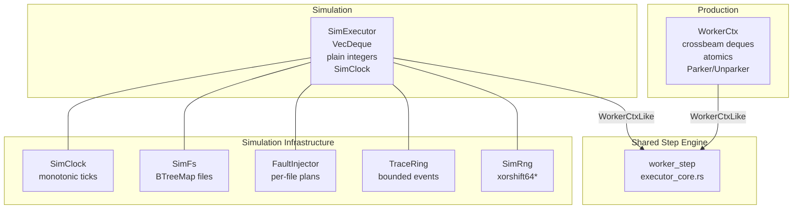

# "The Unreproducible Bug" -- Determinism and Simulation

*A nightly CI run reports a finding at offset 42,108 in `app/config.json` that the previous run did not detect. The file has not changed. The scanner version has not changed. The difference: in run A, Worker 3 stole a chunk-scan task from Worker 1's deque at tick 4,217, processing the chunk before Worker 1's local re-read of the overlap region. In run B, Worker 1 completed the task locally. The steal reordered chunk processing, and a timing-dependent deduplication edge case caused the finding to be emitted in one run but dropped in the other. With 8 workers, 340,000 files, and sub-microsecond steal decisions, reproducing the exact interleaving requires: the same seed (0x853c49e6748fea9b), the same worker count (8), the same input order, and identical timing -- which is impossible on real hardware. Without a simulation harness that replays the exact sequence of scheduling decisions in a single thread, this class of bug is effectively unfixable. The simulation infrastructure exists to make every scheduling decision deterministic and replayable from a seed.*

---

The simulation subsystem strips away OS scheduling, real I/O, and wall-clock time, replacing them with deterministic substitutes controlled by a single seed. Given seed S and input I, the simulation produces identical scheduling decisions, I/O results, and findings -- every time, on every platform. This chapter examines the simulation clock, RNG, filesystem, executor, fault injection, and trace infrastructure.

## 1. SimClock -- Monotonic Simulated Time

The simulation clock advances only through explicit calls. From `sim/clock.rs`:

```rust
/// Tick-based simulated clock.
///
/// Invariant: the internal counter is monotonically non-decreasing.
/// `advance_to` enforces this with a debug assertion; `advance_by`
/// saturates at `u64::MAX` instead of wrapping.
#[derive(Clone, Copy, Debug, Default, PartialEq, Eq, serde::Serialize, serde::Deserialize)]
pub struct SimClock {
    now: u64,
}

impl SimClock {
    /// Create a new clock at tick 0.
    pub fn new() -> Self {
        Self { now: 0 }
    }

    /// Current time in ticks.
    #[inline(always)]
    pub fn now_ticks(&self) -> u64 {
        self.now
    }

    /// Advance to an absolute tick.
    ///
    /// # Panics
    ///
    /// Debug-asserts that `t >= self.now` (monotonicity).
    #[inline(always)]
    pub fn advance_to(&mut self, t: u64) {
        debug_assert!(t >= self.now);
        self.now = t;
    }

    /// Advance by a relative delta, saturating at `u64::MAX`.
    #[inline(always)]
    pub fn advance_by(&mut self, dt: u64) {
        self.now = self.now.saturating_add(dt);
    }
}
```

Ticks are unitless -- callers assign meaning (1 tick = 1 ms of simulated time, for example). The only guarantee is monotonicity: `now_ticks()` never decreases. `advance_by` saturates rather than wrapping to prevent time from going backward due to overflow.

No `Instant::now()` is ever called in simulation. Rate limiters, backoff timers, and TTLs operate against `SimClock` ticks, making all time-based logic deterministic and replayable.

## 2. SimRng -- Simulation-Grade RNG

From `sim/rng.rs`:

```rust
/// Deterministic RNG with a single 64-bit state.
#[derive(Clone, Debug, PartialEq, Eq, serde::Serialize, serde::Deserialize)]
pub struct SimRng {
    state: u64,
}

impl SimRng {
    /// Create a new RNG. A zero seed is remapped to a non-zero constant to
    /// avoid the xorshift lockup state.
    pub fn new(seed: u64) -> Self {
        let s = if seed == 0 { 0x9E3779B97F4A7C15 } else { seed };
        Self { state: s }
    }

    /// Next 64-bit value from xorshift64*.
    #[inline(always)]
    pub fn next_u64(&mut self) -> u64 {
        let mut x = self.state;
        x ^= x >> 12;
        x ^= x << 25;
        x ^= x >> 27;
        self.state = x;
        x.wrapping_mul(0x2545F4914F6CDD1D)
    }

    /// Generate a value in `[lo, hi_exclusive)`.
    #[inline(always)]
    pub fn gen_range(&mut self, lo: u32, hi_exclusive: u32) -> u32 {
        debug_assert!(lo < hi_exclusive);
        let span = (hi_exclusive - lo) as u64;
        (lo as u64 + (self.next_u64() % span)) as u32
    }

    /// Generate a boolean with probability `numerator / denominator`.
    #[inline(always)]
    pub fn gen_bool(&mut self, numerator: u32, denominator: u32) -> bool {
        debug_assert!(denominator > 0);
        debug_assert!(numerator <= denominator);
        (self.next_u64() % (denominator as u64)) < (numerator as u64)
    }
}
```

`SimRng` uses xorshift64* (the starred variant applies a final multiplication for better statistical properties). It is `Serialize + Deserialize` so that RNG state can be persisted in repro artifacts. The zero-seed remapping prevents the lockup state where all outputs would be zero.

## 3. SimFs -- Deterministic In-Memory Filesystem

From `sim/fs.rs`:

```rust
/// Deterministic in-memory filesystem.
#[derive(Clone, Debug)]
pub struct SimFs {
    files: BTreeMap<Vec<u8>, Vec<u8>>,
    dirs: BTreeMap<Vec<u8>, Vec<Vec<u8>>>,
}
```

`SimFs` stores file contents and directory listings in `BTreeMap`s keyed by raw path bytes. `BTreeMap` provides deterministic iteration order (lexicographic by key bytes), which is critical for reproducibility.

```rust
impl SimFs {
    /// Build a filesystem instance from a spec.
    pub fn from_spec(spec: &SimFsSpec) -> Self {
        let mut files = BTreeMap::new();
        let mut dirs = BTreeMap::new();

        for node in &spec.nodes {
            match node {
                SimNodeSpec::File { path, contents, .. } => {
                    files.insert(path.bytes.clone(), contents.clone());
                }
                SimNodeSpec::Dir { path, children } => {
                    let mut child_bytes: Vec<Vec<u8>> =
                        children.iter().map(|p| p.bytes.clone()).collect();
                    child_bytes.sort();
                    dirs.insert(path.bytes.clone(), child_bytes);
                }
            }
        }

        Self { files, dirs }
    }

    /// List a directory's immediate children in deterministic order.
    pub fn list_dir(&self, dir: &SimPath) -> std::io::Result<&[Vec<u8>]> {
        self.dirs
            .get(&dir.bytes)
            .map(|v| v.as_slice())
            .ok_or_else(|| std::io::Error::new(std::io::ErrorKind::NotFound, "dir not found"))
    }
}
```

The filesystem spec (`SimFsSpec`) is declarative and serializable, enabling scenarios to be stored as JSON artifacts and replayed exactly.

### 3.1 File Handles and Reads

```rust
/// Open a file handle for a path.
pub fn open_file(&self, path: &SimPath) -> std::io::Result<SimFileHandle> {
    let data = self
        .files
        .get(&path.bytes)
        .ok_or_else(|| std::io::Error::new(std::io::ErrorKind::NotFound, "file not found"))?;

    Ok(SimFileHandle {
        path: path.bytes.clone(),
        cursor: 0,
        len: data.len() as u64,
    })
}
```

Reads past EOF return an empty slice. Missing paths return `io::ErrorKind::NotFound`. No OS interaction occurs.

### 3.2 Discovery Type Hints

```rust
/// Type hint used by simulated discovery.
#[derive(Clone, Copy, Debug, PartialEq, Eq, Serialize, Deserialize)]
pub enum SimTypeHint {
    /// `file_type()` reports a regular file.
    File,
    /// `file_type()` reports a non-file entry.
    NotFile,
    /// `file_type()` returned `None` (unknown, fallback to metadata).
    Unknown,
}
```

The `Unknown` variant models platforms that do not supply `file_type()` in directory entries. The discovery code (Chapter 5) must fall back to metadata in this case. By including `Unknown` in the simulation, type-hint edge cases are testable without platform-specific behavior.

## 4. SimExecutor -- Deterministic Work-Stealing

The `SimExecutor` models a multi-worker scheduler in a single OS thread. From `sim/executor.rs`:

```rust
/// Deterministic single-thread executor with work-stealing queues.
///
/// Models a multi-worker work-stealing scheduler within a single OS thread
/// for property testing and simulation. Each [`step()`] call selects a
/// worker uniformly at random (via seeded RNG), then that worker pops from
/// its local queue (LIFO), falls back to the global queue (FIFO), or steals
/// from a random victim (FIFO).
///
/// # What This Models
///
/// - Worker-local queue semantics (LIFO pop, FIFO steal)
/// - Global injection queue (FIFO)
/// - Random worker selection and victim selection
///
/// # What This Does NOT Model
///
/// - Real-time scheduling or timing
/// - Cache effects or memory locality
/// - Contention or CAS failures
/// - Thread wake/sleep transitions
pub struct SimExecutor {
    workers: u32,
    next_task_id: u32,
    tasks: Vec<SimTask>,
    states: Vec<SimTaskState>,
    local_queues: Vec<VecDeque<SimTaskId>>,
    global_queue: VecDeque<SimTaskId>,
    rng: SimRng,
}
```

The executor uses `VecDeque` instead of concurrent deques because it runs in a single thread. Each `step()` call:

1. Selects a worker uniformly at random via the seeded RNG
2. The selected worker pops from its local queue (LIFO)
3. Falls back to the global queue (FIFO)
4. Falls back to stealing from a random victim (FIFO)

```rust
/// Spawn a task from outside the executor (goes to the global queue).
pub fn spawn_external(&mut self, task: SimTask) -> SimTaskId {
    let id = self.alloc_task(task, SimTaskState::Runnable);
    self.global_queue.push_back(id);
    id
}
```

The `SimTaskId` is a stable `u32` identifier that survives across steps, enabling trace logging and assertion.

## 5. Fault Injection

The `FaultInjector` applies deterministic faults based on file path and operation index. From `sim/fault.rs`:

```rust
/// Fault plan keyed by file path bytes.
#[derive(Clone, Debug)]
pub struct FaultPlan {
    pub per_file: BTreeMap<Vec<u8>, FileFaultPlan>,
}

/// Fault plan for a single file.
#[derive(Clone, Debug, Serialize, Deserialize)]
pub struct FileFaultPlan {
    /// Optional fault on open.
    pub open: Option<IoFault>,
    /// Per-read fault plan, indexed by read count (0-based).
    pub reads: Vec<ReadFault>,
    /// Optional cancellation after N reads.
    pub cancel_after_reads: Option<u32>,
}
```

Faults are keyed by path bytes and per-operation index. The same scenario and schedule seeds reproduce identical behavior.

### 5.1 I/O Fault Types

```rust
/// I/O fault kinds understood by the simulation runner.
#[derive(Clone, Debug, Serialize, Deserialize)]
pub enum IoFault {
    /// Signal a generic I/O error.
    ErrKind { kind: u16 },
    /// Return at most `max_len` bytes for the read.
    PartialRead { max_len: u32 },
    /// Emulate a single EINTR-style interruption.
    EIntrOnce,
}
```

### 5.2 Data Corruption

```rust
/// Optional data corruption applied to read results.
#[derive(Clone, Debug, Serialize, Deserialize)]
pub enum Corruption {
    TruncateTo { new_len: u32 },
    FlipBit { offset: u32, mask: u8 },
    Overwrite { offset: u32, bytes: Vec<u8> },
}
```

`FlipBit` flips a single bit at a specified offset -- useful for testing whether the scanner correctly handles corrupted headers or partial decompression failures. `Overwrite` replaces a range of bytes, enabling injection of specific test patterns.

### 5.3 Fault Injector Runtime

```rust
/// Runtime fault injector that tracks per-file read indices.
#[derive(Clone, Debug)]
pub struct FaultInjector {
    plan: FaultPlan,
    read_idx: BTreeMap<Vec<u8>, u32>,
}
```

The injector maintains a per-file read counter. The `reads` vector in `FileFaultPlan` is indexed by this counter, so the first read applies `reads[0]`, the second applies `reads[1]`, and so on. This deterministic indexing means faults reproduce identically across runs.

## 6. TraceRing -- Bounded Event Buffer

From `sim/trace.rs`:

```rust
/// Minimal event set for deterministic replay and failure forensics.
#[derive(Clone, Debug, PartialEq, Eq, serde::Serialize, serde::Deserialize)]
pub enum TraceEvent {
    StepChoose { choices: u32, chosen: u32 },
    TaskSpawn { task_id: u32, kind: u16 },
    TaskPoll { task_id: u32, outcome: u16 },
    IoSubmit { file: u32, op: u32, offset: u64, len: u32, ready_at: u64 },
    IoComplete { file: u32, op: u32, result: u16 },
    FaultInjected { file: u32, op: u32, kind: u16 },
    FindingEmit { file: u32, rule: u32, span0: u32, span1: u32, root0: u32, root1: u32 },
    ArchiveStart { root: u32, kind: u16 },
    ArchiveEntryStart { root: u32, entry: u32 },
    ArchiveEntryEnd { root: u32, entry: u32 },
    ArchiveEnd { root: u32, outcome: u16 },
    InvariantFail { code: u32 },
}
```

Events use `u32` and `u16` fields rather than strings or paths. This keeps the trace compact and serializable without heap allocation per event.

```rust
/// Fixed-capacity ring buffer of trace events.
#[derive(Clone, Debug, serde::Serialize, serde::Deserialize)]
pub struct TraceRing {
    cap: usize,
    buf: VecDeque<TraceEvent>,
}

impl TraceRing {
    /// Push a new event, evicting the oldest if at capacity.
    #[inline(always)]
    pub fn push(&mut self, ev: TraceEvent) {
        if self.buf.len() == self.cap {
            self.buf.pop_front();
        }
        self.buf.push_back(ev);
    }

    /// Snapshot the ring contents in chronological order.
    pub fn dump(&self) -> Vec<TraceEvent> {
        self.buf.iter().cloned().collect()
    }
}
```

The ring buffer has a fixed capacity. When full, the oldest events are evicted first. This bounds memory usage while preserving the most recent events for failure forensics. The `dump()` method returns events in chronological order for inclusion in repro artifacts.

## 7. How Simulation Connects to Production

The production executor and the simulation executor share the same step engine via the `WorkerCtxLike` trait (recall from [Chapter 3](03-the-executor.md)):

```rust
/// Minimal worker context needed by the core step engine.
///
/// Implementations must preserve executor invariants:
/// - `shared_state_*` operations follow the combined `(count<<1)|accepting` layout.
/// - `pop_local` is LIFO; `steal_from_victim` is FIFO for stolen tasks.
/// - `record_panic` must signal shutdown and wake sleeping workers.
pub(crate) trait WorkerCtxLike<T, S> {
    fn worker_id(&self) -> usize;
    fn worker_count(&self) -> usize;
    fn scratch_mut(&mut self) -> &mut S;

    fn pop_local(&mut self) -> Option<T>;
    fn push_local(&mut self, task: T);

    fn push_injector(&mut self, task: T);
    fn steal_from_injector(&mut self) -> Option<T>;
    fn steal_from_victim(&mut self, victim: usize) -> Option<T>;

    // ... state management, done detection, panic recording ...
}
```

The production `WorkerCtx` implements this trait using crossbeam deques and atomics. The simulation executor implements the same trait using `VecDeque` and plain integers. The `worker_step` function operates identically on both -- the step engine does not know whether it is running in production or simulation.



## 8. Scenario Generation and Replay

The simulation primitives are all `Serialize + Deserialize`:

- `SimFsSpec` -- filesystem layout
- `FaultPlan` -- fault injection plan
- `SimClock` -- starting time
- `SimRng` -- RNG state
- `TraceRing` -- trace events

A failing simulation run produces a `ReproArtifact` (from `sim/artifact.rs`) containing all of these. The artifact is a self-contained JSON file that reproduces the exact failure without any OS dependencies.

The `minimize` module (from `sim/minimize.rs`) reduces failing scenarios to minimal repro cases by shrinking the filesystem spec and fault plan while preserving the invariant violation.

This infrastructure enables three classes of testing:

1. **Property tests**: Generate random scenarios (random file sizes, random fault plans) and assert invariants (no lost findings, no leaked bufgets, no in-flight underflow)
2. **Regression tests**: Store repro artifacts from CI failures and replay them deterministically in unit tests
3. **Mutation testing**: Modify the scheduler code and verify that the simulation catches the introduced bug

The simulation module is gated behind feature flags:

```rust
#[cfg(feature = "sim-harness")]
pub mod sim;
#[cfg(feature = "sim-harness")]
pub mod sim_archive;
#[cfg(feature = "sim-harness")]
pub mod sim_scanner;
#[cfg(feature = "scheduler-sim")]
pub mod sim_scheduler;
```

This keeps simulation infrastructure out of the default runtime build while making it available for harness and testing builds.

## What Comes Before

This chapter concludes the scanner-scheduler section. The executor, budgets, chunking, filesystem scanning, archive handling, events, and simulation form a complete parallel execution runtime that is backend-agnostic, memory-bounded, and deterministically testable.

For the detection engine that runs within each scan task, see [section 10 (scanner-engine)](../10-scanner-engine/). For git-specific scanning that uses this scheduler as its CPU engine, see [section 12 (scanner-git)](../12-scanner-git/).
